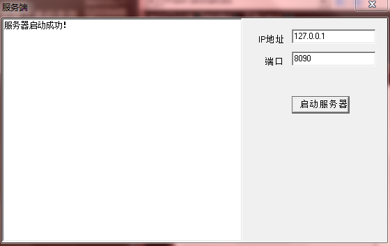
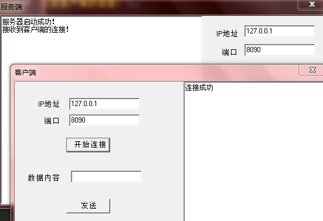
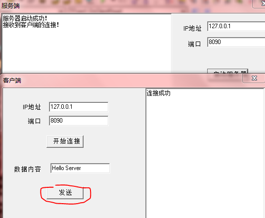
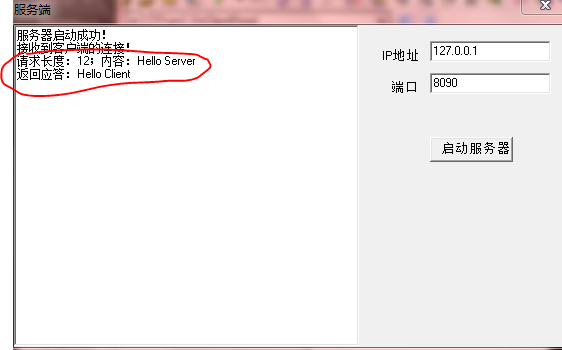
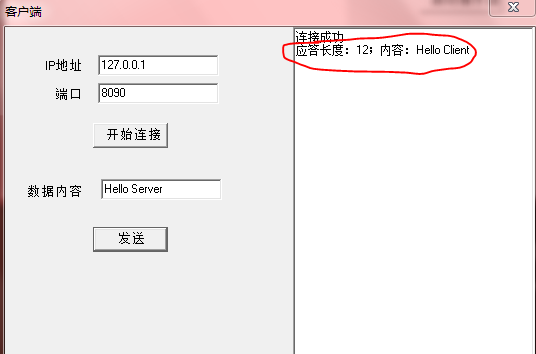

说到文本文件，可能想到与之对应的是二进制文件。其实它们两并不是对立的关系，还是包含的关系：二进制文件包括文本文件，因为文本最本质也是以二进制（0、1）的形式存在的。文本文件中的内容主要是对人类可读的文本信息，主要是汉字、字母、数字，但其在底层还是通过二进制的0和1来表示的，比如英文字母“a”对应二进制：01100001，字符“A”对应的二进制：01000001，数字“2”对应二进制：00110010，汉字“我”对应二进制（GBK编码）：1100111011010010

其实Socket天然支持的是发送二进制文件，可以看一下Windows SockAPI中send的函数原型

```
int PASCAL FAR send (SOCKET s, const char FAR * buf, int len, int flags);
```

比如可以将buf指向一个结构体变量的首地址，len表示该结构体的大小，然后调用send就可以将结构体变量在进程内存中的二进制内容发送出去了。只不过平时接触的较多的是直接发送字符串，比如HTTP这种文本格式，还有金融开发中常用的FIX包、XML包等文本形式的网络包（至少我是这样的）

>总有一些先入为主的部分事实遮住人的认知，误以为这就是全部事实！

##Delphi发送和接收二进制数据

Delphi的ClientSocket、ServerSocket其实是将底层的WinSockAPI又做了封装然后供开发者调用的，所以其实Delphi在进行网络编程时也可以发送和接收二进制数据

接下来通过一个例子展示客户端发送二进制数据，服务端接收二进制数据。对应的程序源码点击[这里](../download/20161222/Binary.rar)下载

规定发送数据的格式如下

* 定义一个结构体，存储后续的的字符串的相关信息
* 结构体中定义了后续字符串的长度、等相关信息
* 发送数据的第一部分是该结构体变量的内容，第二部分是字符串信息

##结构体定义

```
type
  PRemark = ^TRemark;
  TRemark = packed record
    len: Integer;                 //后续的字符串长度
    about: array[0..9] of Char;   //附加信息
  end;
```

##客户端代码

```
unit MainForm;

interface

uses
  Windows, Messages, SysUtils, Variants, Classes, Graphics, Controls, Forms,
  Dialogs, StdCtrls, ScktComp, CommonData;

type
  TForm1 = class(TForm)
    lblIP: TLabel;
    lblPort: TLabel;
    edtIP: TEdit;
    edtPort: TEdit;
    btnConnect: TButton;
    lblMessage: TLabel;
    edtMessage: TEdit;
    btnSend: TButton;
    mmo1: TMemo;
    procedure FormCreate(Sender: TObject);
    procedure FormDestroy(Sender: TObject);
    procedure btnConnectClick(Sender: TObject);
    procedure btnSendClick(Sender: TObject);
  private
    { Private declarations }
  public
    procedure SocketConnect(Sender: TObject; Socket: TCustomWinSocket);
    procedure SocketRead(Sender: TObject; Socket: TCustomWinSocket);
  end;

var
  Form1: TForm1;
  Client: TClientSocket;

implementation

{$R *.dfm}

procedure TForm1.FormCreate(Sender: TObject);
begin
  Client := TClientSocket.Create(nil);
end;

procedure TForm1.FormDestroy(Sender: TObject);
begin
  Client.Free;
end;

procedure TForm1.btnConnectClick(Sender: TObject);
var
  IP: string;
  Port: Integer;
begin
  IP := edtIP.Text;
  Port := StrToInt(edtPort.Text);
  Client.Host := IP;
  Client.Port := Port;
  Client.OnConnect := SocketConnect;
  Client.OnRead := SocketRead;
  Client.Open;
end;

procedure TForm1.btnSendClick(Sender: TObject);
var
  SendMsg: string;
  remark: TRemark;
  remarkSize: Integer;
  buf: array of Byte;
begin
  SendMsg := edtMessage.Text;
  remark.len := Length(SendMsg);
  StrCopy(remark.about, '测试请求');
  
  //设置Byte数组长度是字符串长度+结构体
  remarkSize := Sizeof(TRemark);
  SetLength(buf, remark.len + remarkSize);

  //将结构体拷贝到Byte数组中
  Move(remark, buf[0], remarkSize);

  //将字符串拷贝到Byte数组中
  Move(SendMsg[1], buf[remarkSize], remark.len);

  //发送二进制内容
  Client.Socket.SendBuf(buf[0], remark.len + remarkSize);
end;

procedure TForm1.SocketConnect(Sender: TObject; Socket: TCustomWinSocket);
begin
  Form1.mmo1.Lines.Add('连接成功');
end;

procedure TForm1.SocketRead(Sender: TObject; Socket: TCustomWinSocket);
var
  buf: array of Byte;
  remark: TRemark;
  remarkSize: Integer;
//  respTextLen: Integer;
  respText: string;
begin
  try
    if Socket.ReceiveLength > 0 then
    begin
      //结构体
      remarkSize := SizeOf(TRemark);
      Socket.ReceiveBuf(remark, remarkSize);
      
      //剩余字节：消息内容
      SetLength(buf, remark.len);
      Socket.ReceiveBuf(buf[0], remark.len);

      SetLength(respText, remark.len);
      Move(buf[0], respText[1], remark.len);

      Form1.mmo1.Lines.Add('应答长度：' + IntToStr(remark.len));
      Form1.mmo1.Lines.Add('附加信息：' + remark.about);
      Form1.mmo1.Lines.Add('应答内容：' + respText);
      Form1.mmo1.Lines.Add('');
    end;
  except
    on E: Exception do
    begin
      Form1.mmo1.Lines.Add('接收应答出现异常！');
    end;
  end;
end;

end.
```

##服务端代码

```
unit MainForm;

interface

uses
  Windows, Messages, SysUtils, Variants, Classes, Graphics, Controls, Forms,
  Dialogs, StdCtrls, ScktComp, CommonData;

type
  TForm1 = class(TForm)
    mmo1: TMemo;
    lblIP: TLabel;
    edtIP: TEdit;
    lblPort: TLabel;
    edtPort: TEdit;
    btnStart: TButton;
    procedure FormCreate(Sender: TObject);
    procedure FormDestroy(Sender: TObject);
    procedure btnStartClick(Sender: TObject);
  private
    { Private declarations }
  public
    procedure OnClientConnect(Sender: TObject; Socket: TCustomWinSocket);
    procedure OnClientRead(Sender: TObject; Socket: TCustomWinSocket);
  end;

var
  Form1: TForm1;
  Server: TServerSocket;

implementation

{$R *.dfm}

procedure TForm1.FormCreate(Sender: TObject);
begin
  Server := TServerSocket.Create(nil);
end;

procedure TForm1.FormDestroy(Sender: TObject);
begin
  Server.Close;
  Server.Free;
end;

procedure TForm1.btnStartClick(Sender: TObject);
var
  IP: string;
  Port: Integer;
begin
  IP := edtIP.Text;
  Port := StrToInt(edtPort.Text);

  Server.Port := Port;
  Server.OnClientConnect := OnClientConnect;       //当有某个客户端连接上后，回调该方法
  Server.OnClientRead := OnClientRead; 
  Server.Open;

  mmo1.Lines.Add('服务器启动成功！');
end;

procedure TForm1.OnClientConnect(Sender: TObject; Socket: TCustomWinSocket);
begin
  mmo1.Lines.Add('接收到客户端的连接！');
end;

procedure TForm1.OnClientRead(Sender: TObject; Socket: TCustomWinSocket);
var
  remarkSize: Integer;

  reqRemark: TRemark;
  reqBuf: array of Byte;
  reqText: string;

  respRemark: TRemark;
  respBuf: array of Byte;
  respText: string;
begin
  if Socket.ReceiveLength > 0 then
  begin
    remarkSize := SizeOf(TRemark);

    //先接收前部分的结构体变量
    Socket.ReceiveBuf(reqRemark, remarkSize);

    //再接收后续的字符串 
    SetLength(reqBuf, reqRemark.len);
    Socket.ReceiveBuf(reqBuf[0], reqRemark.len);
    SetLength(reqText, reqRemark.len);
    Move(reqBuf[0], reqText[1], reqRemark.len);
    mmo1.Lines.Add('请求长度：' + IntToStr(reqRemark.len));
    mmo1.Lines.Add('附加信息：' + reqRemark.about);
    mmo1.Lines.Add('请求内容：' + reqText);
    mmo1.Lines.Add('');

    //返回应答
    respText := 'Hello Client';
    respRemark.len := Length(respText);
    StrCopy(respRemark.about, '测试应答');

    SetLength(respBuf, respRemark.len + remarkSize);
    Move(respRemark, respBuf[0], remarkSize);
    Move(respText[1], respBuf[remarkSize], respRemark.len);

    Socket.SendBuf(respBuf[0], respRemark.len + remarkSize);
    mmo1.Lines.Add('返回应答：' + respText);
  end;
end;

end.
```

##运行效果展示

首先是打开服务端程序，监听8090，开启服务



然后客户端连接到服务端



输入内容，点击发送



然后可以看到服务端收到请求



继续看到客户端收到应答


