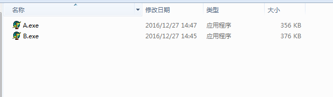
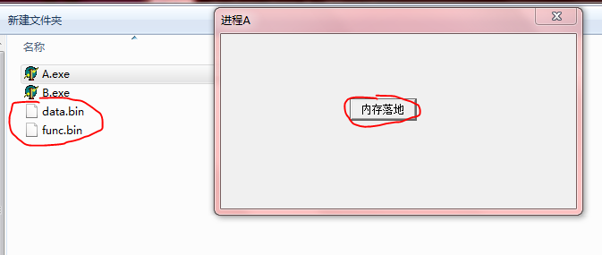
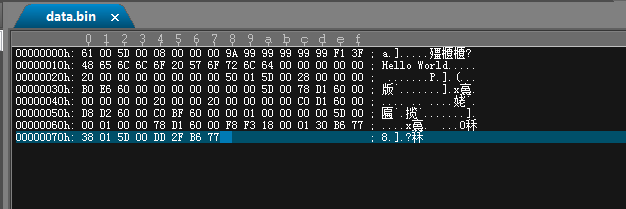
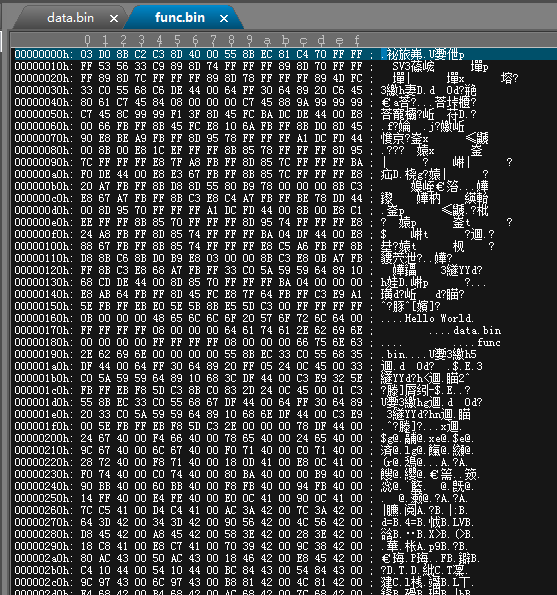
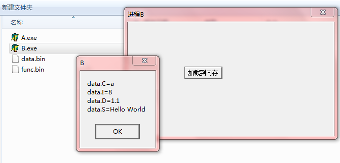
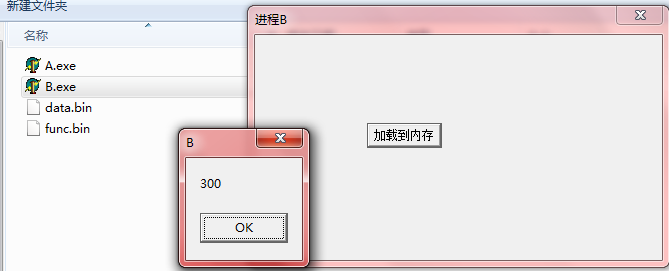

一个进程内存中结构体是以二进制的形式存储在某个地址的，一个函数指令也是以二进制的形式存储在某个地址的

既然是这样，就想到用如下逻辑做测试：从进程A中将二进制数据先落地到文件，然后进程B从文件中将数据加载到内存；同样的，对于函数指令，先从进程A中将函数指令落地到文件，然后进程B从文件中加载指令到内存，然后再去调用该函数，看看运行效果会是如何？

测试环境：Windows 7、Delphi 6

##定义结构体和函数指针

```
unit CommonData;

interface

type
  //定义一个2进程共用的结构体类型
  PCommonRecord = ^TCommonRecord;
  TCommonRecord = record
    C: Char;
    I: Integer;
    D: Double;
    S: array[0..99] of Char;
  end;

  //定义一个2进程共用的函数指针类型
  TCommonAdd = function(a: Integer; b: Integer): Integer; 

implementation

end.
```

##进程A将二进制数据、指令落地

```
unit MainForm;

interface

uses
  Windows, Messages, SysUtils, Variants, Classes, Graphics, Controls, Forms,
  Dialogs, StdCtrls, CommonData;

type
  TForm1 = class(TForm)
    btnSave: TButton;
    procedure btnSaveClick(Sender: TObject);
  private
    { Private declarations }
  public
    { Public declarations }
  end;

var
  Form1: TForm1;

implementation

{$R *.dfm}

procedure TForm1.btnSaveClick(Sender: TObject);
var
  s: string;
  data: TCommonRecord;
  p: PByte;
  fBinFile: Integer;

  function AddInt(a: Integer; b: Integer): Integer;
  begin
    Result := a + b;
  end;
begin
//数据
  data.C := 'a';
  data.I := 8;
  data.D := 1.1;
  s := 'Hello World';
  StrCopy(data.S, PChar(s));
  //通过文件操作将数据落地
  fBinFile := FileCreate(ExtractFilePath(Application.ExeName) + 'data.bin');
  FileWrite(fBinFile, data, SizeOf(TCommonRecord));
  FileClose(fBinFile);

//函数指令
  p := Pointer(@AddInt);
  //通过文件操作将函数指令落地
  fBinFile := FileCreate(ExtractFilePath(Application.ExeName) + 'func.bin');
  //无法获知指令实际的长度，稳妥起见给一个较大的1000
  FileWrite(fBinFile, p^, 1000);
  FileClose(fBinFile);     
end;

end.
```

>通过指针类型指向函数的首地址，然后将指针指向的函数指令落地到文件中

##进程B加载二进制数据、指令

```
unit MainForm;

interface

uses
  Windows, Messages, SysUtils, Variants, Classes, Graphics, Controls, Forms,
  Dialogs, StdCtrls, CommonData;

type
  TForm1 = class(TForm)
    btnLoad: TButton;
    procedure btnLoadClick(Sender: TObject);
  private
    { Private declarations }
  public
    { Public declarations }
  end;

var
  Form1: TForm1;

implementation

{$R *.dfm}

procedure TForm1.btnLoadClick(Sender: TObject);
var
  data: TCommonRecord;
  ShowData: string;

  p: PByte;
  add: TCommonAdd;
  AddResult: Integer;
  
  wMode: Word;
  FileStream: TFileStream;
begin
  wMode := fmShareExclusive or fmOpenReadWrite;
//数据
  FileStream := TFileStream.Create(ExtractFilePath(Application.ExeName) + 'data.bin', wMode);
  FileStream.Seek(0, soFromBeginning);
  FileStream.Read(data, SizeOf(TCommonRecord));

  ShowData := 'data.C=' + data.C + #13#10
            + 'data.I=' + IntToStr(data.I) + #13#10
            + 'data.D=' + FloatToStr(data.D) + #13#10
            + 'data.S=' + data.S;
  ShowMessage(ShowData);
  FileStream.Free;
  
//指令
  FileStream := TFileStream.Create(ExtractFilePath(Application.ExeName) + 'func.bin', wMode);
  p := AllocMem(1000);
  FileStream.Seek(0, soFromBeginning);
  FileStream.Read(p^, 1000);
  add := TCommonAdd(p);
  AddResult := add(100, 200);
  ShowMessage(IntToStr(AddResult));
  FileStream.Free;
end;

end.
```

>先通过指针类型申请内存，然后将文件中的二进制指令加载到该内存空间，然后将函数指针指向该内存首地址，紧接着就可以通过函数指针调用该指令

##运行效果极其解释

以上对应的程序可以点击[这里](../download/20161225/CopyBinary.zip)下载。以上程序纯粹为了展示运行效果，其中文件读写时可能出现的异常并未做任何保护

首先bin目录下只有进程A和进程B的EXE文件



打开进程A，点击按钮，即可发现目录下生成两个文件，分别是二进制数据和二进制指令落地的文件



使用UE打开data.bin可以看到如下内容



再去结合程序进行解释，TCommonData的定义如下

```
TCommonRecord = record
  C: Char;
  I: Integer;
  D: Double;
  S: array[0..99] of Char;
end;
```

该结构体定义没有使用packed关键字，参见[《Delphi配合VC++开发：结构体对齐机制》](http://www.xumenger.com/delphi-vc-dll-2-20160903/)可以知道该结构体的数据在内存中需要对齐。其布局如下：

* C：第1个字节，十六进制是61，对应十进制97，对应字符a
* 补齐：第2~4字节，是无意义字节，主要作用是结构体对齐时补空位
* I：第5~8字节，十六进制是00 00 00 08（和图中的顺序是反的，是小端模式），对应Integer是8
* D：第9~16字节，十六进制是3F F1 99 99 99 99 99 9A（同样是小端模式），是Double类型，对应浮点数1.1
* S：第17~116字节，就是对应S数组的100个字节，可以看到先是内容Hello World，紧接着第28个字节存储内容是#0，表示字符串结束
* 补齐：第117~120字节，也是无意义字节，主要作用是结构体对齐时补空位

>大端模式：数据的低位保存在内存的高地址中，而数据的高位保存在内存的低地址中

>小端模式：数据的低位保存在内存的低地址中，而数据的高位保存在内存的高地址中

使用UE打开func.bin可以看到如下内容



然后打开进程B，点击按钮，先看到其加载了data.bin，并展示加载的情况，和程序A中的数据一致



然后其加载指令到内存中，并调用add(100, 200)，可以看到输出结果是300



>Core Dump其实就是将进程的全部内存信息（数据、指令……二进制内容）落地所生成的文件
