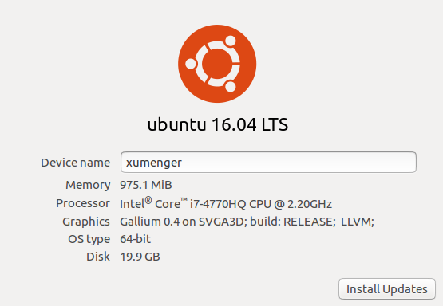
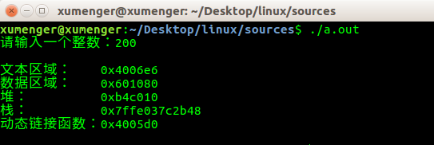
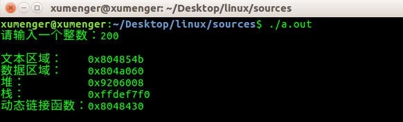
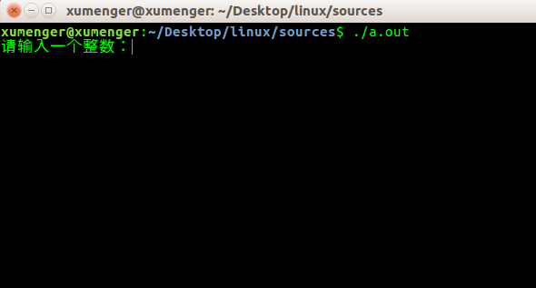
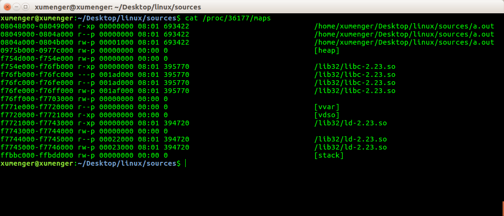
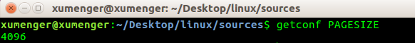

完全是对应[《Windows下32位进程内存模型》](http://www.xumenger.com/01-windows-process-memory-20170101/)顺便整理一份关于Linux进程的技术文章，都从用户进程层面对Linux、Windows操作系统内部分别进行尝试性的窥探！

以下的内容完全是直接参考[《Windows下32位进程内存模型》](http://www.xumenger.com/01-windows-process-memory-20170101/)中对应的例程、思路，然后在Linux平台上做的实验，并整理在Linux平台上关于进程内存的一些规律。可以对比两篇文章，对Windows和Linux的异同进行简单的了解

>强调一下，这两篇文章基本都是经验性的总结，而不是很专业化的理论性知识。目前还有还多以我目前的经验和现有的知识掌握程度所没有能够解释清楚的地方。所以必须在后续进行严谨的、深入的这方面的理论学习后，再回过头对其中的疑问点进行补充！

使用的Linux的版本是Ubuntu16，运行在Vmware虚拟机下，对应的配置如下



##Linux32位进程内存模型

类似于Windows平台的程序

```
#include <stdio.h>

int q[200];

int main(void)
{
    int i, n, *p;
    p = malloc(sizeof(int));
    printf("请输入一个整数：");
    scanf("%d", &n);
    for(i=0; i<200; i++){
        q[i] = i;
    }

    printf("\n");
    printf("文本区域：    %p\n", main);
    printf("数据区域：    %p\n", q);
    printf("堆：          %p\n", p);
    printf("栈：          %p\n", &n);
    printf("动态链接函数：%p\n", scanf);
    printf("\n");

    free(p);

    return 0;
}
```

执行`gcc memory.c`编译程序，然后运行程序



但是这是64位的程序，想要在64位的linux平台上编译得到32的程序需要如下处理

先执行`sudo apt-get install aptitude`安装aptitude

接着执行`sudo aptitude install ia32-libs libc6-i386`安装ia32-libs（ia32/i386框架的运行时库）、libc6-i386（运行在64位系统中的32位共享库）

然后执行`sudo aptitude install libc6-dev-i386`安装32-bit的开发库，主要是各种32位的头文件

不过此时执行`gcc memory.c`默认编译选项还是使用64位的头文件和链接64位的库，要想编译得到32位的程序，需要执行命令`gcc -m32 memory.c`

运行程序如下



>从运行输出的各个段的地址大小比较来看，确实符合下图的32位进程内存模型（比如栈内存地址大于堆内存地址……）。但[《Windows下32位进程内存模型》](http://www.xumenger.com/01-windows-process-memory-20170101/)之中对应的测试和我的初始预期仍有出入，具体原因还有待深究！


##Maps文件查看程序内存分布

开启一个Shell，执行`./a.out`运行上面编译得到的32位进程



当程序处于以上状态时，在另一个Shell中执行`ps a`显示现行终端机下的所有程序，包括其他用户的程序，可以看到对应的进程编号是36177


然后执行`cat /proc/36177/maps`命令就可以查看该进程在Linux上精确的内存布局情况



从显示结果中，可以看到文本和数据区域（从文件a.out中），以及堆和栈。从中也可以看到C库（对于调用scanf()、printf()、malloc()）被放在何处（从文件/lib32/libc-2.23.so中）。此外，还可以看到一个权限字段，比如：r-xp

##并非所有非法内存操作都会导致错误

如下代码

```
#include <stdio.h>

int q[200];

int main()
{
    int i;
    for (i=0; i<2000; i++){
        q[i] = i;
        printf("i值为%d时没有发生错误\n", i);

        printf("当前操作元素的首地址为：%p\n", &q[i]);
        printf("q[0]的首地址：%p\n", &q[0]);
        printf("q[199]的首地址：%p\n", &q[199]);
    }

    return 0;
}
```

执行`gcc -m32 array.c`编译程序，然后运行程序的结果如下


对于[《Windows下32位进程内存模型》](http://www.xumenger.com/01-windows-process-memory-20170101/)文章，同样用虚拟内存、内存页的理论来进行解释

执行`getconf PAGESIZE`命令，返回值单位为Bytes，可以看到当前机器的内存页大小是4096 Byte。参考[《Linux 获取内存页大小 》](http://blog.chinaunix.net/uid-16813896-id-5368280.html)



对于上面的程序，当数组越界时并没有立马出错，而是当**i=1007+1=1008**时才出现报错

按照程序运行的输出，q[]数组在地址0x804a35c+4=0x804a360处结束，即q[199]元素的首地址+4

考虑到内存页大小是4096 Bytes，程序是32位的程序，所以一个虚拟地址被分为20位的页号和12位的偏移量。在本程序中，q[]在虚拟页号0x0804a=32842处结束，偏移量是0x360=864，因此分配了q的页上仍有4096-864=3232个字节，该空间可以存放3232/4=808个整型变量，所以当试图访问第200+808=1008个元素时就要引用其他页上的地址，在这种情况下，它就是所谓的不具有写权限的页，虚拟内存硬件检测到了这一点，就触发了段错误

>以上可以完美的使用内存页机制进行解释，但[《Windows下32位进程内存模型》](http://www.xumenger.com/01-windows-process-memory-20170101/)之中对应的测试和我的初始预期仍有出入，具体原因还有待深究！

##简单总结

>Linux上的运行情况完全可以用进程内存模型、内存页的理论进行解释，但是Windows平台上对应的测试却和预期有出入，难道Windows平台的进程内存模型和Linux的进程内存模型、虚拟内存的权限机制等细节存在如此大的差别？
