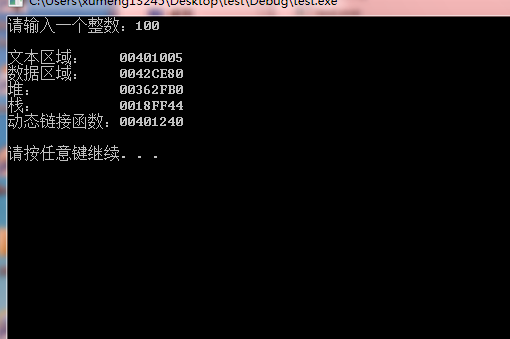
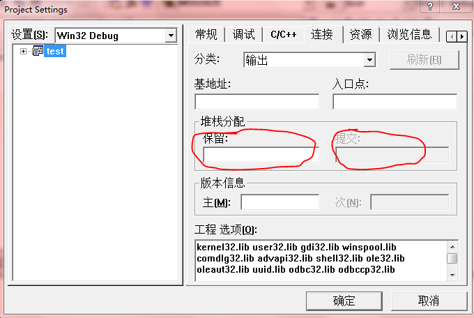
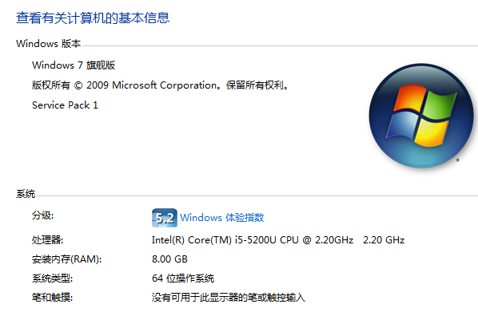
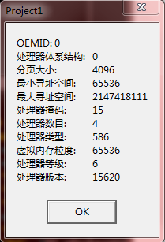
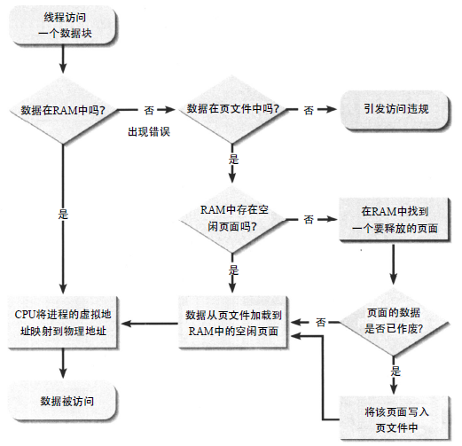
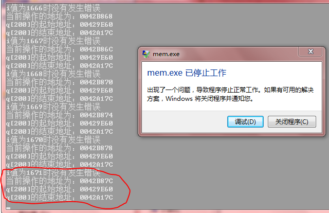
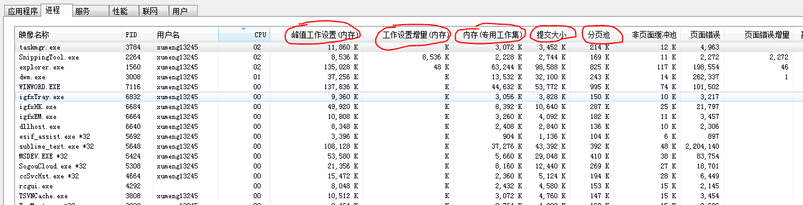
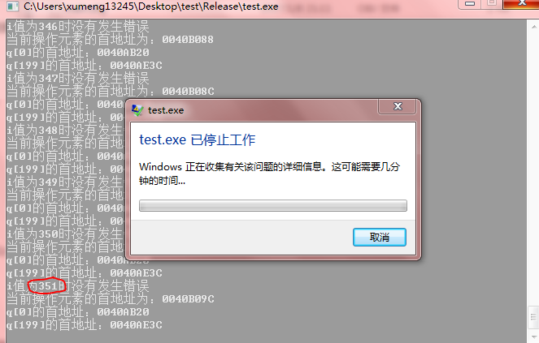

一般而言对于C/C++、Delphi这种直接涉及到底层的编程语言，如果程序出错，那么一般就是以下两个范畴中的一个

* 逻辑错误，比如if-else，预期进入if分支，结果走到else分支
* 程序崩溃，比如指针访问非法地址、栈溢出、重复释放同一块堆内存……导致错误

最常见的导致程序崩溃的原因是试图在未经允许的情况下访问一个内存单元，硬件会感知到这件事，并执行对操作系统的跳转。在Unix/Linux平台上一般会报段错误（segment fault），并停止程序的执行；在Windows平台上，对应的术语一般是保护错误（general protection fault）。以上的描述依赖的条件是硬件必须支持虚拟内存，而且操作系统必须使用虚拟内存才会发生这个错误

##内存中的程序布局

为程序分配的虚拟地址的布局如下


.text，文本段。由程序源码中的编译器产生的机器指令组成。例如每行C代码通常会转换成两至三条机器指令，所有机器指令的集合组成了可执行文件的文本部分。[《拷贝进程内存中的数据、函数指令》](http://www.xumenger.com/process-binary-copy-20161225/)中拷贝函数指令其实就是拷贝文本区域的内存。这一内存区域包括静态链接代码，包括做初始化工作的系统代码，然后调用main()

数据段。包含在编译时分配的所有程序变量，即全局变量。实际上，这个段由各种各样的子区域组成

* .data。由初始化过的变量组成，比如全局变量`int x = 5;`
* .bss。用于存放未初始化数据的区域，比如全局变量`int y;`

堆内存。当程序在运行时从操作系统中请求额外的内存时（比如在C语言中调用malloc，在C++中调用new时），请求的内存在名为堆的区域中分配。如果堆空间不够，可以通过调用brk()来扩展堆（这正是malloc()及相关函数所做的事情）

栈内存。用来动态分配数据的空间，函数调用的数据（包括参数、局部变量和返回地址）都存储在栈上。每次进行函数调用时栈都会增长，每次函数返回其调用者时栈都会收缩

由于位置的平台依赖性，上面的进程内存模型图中没有显示程序的动态连接代码，但动态连接代码确实在某个地方存在

使用在Windows7机器上使用VC6.0编写如下测试程序（使用C实现，而非C++），并使用Debug模式编译。输出文本区域、数据区域、栈、堆和动态链接函数的地址

```
#include <stdio.h>
#include <stdlib.h>

int q[200];

int main(void)
{
	int i, n, *p;
	p = malloc(sizeof(int));
	printf("请输入一个整数：");
	scanf("%d", &n);
	for(i=0; i<200; i++){
		q[i] = i;
	}

	printf("\n");
	printf("文本区域：    %p\n", main);
	printf("数据区域：    %p\n", q);
	printf("堆：          %p\n", p);
	printf("栈：          %p\n", &n);
	printf("动态链接函数：%p\n", scanf);
	printf("\n");
	
	free(p);

	system("pause");
	return 0;
}
```

程序运行效果如下



？？？？？？？？？？？？？为什么实际地址的输出和上面的内存模型图不一致？

如果是在Linux平台，还可以通过查看这个进程的maps文件来得到程序在Linux上的精确内存布局，比如进程号是10001，可以执行命令`cat /proc/10001/maps`查看

##栈内存相关

>每当创建一个线程时，系统就会为线程的堆栈保留一个堆栈空间区域，并将一些物理存储器交给这个已保留的区域（每个线程有它自己的栈）。按照默认设置，系统保留1MB的地址空间并提交两个页面的内存

单个线程中局部变量以及函数调用栈总大小超过1M（栈大小是可配置的），比如当函数递归调用的层次太深时就会出现栈溢出错误

在Windows 7上使用VC6编译程序，栈内存大小默认是1MB，如果你分配大于1MB的栈内存，一般会出现异常，可以通过【工程】-->【设置】-->【连接】-->【输出】设置



* “保留(reserve)”指定虚拟内存中的总的堆栈分配
	* 对于ARM、x86和x64计算机，默认值为1MB，最小值为4Byte
	* 如修改为4MB，则将“保留”改为0x400000
* “提交(commit)”取决于操作系统所做的解释
	* 在Windows WindowsRT中，它指定一次分配的物理内存的数量
	* 提交的虚拟内存导致被保留在页面文件中
	* 更高的commit值再应用程序需要更多堆空间时刻节省时间，但会增加内存需求并有可能延长启动时间
	* 对于ARM、x86和x64计算机，默认提交值是4KB

参考[《/STACK（堆栈分配）》](https://msdn.microsoft.com/zh-cn/library/8cxs58a6.aspx)

##获取系统信息

当前我使用的测试机器配置如下



通过下面的Delphi程序可以查看当前系统的相关信息

```
unit Unit1;

interface

uses
  Windows, Messages, SysUtils, Variants, Classes, Graphics, Controls, Forms,
  Dialogs, StdCtrls;

type
  TForm1 = class(TForm)
    btn1: TButton;
    procedure btn1Click(Sender: TObject);
  private
    { Private declarations }
  public
    { Public declarations }
  end;

var
  Form1: TForm1;

implementation

{$R *.dfm}

procedure TForm1.btn1Click(Sender: TObject);
var
  SI: TSystemInfo;
  SystemInfo: string;
begin
  GetSystemInfo(SI);

  SystemInfo := Format('OEMID:' + #9 + '%d', [SI.dwOemId]);
  SystemInfo := SystemInfo + #13#10 +Format('处理器体系结构:' + #9 + '%d', [SI.wProcessorArchitecture]);
  SystemInfo := SystemInfo + #13#10 + Format('分页大小:' + #9 + '%d', [SI.dwPageSize]);
  SystemInfo := SystemInfo + #13#10 + Format('最小寻址空间:' + #9 + '%d', [Integer(SI.lpMinimumApplicationAddress)]);
  SystemInfo := SystemInfo + #13#10 + Format('最大寻址空间:' + #9 + '%d', [Integer(SI.lpMaximumApplicationAddress)]);
  SystemInfo := SystemInfo + #13#10 + Format('处理器掩码:' + #9 + '%d', [SI.dwActiveProcessorMask]);
  SystemInfo := SystemInfo + #13#10 + Format('处理器数目:' + #9 + '%d', [SI.dwNumberOfProcessors]);
  SystemInfo := SystemInfo + #13#10 + Format('处理器类型:' + #9 + '%d', [SI.dwProcessorType]);
  SystemInfo := SystemInfo + #13#10 + Format('虚拟内存粒度:' + #9 + '%d', [SI.dwAllocationGranularity]);
  SystemInfo := SystemInfo + #13#10 + Format('处理器等级:' + #9 + '%d', [SI.wProcessorLevel]);
  SystemInfo := SystemInfo + #13#10 + Format('处理器版本:' + #9 + '%d', [SI.wProcessorRevision]);

  ShowMessage(SystemInfo);
end;

end.
```

点击按钮后输出如下



>说明：本文使用的测试机器是64位，操作系统是64位，所有的测试程序（C、Delphi）是32位程序

##虚拟内存和页

在进程内存模型的图中，虚拟地址空间概念上从0延伸到2^w-1，其中w表示当前机器是多少位机器。对于32位进程来说，虚拟地址空间为4GB，因为32位指针可以拥有从0x00000000至0xFFFFFFFF之间的任何一个值

当然程序通常只会使用该空间的很少一部分，操作系统可能保留空间的一部分留给自己使用。但是程序员编写的代码可以通过指针在该范围的任何地方生成地址。通常这样的地址会是错误的，原因在于程序中有程序错误

>比如对于32位Windows而言，只有4G的内存，如果操作系统需要2G（内核方式分区），那么剩下只有2G给用户进程使用（用户方式分区）。操作系统使用多少内存其实是可配置的

虚拟地址空间是通过称为页(page)的块来查看的。在Pentium硬件上，默认页大小是4096字节，如上面的输出，本台测试机器的页大小是4096字节

上面提到了VC6设置栈内存时，提到默认ARM、x86、x64的commit是4KB，其实就是默认的页大小是4KB，也就是4096字节

>操作系统以内存页为单位管理内存，内存页的大小对系统性能有影响。内存页设得太小，内存页会很多，管理内存页的数组会比较大，耗内存，同时TLB大小是固定的，导致TLB MISS增加。所谓的TLB就是把虚拟内存页面与物理内存页面的转换结果存起来，不用每次都用MMU做转换。内存页设大了，因为一个进程拥有的内存是内存页大小的整数倍，会导致内存碎片，即申请了很多内存，真正用到的只有一点。所以需要根据不同的应用场合选择对应的合适的内存页大小设置。就线上服务器来说，一般只跑少数几个进程，内存大都是被某个进程所用，这时候可以把内存页设置的比较大

物理内存（包括RAM和ROM）也都是分成页来查看的。当程序被加载到内存中执行时，操作系统会安排程序的部分页存储到物理内存的页中。这些页称为被“驻留”，其余部分存储在磁盘上

在执行期间的各个阶段，将需要一些当前没有驻留的程序页，当发生这种情况时，硬件会感知到，将控制转移给操作系统。后者将所需页带到内存中，可能会替换掉当前驻留的另一个程序页（如果没有可用的自由内存页），然后将控制返回给程序。如果有被驱逐的程序页，就会变成非驻留页，被存储在磁盘上

为了管理所有这些操作，操作系统为每个进程设立一个页表(page table)。（页表一般有一个层次结构，但这里为了简单起见，假定只有一层）

进程的每个虚拟页在表中都有对应的一个项(entry)，其中包括如下信息：

* 这个页的当前物理地址在内存中或磁盘上。如果是在磁盘上，页表上对应的项会指示该页是非驻留的，可能由一个指向最终导致磁盘上的物理位置的指针组成。例如，它可能显示：程序的虚拟页12是驻留的，位于内存的物理页200中
* 该页的权限分为3中：读、写、执行

>操作系统不会将不完整的页分配给程序。例如如果要运行的程序大约有10000字节，如果被完全加载，会占3个内存页。它不会仅占2.5个页，因为页是在虚拟内存系统能够操作的最小内存单元。这是调试时要着重了解的情况。因为这一点暗示了程序的一些错误内存访问不会触发段错误。换言之，在调试会话期间，不能进行如此武断的得到结论：这行代码一定没有问题，因为它没有引起段错误

##内存地址寻址

假如有很多的进程同时启动，虽然很多进程自己的虚拟地址空间并不会真的达到2G，但是很多的进程同时运行，总共的虚拟地址空间的和绝对可能超过物理内存的大小，那么这时候要怎么办？

物理地址放不下这么多的内存，这时候就需要用到虚拟内存，操作系统就需要长时间不运行的进程的内存从物理内存中移出到虚拟内存（比如使用最近未使用页面置换算法、先进先出页面置换算法等多种算法），这样物理内存中真正存放的是正在运行的进程的内存

虚拟内存实际是在机器上的一块磁盘空间，如果页面替换的算法处理的不合理可能导致进程的内存在物理内存和虚拟内存之间数据的频繁的来回移动，就会导致在磁盘和物理内存之间的频繁拷贝，就会导致电脑很卡

内存地址寻址流程图大致如下



##页与访问权限

假设页大小是4096字节。然后虚拟页0包含虚拟地址空间第0~4095字节，页1包括4096~8191字节，以此类推

当我们运行程序时，操作系统创建一个用来管理执行程序代码进程的虚拟内存页表。每当该进程运行时，硬件的页表寄存器都会指向该表

从概念上将，进程虚拟地址空间的每个页在页表中都有一个页表项。这个页表项存储与该页相关的各块信息。与段错误相关的数据是该页的访问权限，它类似于文件访问权限：读、写、执行。例如页3的页表项将之处进程是否具有从该页读取数据的权限，向该页写数据的权限，以及在该页上执行指令的权限（如果页中包含机器码）

当程序执行时，它会如上文所述连续访问各个区域，导致硬件按以下几种情况所示处理页表

* 每次程序使用其全局变量之一时，需要具有对数据区域的读/写访问权限
* 每次程序访问局部变量时，程序会访问栈，需要对栈区域具有读/写访问权限
* 每次程序进入或离开函数时，对该栈进行一次或多次访问，需要对栈区域具有读/写访问权限
* 每次程序访问通过调用malloc()或new创建的存储器时，都会发生堆访问，也需要具有读/写访问权限
* 程序执行的每个机器指令是从文本区域（或动态链接码的区域）取出的，因此需要具有读和可执行权限

>在程序的执行期间，生成的地址会是虚拟的。当程序试图访问某个虚拟地址处的内存时，比如y，硬件就会将其转换成虚拟页号v，它等于y除以4096（其中除法是整除算法，舍去余数）。然后硬件会检查页表中的页表项v来查看该页的权限是否与要执行的操作匹配。如果匹配，硬件就会从这个页表项中得到所需位置的实际物理页号，然后完成请求的内存操作。但如果该页表项显示请求的操作不具有恰当的权限，硬件就会执行内部中断，这会导致跳转到操作系统的错误处理例程。然后操作系统一般会宣告一个内存访问违法，并停止程序的执行（即从进程表和内存中去掉该进程）

例如程序中有以下全局声明

```
int arr[100];
```

然后有如下语句

```
arr[i] = 1;
```

在C/C++中，表达式arr[i]等价于*(arr+i)，即地址arr+i指向内存地址的内容。如果偏移量i为1000000，那么这个表达式可能会产生虚拟内存y，它超出了操作系统为该程序的数据区域执行的页组范围（编译器和连接程序为存储数组arr[]安排的地方）。然后当试图执行写操作时就会发生错误

如果arr是局部变量，那么会在栈区域发生同样的错误

与执行权限相关的违法的发生方式更微妙。例如在汇编语言程序中，假设有一个名为finc的数据项和一个名为func()函数，当调用这个函数时错误写出

```
call finc
```

而不是

```
call func
```

也会导致错误，因为程序会试图在finc的地址处执行指令，该地址位于数据区域，而数据区域的页没有启动执行权限

##并非所有非法内存操作都会导致错误

如下代码

```
#include <stdio.h>
#include <stdlib.h>

int q[200];

int main()
{
	int i;
	for (i=0; i<2000; i++){
		q[i] = i;
		printf("i值为%d时没有发生错误\n", i);
	}

	system("pause");
	return 0;
}
```

Windows7机器上，使用VC6的Debug模式编译该程序，以上的程序中设置循环了2000次，而不是200次，明显超过了数组q[200]的边界。运行结果如下



Debug模式下执行时会发生错误，但是并不是在i=200时出现错误，如上面的截图，而是在i=1671之后出错

使用Release模式编译的话，运行结果如下



Release模式下的运行情况和Debug的模式有所差别，Release模式下，在i=351之后出错

针对这个测试，我们主要对Release模式下的运行效果进行解释。正如[《汇编与逆向基础：VC++6.0 调试模式下探究Win32进程内存模型》](http://www.xumenger.com/windows-vcpp-debug-20161203/)中所描述的，Debug模式和Release模式在编译层面会有比较大的差别

我们修改一下程序，输出q[]数组的起始和结束地址

```
#include <stdio.h>
#include <stdlib.h>

int q[200];

int main()
{
	int i;
	for (i=0; i<2000; i++){
		q[i] = i;
		printf("i值为%d时没有发生错误\n", i);

		printf("当前操作的地址为：%p\n", &q[i]);
		printf("q[200]的起始地址：%p\n", &q[0]);
		printf("q[200]的结束地址：%p\n", &q[199]);
	}

	system("pause");
	return 0;
}
```

运行输出如下，还是在i=351之后出错，也就是想要访问q[352]时出错


根据以上的输出，可以看到q[200]的起始地址为0x0040AB20，结束地址是0x0040AE3C，当前正在访问的地址是0x0040B09C

考虑到本台测试机器的页大小是4096字节，进程是32位的。所以虚拟地址被分解为20位的页号和12位的偏移量。本例中，q[]数组的结束地址所在的虚拟页号是0x0040A=1034，偏移量是0xE3C=3644。因此分配了q的内存的页上仍然有4096-3644=452字节，该空间可以存放452/4=113个int型变量

如上面的运行情况，当出现越界写操作时，编译器在编译时没有报错，在一定范围的越界时硬件也没有报错。因为这种写操作仍然是在我们肯定具有写权限的页上执行的（因为q[]的实际元素位于该数据段上，所以在其中分配了q[]），只有当i变成351+1时，q[i]才会引用某个页上不具备写权限的内存。在这种情况下，它就是我们所说的不具有写权限的内存，虚拟内存硬件检测到这一点，并触发了一个错误

由于每个整数变量都存储在4字节中，因此这个页包含113(452/4)个额外的“幻影”元素，代码将它作为属于数组q[]对待，因此虽然我们没有打算应按这样的方式处理，但访问q[200]、q[201]..一直到元素199+113=312，即q[312]仍然是合法的（不会导致非法内存访问），只有当试图访问q[313]时才会遇到新页，你可能有也可能没有对它的必需访问权限。但这个例子中，我们的程序没有在访问q[313]时报错，说明对下一个页还是有写权限，但是继续往下访问，直到尝试去访问q[352]时，才遇到不可写的内存才导致出错

？？？？？？？？？为什么不是访问到下一个页开始处就报错，而是在下一个内存页操作了部分内存后才报错？？？

？？？？？？？？？这里我们不具有对该页的访问权限，因此发生了错误。然而下一个页可能侥幸具有指定给它的恰当权限，然后甚至会有更多幻影数组元素

##Windows资源管理器

如下所示的Windows资源管理器中的截图



其中峰值工作设置、工作设置增量、内存(专用工作集)、提交大小分别代表什么意思？

* 工作设置：程序占用的物理内存（包含与其他程序共享的一部分）
	* 其值等于 专用工作集 + 与其他进程共享的物理内存
* 高峰工作集（峰值工作设置）：进程所使用的工作设置的最大数量
* 工作集增量（工作设置增量）：进程所使用的工作设置的更改量
* 专用工作集：程序独占的物理内存
* 提交大小：程序独占的内存，包括物理内存和在页面文件中的内存
	* 页面文件不存放在物理内存中的内存，文件路径一般在C:\pagefile.sys
	* 目的是为了能够让更多的进程运行，即使合起来所占用的内存已经超过物理内存，只要将其中一部分内存转入页面文件，物理内存就可以空出来继续运行新的进程了
	* 其值等于 专用工作集 + 保存在页面文件中的独占内存
* 页面缓冲池（分页池）：可以写入其他存储媒体（如硬盘）的某个进程的认可虚拟内存数量
* 非页面缓冲池：无法写入其他存储媒体的某个进程的认可虚拟内存数量
* 页面错误：
* 页面错误增量：

参见[《windows任务管理器中的工作设置内存,内存专用工作集,提交大小详解》](shashanzhao.com/archives/832.html)