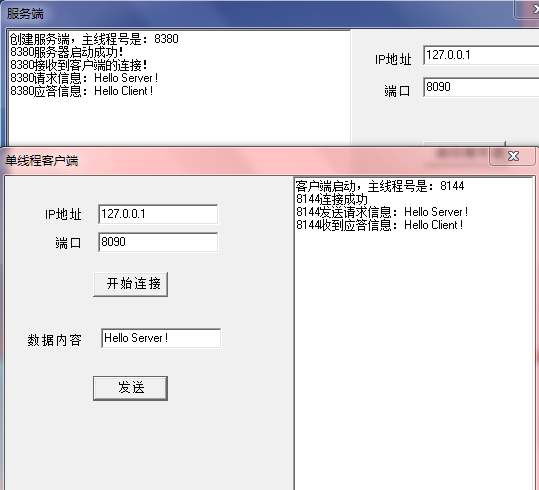
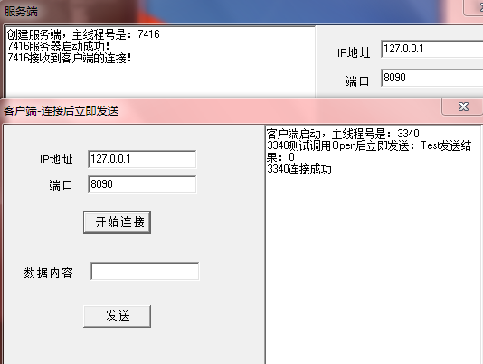

## Add in 2017-03-30

真实的线程分布情况并非下面所说的这样，以下的总结只是因为最开始接触ScktComp时，通过实验然后作出的“合理”猜测

真实的线程分布情况在阻塞、非阻塞情况下各有不同，总之并不完全像以下描述的（当然下面的描述有对有错）！

---

本文介绍一下使用Delphi的网络编程组件ServerSocket/ClientSocket时连接、发送、接收的一些注意事项，以及对应程序内部的线程分布情况

说明，本文所有测试程序的源码，点击[这里](../download/20170103/testSocket.rar)下载

## 服务端程序

本文主要测试客户端ClientSocket的语法细节，对应的服务端程序如下（注意其中也在各个关键函数中输出了线程号，后续在测试客户端时也要去观察一下服务端的线程分布情况）

```
unit MainForm;

interface

uses
  Windows, Messages, SysUtils, Variants, Classes, Graphics, Controls, Forms,
  Dialogs, StdCtrls, ScktComp, CommonData;

type
  TForm1 = class(TForm)
    mmo1: TMemo;
    lblIP: TLabel;
    edtIP: TEdit;
    lblPort: TLabel;
    edtPort: TEdit;
    btnStart: TButton;
    procedure FormCreate(Sender: TObject);
    procedure FormDestroy(Sender: TObject);
    procedure btnStartClick(Sender: TObject);
  private
    { Private declarations }
  public
    procedure OnClientConnect(Sender: TObject; Socket: TCustomWinSocket);
    procedure OnClientRead(Sender: TObject; Socket: TCustomWinSocket);
  end;

var
  Form1: TForm1;
  Server: TServerSocket;

implementation

{$R *.dfm}

procedure TForm1.FormCreate(Sender: TObject);
begin
  Server := TServerSocket.Create(nil);
  mmo1.Lines.Add('创建服务端，线程号是：' + IntToStr(GetCurrentThreadId));
end;

procedure TForm1.FormDestroy(Sender: TObject);
begin
  Server.Close;
  Server.Free;
end;

procedure TForm1.btnStartClick(Sender: TObject);
var
  IP: string;
  Port: Integer;
begin
  IP := edtIP.Text;
  Port := StrToInt(edtPort.Text);

  Server.Port := Port;
  Server.OnClientConnect := OnClientConnect;       //当有某个客户端连接上后，回调该方法
  Server.OnClientRead := OnClientRead; 
  Server.Open;

  mmo1.Lines.Add(IntToStr(GetCurrentThreadId) + '服务器启动成功！');
end;

procedure TForm1.OnClientConnect(Sender: TObject; Socket: TCustomWinSocket);
begin
  mmo1.Lines.Add(IntToStr(GetCurrentThreadId) + '接收到客户端的连接！');
end;

procedure TForm1.OnClientRead(Sender: TObject; Socket: TCustomWinSocket);
var
  reqMsg: string;
  respMsg: string;
begin
  if Socket.ReceiveLength > 0 then
  begin
    reqMsg := Socket.ReceiveText;
    mmo1.Lines.Add(IntToStr(GetCurrentThreadId) + '请求信息：' + reqMsg);

    respMsg := 'Hello Client !';
    Socket.SendText(respMsg);
    mmo1.Lines.Add(IntToStr(GetCurrentThreadId) + '应答信息：' + respMsg);    
  end;
end;

end.
```

## 单线程：调用连接等连接成功后再发送

>在主线程调用Socket的发送方法

```
unit MainForm;

interface

uses
  Windows, Messages, SysUtils, Variants, Classes, Graphics, Controls, Forms,
  Dialogs, StdCtrls, ScktComp;

type
  TForm1 = class(TForm)
    lblIP: TLabel;
    lblPort: TLabel;
    edtIP: TEdit;
    edtPort: TEdit;
    btnConnect: TButton;
    lblMessage: TLabel;
    edtMessage: TEdit;
    btnSend: TButton;
    mmo1: TMemo;
    procedure FormCreate(Sender: TObject);
    procedure FormDestroy(Sender: TObject);
    procedure btnConnectClick(Sender: TObject);
    procedure btnSendClick(Sender: TObject);
  private
    { Private declarations }
  public
    procedure SocketConnect(Sender: TObject; Socket: TCustomWinSocket);
    procedure SocketRead(Sender: TObject; Socket: TCustomWinSocket);
  end;

var
  Form1: TForm1;
  Client: TClientSocket;

implementation

{$R *.dfm}

procedure TForm1.FormCreate(Sender: TObject);
begin
  Client := TClientSocket.Create(nil);
  mmo1.Lines.Add('客户端启动，主线程号是：' + IntToStr(GetCurrentThreadId))
end;

procedure TForm1.FormDestroy(Sender: TObject);
begin
  Client.Free;
end;

procedure TForm1.btnConnectClick(Sender: TObject);
var
  IP: string;
  Port: Integer;
begin
  IP := edtIP.Text;
  Port := StrToInt(edtPort.Text);
  Client.Host := IP;
  Client.Port := Port;
  Client.OnConnect := SocketConnect;
  Client.OnRead := SocketRead;
  Client.Open;
end;

procedure TForm1.btnSendClick(Sender: TObject);
var
  SendMsg: string;
begin
  SendMsg := edtMessage.Text;
  Client.Socket.SendText(SendMsg);
  mmo1.Lines.Add(IntToStr(GetCurrentThreadId) + '发送请求信息：' + SendMsg);
end;

procedure TForm1.SocketConnect(Sender: TObject; Socket: TCustomWinSocket);
begin
  Form1.mmo1.Lines.Add(IntToStr(GetCurrentThreadId) + '连接成功');
end;

procedure TForm1.SocketRead(Sender: TObject; Socket: TCustomWinSocket);
var
  RecvMsg: string;
begin
  try
    if Socket.ReceiveLength > 0 then
    begin
      RecvMsg := Socket.ReceiveText;
      mmo1.Lines.Add(IntToStr(GetCurrentThreadId) + '收到应答信息：' + RecvMsg)

    end;
  except
    on E: Exception do
    begin
      mmo1.Lines.Add('接收应答出现异常！');
    end;
  end;
end;

end.
```

使用上面的服务端进行测试，从启动，到连接，到发送，到应答的截图如下



可以看到对于服务端，创建服务端ServerSocket、接收客户端连接、接收客户端请求信息的回调函数等都是在主线程中执行的

对于客户端，可以看到创建ClientSocket、连接成功响应、收到应答响应也都是在主线程中执行的

>关于回调到底是在哪个线程中执行的，以上的总结是有问题的，并不像上面说的都是在主线程中回调。这里的总结是存在一些问题的，莫轻信！

>后续在开发中发现，回调并不一定在主线程，和ScktComp的ServerSocket/ClientSocket创建或开启的线程有关，**接下来需阅读ScktComp源码弄清楚这一点**

## 单线程：调用连接后立即调用发送

客户端的代码修改如下，在调用Open连接服务端后，立即调用Send方法发送数据，看服务端是否能收到？

```
unit MainForm;

interface

uses
  Windows, Messages, SysUtils, Variants, Classes, Graphics, Controls, Forms,
  Dialogs, StdCtrls, ScktComp;

type
  TForm1 = class(TForm)
    lblIP: TLabel;
    lblPort: TLabel;
    edtIP: TEdit;
    edtPort: TEdit;
    btnConnect: TButton;
    lblMessage: TLabel;
    edtMessage: TEdit;
    btnSend: TButton;
    mmo1: TMemo;
    procedure FormCreate(Sender: TObject);
    procedure FormDestroy(Sender: TObject);
    procedure btnConnectClick(Sender: TObject);
    procedure btnSendClick(Sender: TObject);
  private
    { Private declarations }
  public
    procedure SocketConnect(Sender: TObject; Socket: TCustomWinSocket);
    procedure SocketRead(Sender: TObject; Socket: TCustomWinSocket);
  end;

var
  Form1: TForm1;
  Client: TClientSocket;

implementation

{$R *.dfm}

procedure TForm1.FormCreate(Sender: TObject);
begin
  Client := TClientSocket.Create(nil);
  mmo1.Lines.Add('客户端启动，主线程号是：' + IntToStr(GetCurrentThreadId))
end;

procedure TForm1.FormDestroy(Sender: TObject);
begin
  Client.Free;
end;

procedure TForm1.btnConnectClick(Sender: TObject);
var
  IP: string;
  Port: Integer;
  SendMsg: string;
  Ret: Integer;
begin
  IP := edtIP.Text;
  Port := StrToInt(edtPort.Text);
  Client.Host := IP;
  Client.Port := Port;
  Client.OnConnect := SocketConnect;
  Client.OnRead := SocketRead;
  Client.Open;

  //测试调用连接后立马调用发送
  SendMsg := 'Test';
  Ret := Client.Socket.SendText(SendMsg);
  mmo1.Lines.Add(IntToStr(GetCurrentThreadId) + '测试调用Open后立即发送：' + SendMsg + '发送结果：' + IntToStr(Ret));
end;

procedure TForm1.btnSendClick(Sender: TObject);
var
  SendMsg: string;
begin
  SendMsg := edtMessage.Text;
  Client.Socket.SendText(SendMsg);
  mmo1.Lines.Add(IntToStr(GetCurrentThreadId) + '发送请求信息：' + SendMsg);
end;

procedure TForm1.SocketConnect(Sender: TObject; Socket: TCustomWinSocket);
begin
  Form1.mmo1.Lines.Add(IntToStr(GetCurrentThreadId) + '连接成功');
end;

procedure TForm1.SocketRead(Sender: TObject; Socket: TCustomWinSocket);
var
  RecvMsg: string;
begin
  try
    if Socket.ReceiveLength > 0 then
    begin
      RecvMsg := Socket.ReceiveText;
      mmo1.Lines.Add(IntToStr(GetCurrentThreadId) + '收到应答信息：' + RecvMsg)

    end;
  except
    on E: Exception do
    begin
      mmo1.Lines.Add('接收应答出现异常！');
    end;
  end;
end;

end.
```

点击客户端的开始连接按钮后，运行效果如下！服务端并没有收到客户端发送的信息，而且客户端调用SendText的返回值是0，也说明没有发送成功



仔细看一下，连接成功的回调在发送之后才有，所以在调用发送之前，客户端认为是没有成功连接到客户端的，所以对应做以下修改

```
unit MainForm;

interface

uses
  Windows, Messages, SysUtils, Variants, Classes, Graphics, Controls, Forms,
  Dialogs, StdCtrls, ScktComp;

type
  TForm1 = class(TForm)
    lblIP: TLabel;
    lblPort: TLabel;
    edtIP: TEdit;
    edtPort: TEdit;
    btnConnect: TButton;
    lblMessage: TLabel;
    edtMessage: TEdit;
    btnSend: TButton;
    mmo1: TMemo;
    procedure FormCreate(Sender: TObject);
    procedure FormDestroy(Sender: TObject);
    procedure btnConnectClick(Sender: TObject);
    procedure btnSendClick(Sender: TObject);
  private
    { Private declarations }
  public
    procedure SocketConnect(Sender: TObject; Socket: TCustomWinSocket);
    procedure SocketRead(Sender: TObject; Socket: TCustomWinSocket);
  end;

var
  Form1: TForm1;
  Client: TClientSocket;

implementation

{$R *.dfm}

procedure TForm1.FormCreate(Sender: TObject);
begin
  Client := TClientSocket.Create(nil);
  mmo1.Lines.Add('客户端启动，主线程号是：' + IntToStr(GetCurrentThreadId))
end;

procedure TForm1.FormDestroy(Sender: TObject);
begin
  Client.Free;
end;

procedure TForm1.btnConnectClick(Sender: TObject);
var
  IP: string;
  Port: Integer;
  SendMsg: string;
  Ret: Integer;
begin
  IP := edtIP.Text;
  Port := StrToInt(edtPort.Text);
  Client.Host := IP;
  Client.Port := Port;
  Client.OnConnect := SocketConnect;
  Client.OnRead := SocketRead;
  Client.Open;

  {
  //测试调用连接后立马调用发送
  SendMsg := 'Test';
  Ret := Client.Socket.SendText(SendMsg);
  mmo1.Lines.Add(IntToStr(GetCurrentThreadId) + '测试调用Open后立即发送：' + SendMsg + '发送结果：' + IntToStr(Ret));
  }

  //等待连接成功
  while not Client.Active do
  begin
    Application.ProcessMessages;
    Sleep(10);
  end;
  SendMsg := 'Test';
  Ret := Client.Socket.SendText(SendMsg);
  mmo1.Lines.Add(IntToStr(GetCurrentThreadId) + '测试调用Open后立即发送：' + SendMsg + '发送结果：' + IntToStr(Ret));
end;

procedure TForm1.btnSendClick(Sender: TObject);
var
  SendMsg: string;
begin
  SendMsg := edtMessage.Text;
  Client.Socket.SendText(SendMsg);
  mmo1.Lines.Add(IntToStr(GetCurrentThreadId) + '发送请求信息：' + SendMsg);
end;

procedure TForm1.SocketConnect(Sender: TObject; Socket: TCustomWinSocket);
begin
  Form1.mmo1.Lines.Add(IntToStr(GetCurrentThreadId) + '连接成功');
end;

procedure TForm1.SocketRead(Sender: TObject; Socket: TCustomWinSocket);
var
  RecvMsg: string;
begin
  try
    if Socket.ReceiveLength > 0 then
    begin
      RecvMsg := Socket.ReceiveText;
      mmo1.Lines.Add(IntToStr(GetCurrentThreadId) + '收到应答信息：' + RecvMsg)

    end;
  except
    on E: Exception do
    begin
      mmo1.Lines.Add('接收应答出现异常！');
    end;
  end;
end;

end.
```

运行效果如下


首先服务端确实收到了客户端发送过来的信息，而且调用SendText的返回值是4，说明发送了长度为4的字符串

上面的程序中在发送之前加了下面的代码

```
  //等待连接成功
  while not Client.Active do
  begin
    Application.ProcessMessages;
    Sleep(10);
  end;
```

因为ClientSocket通过Active判断是否连接成功，而Active是在客户端回调OnConnect的时候置为True的，所以需要通过`Application.ProcessMessages;`让主线程在调用`Client.Open;`后先响应OnConnect事件（将Active置为True），然后再调用SendText方法发送数据时客户端就连接成功了，当然也就可以发送数据了
