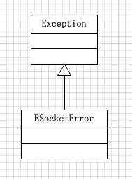
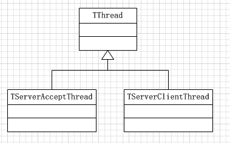
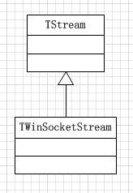
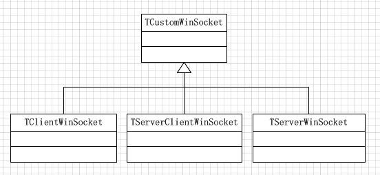

Delphi的网络编程组件ServerSocket/ClientSocket，这两个类是对底层的WinSockAPI做了封装后给开发者的新形式的网络编程的接口。所以通过研究ServerSocket/ClientSocket的源码不失为一种好的学习网络编程、学习代码封装的好资源

ServerSocket、ClientSocket的源码对应在ScktComp这个单元中，对应的源码可以点击[这里](../download/20170103/ScktComp.rar)下载。也就2000多行的代码而已

##类图

以下是ScktComp单元中涉及到的所有类

##异常类

##线程类

##流

##CustomWinSocket类

##CustomSocket类

