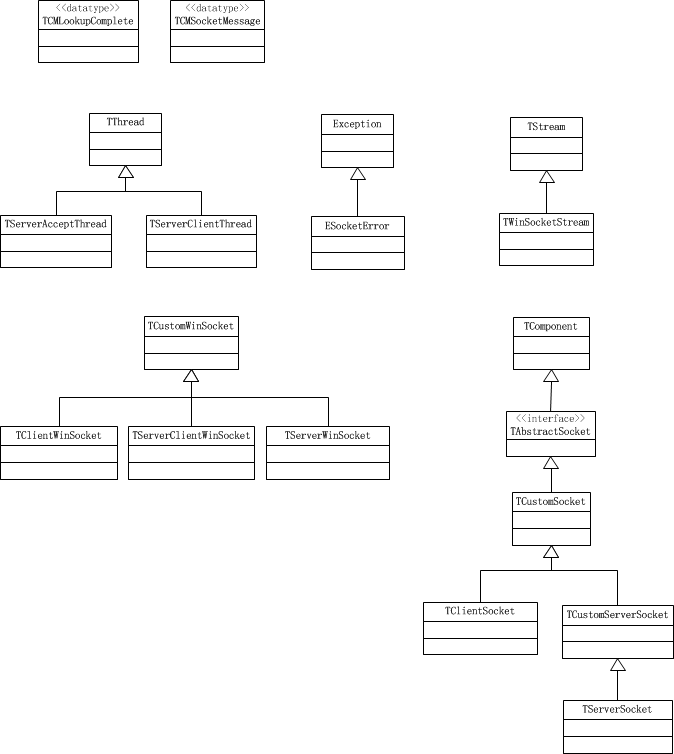

之前在[《Delphi网络编程：使用ServerSocket/ClientSocket》](http://www.xumenger.com/windows-delphi-socket-20161010/)、[《Delphi网络编程：阻塞和非阻塞》](http://www.xumenger.com/windows-delphi-socket-20161011/)、[《Delphi网络编程：发送和接收二进制数据》](http://www.xumenger.com/delphi-binary-socket-20161222/)、[《Delphi网络编程：ServerSocket/ClientSocket的线程分布》](http://www.xumenger.com/01-delphi-socket-thread-20170103/)这几篇文章中对Delphi的ClientSocket/ServerSocket如何应用做了简单的归纳，但依然觉得太不深刻，所以要对它们的源码实现好好研究一下

Delphi的网络编程组件ServerSocket/ClientSocket，这两个类是对底层的WinSockAPI做了封装后给开发者的新形式的网络编程的接口。所以通过研究ServerSocket/ClientSocket的源码不失为一种好的学习网络编程、学习代码封装的好资源

ServerSocket、ClientSocket的源码对应在ScktComp这个单元中，对应的源码可以点击[这里](../download/20170103/ScktComp.rar)下载。也就2000多行的代码而已

##类图

以下是ScktComp单元中涉及到的所有类



以下对该单元中的各个类进行简单的列举和简单的说明，详细的解析内容参见后面对应的分析文章

主要分为以下：

* 异常类ESocketError：该类继承自Exception，主要用于本单元所有的异常管理
* 线程类：主要是线程TServerAcceptThread、TServerClientThread
* 流：TWinSocketStream，继承自TStream类
* CustomWinSocket类：：主要有子类TClientWinSocket、TServerClientWinSocket、TServerWinSocket
* CustomSocket类：TCustomSocket、TClientSocket、TCustomServerSocket、TServerSocket

##先应用再钻研

直接去看一份陌生的源码往往是没有头绪的，幸好之前使用ClientSocket、ServerSocket做了不少的开发，也整理了一些文章对ClientSocket、ServerSocket的调用语法和特点进行了简单的总结。充分利用以往开发实践的经验再反过来看接口的内部实现，往往是很好的分析源码的方法

>正向思维、逆向思维都要充分应用

##客户端连接

```
var
  Client: TClientSocket;
begin
  ...

  //设置连接的服务端的IP
  Client.Host := IP;
  //设置连接的服务端的端口
  Client.Port := Port;
  //设置连接成功回调函数
  Client.OnConnect := SocketConnect;
  //设置收到应答回调函数
  Client.OnRead := SocketRead;
  //开始连接  
  Client.Open;

  ...
end;
```

TClientSocket继承自TCustomSocket，在TCustomSocket类中有定义各种回调函数

```
  TCustomSocket = class(TAbstractSocket)
  private
    FOnLookup: TSocketNotifyEvent;
    FOnConnect: TSocketNotifyEvent;
    FOnConnecting: TSocketNotifyEvent;
    FOnDisconnect: TSocketNotifyEvent;
    FOnListen: TSocketNotifyEvent;
    FOnAccept: TSocketNotifyEvent;
    FOnRead: TSocketNotifyEvent;
    FOnWrite: TSocketNotifyEvent;
    FOnError: TSocketErrorEvent;
  protected
    ...
```

其中TSocketErrorEvent是一个函数指针类型

```
TSocketNotifyEvent = procedure (Sender: TObject; Socket: TCustomWinSocket) of object;
```

其中FOnConnect就是客户端连接成功后的回调函数、FOnRead是收到请求信息时的回调函数，其在TCustomSocket的Event方法中根据不同的事件而进行回调

```
procedure TCustomSocket.Event(Socket: TCustomWinSocket; SocketEvent: TSocketEvent);
begin
  case SocketEvent of
    seLookup: if Assigned(FOnLookup) then FOnLookup(Self, Socket);
    seConnecting: if Assigned(FOnConnecting) then FOnConnecting(Self, Socket);
    seConnect:
      begin
        FActive := True;
        if Assigned(FOnConnect) then FOnConnect(Self, Socket);
      end;
    seListen:
      begin
        FActive := True;
        if Assigned(FOnListen) then FOnListen(Self, Socket);
      end;
    seDisconnect:
      begin
        FActive := False;
        if Assigned(FOnDisconnect) then FOnDisconnect(Self, Socket);
      end;
    seAccept: if Assigned(FOnAccept) then FOnAccept(Self, Socket);
    seRead: if Assigned(FOnRead) then FOnRead(Self, Socket);
    seWrite: if Assigned(FOnWrite) then FOnWrite(Self, Socket);
  end;
end;
```

很明显，在收到seConnect事件时，先将FActive设置为True，然后再回调具体的OnConnect函数。这里关于Active就和[《Delphi网络编程：ServerSocket/ClientSocket的线程分布》](http://www.xumenger.com/01-delphi-socket-thread-20170103/)一文中的相关说明对应上了

##客户端发送

```
  ...

  SendMsg := edtMessage.Text;

  //Client是TClientSocket类型
  //Client.Socket是TCustomWinSocket类型
  Client.Socket.SendText(SendMsg);

  ...
```

进入SendText方法，可以看到其实现代码如下

```
function TCustomWinSocket.SendText(const s: string): Integer;
begin
  Result := SendBuf(Pointer(S)^, Length(S));
end;
```

继续进入SendBuf内部看其实现逻辑

```
function TCustomWinSocket.SendBuf(var Buf; Count: Integer): Integer;
var
  ErrorCode: Integer;
begin
  Lock;
  try
    Result := 0;
    if not FConnected then Exit;
    Result := send(FSocket, Buf, Count, 0);
    if Result = SOCKET_ERROR then
    begin
      ErrorCode := WSAGetLastError;
      if (ErrorCode <> WSAEWOULDBLOCK) then
      begin
        Error(Self, eeSend, ErrorCode);
        Disconnect(FSocket);
        if ErrorCode <> 0 then
          raise ESocketError.CreateResFmt(@sWindowsSocketError,
            [SysErrorMessage(ErrorCode), ErrorCode, 'send']);
      end;
    end;
  finally
    Unlock;
  end;
end;
```

可以看到发送之前调用`Lock`对其进行加锁（临界区）保护了，并且在发送前判断是否连接成功，而且内部调用的send方法就是WinAPI提供的

```
function send;              external    winsocket name 'send';
```

##客户端接收

使用TClientSocket接收都是在OnRead回调函数中接收应答信息的

```
var
  RecvMsg: string;
begin
  ...

  if Socket.ReceiveLength > 0 then
  begin
    RecvMsg := Socket.ReceiveText;
  end;

  ...
end;
```

进入ReceiveText内部可以看到其是调用ReceiveBuf方法

```
function TCustomWinSocket.ReceiveText: string;
begin
  SetLength(Result, ReceiveBuf(Pointer(nil)^, -1));
  SetLength(Result, ReceiveBuf(Pointer(Result)^, Length(Result)));
end;
```

ReceiveBuf方法实现代码如下

```
function TCustomWinSocket.ReceiveBuf(var Buf; Count: Integer): Integer;
var
  ErrorCode: Integer;
begin
  Lock;
  try
    Result := 0;
    if (Count = -1) and FConnected then
      ioctlsocket(FSocket, FIONREAD, Longint(Result))
    else begin
      if not FConnected then Exit;
      Result := recv(FSocket, Buf, Count, 0);
      if Result = SOCKET_ERROR then
      begin
        ErrorCode := WSAGetLastError;
        if ErrorCode <> WSAEWOULDBLOCK then
        begin
          Error(Self, eeReceive, ErrorCode);
          Disconnect(FSocket);
          if ErrorCode <> 0 then
            raise ESocketError.CreateResFmt(@sWindowsSocketError,
              [SysErrorMessage(ErrorCode), ErrorCode, 'recv']);
        end;
      end;
    end;
  finally
    Unlock;
  end;
end;
```

和SendBuf一样，在调用ReceiveBuf时也做了加锁的处理，并且是和SendBuf用的同样的一把锁。ReceiveBuf中调用的ioctlsocket、recv也都是WinAPI提供的

```
function ioctlsocket;       external    winsocket name 'ioctlsocket';
...
function recv;              external    winsocket name 'recv';
```

##启动服务器

```
var
  Server: TServerSocket;
begin
  ...

  //设置监听的端口
  Server.Port := Port;
  //设置有客户端连接成功时的回调函数
  Server.OnClientConnect := OnClientConnect;
  //当收到客户端发来的消息时的回调函数
  Server.OnClientRead := OnClientRead;

  //启动服务端 
  Server.Open;

  ...
end;
```

TServerSocket继承自TCustomServerSocket（TCustomServerSocket和TClientSocket一样都继承自TCustomSocket）。其中OnClientConnect、OnClientRead是在TCustomServerSocket中定义的

```
    ...

    property OnClientConnect: TSocketNotifyEvent index 2 read GetOnClientEvent
      write SetOnClientEvent;
    property OnClientDisconnect: TSocketNotifyEvent index 3 read GetOnClientEvent
      write SetOnClientEvent;
    property OnClientRead: TSocketNotifyEvent index 0 read GetOnClientEvent
      write SetOnClientEvent;
    property OnClientWrite: TSocketNotifyEvent index 1 read GetOnClientEvent
      write SetOnClientEvent;

    ...
```

##服务端收到客户端请求信息

服务端收到客户端的应答信息也是通过回调的方式

```
begin
  ...

  reqMsg := Socket.ReceiveText;

  ...
end;
```

和客户端一样，其中的Socket是TCustomWinSocket类型，ReceiveText内部也是调用ReceiveBuf方法

##服务端给客户端发回应答

```
begin
  ...

  Socket.SendText(respMsg);

  ...
end;
```

和客户端一样，其中的Socket是TCustomWinSocket类型，SendText内部也是调用SendBuf方法

##总结

至此通过TClientSocket、TServerSocket各个接口的调用逻辑对ScktComp内部实现进行了初步的了解，更多的细节会在后续每个具体类的解析中说明

以下的几篇文章对应研究ScktComp中的各个类的具体实现，针对以下问题进行深入研究：

* ScktComp是非阻塞的，内部是如何实现的？
* ScktComp各个类之间的调用关系是什么样的？
* ScktComp内部是如何设计并实现对WinSock的封装的？
* 服务端是如何管理多个客户端连接的？
* 为什么客户端的连接成功、应答回调是在主线程中调用的？
* 为什么服务端的收到客户端连接、收到客户端发送信息回调是在主线程中调用的？
* ScktComp中的两个线程类分别是做什么的？
* 为什么在TCustomWinSocket的SendBuf和ReceiveBuf中使用同一把锁保护？
* 等等等等