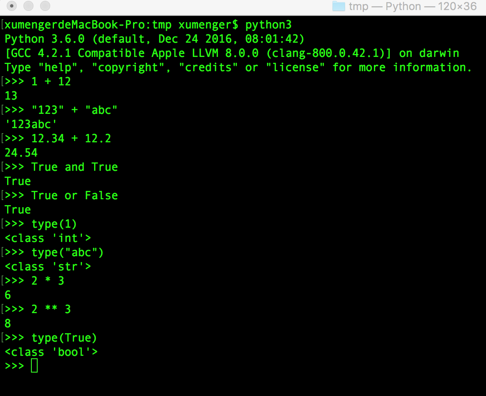

## Mac搭建Python3开发环境

正常mac是自带python2开发环境的，所以需要手动安装python3

首先需要[安装Homebrew](http://brew.sh/index_zh-cn.html)，Homebrew类似于Ubuntu上的apt-get，在终端输入以下脚本

```
/usr/bin/ruby -e "$(curl -fsSL https://raw.githubusercontent.com/Homebrew/install/master/install)"
```

建议在网络环境好的情况下执行，因为这需要从github上下载，可能会出现失败的情况，多试几次应该就可以了。另外关于Homebrew请参见[《Homebrew简介及安装》](http://www.cnblogs.com/lzrabbit/p/4032515.html)

然后执行`brew install python3`即可以安装python3

在命令行输入`python3`即可使用python3


## Python基础数据类型

在C语言中基础数据类型有int、float、double、char，然后可以使用字符数组数组表示字符串、结构体等方式构建更复杂的类型

在Python基础数据类型包括int、float、bool、string等

下面的截图中展示Python3下整型、浮点型、布尔类型、string类型的简单用法



## Python自带的list类型

下面的例子中可以看到list使用[]将所有元素包括在内，元素可以是int类型，可以混合int、string等不同类型，并且list的索引从0而不是从1开始

```
>>> family = [125, 120, 150, 180]
>>> family
[125, 120, 150, 180]
>>> family = ["dave", 125, "lily", 120, "mom", 150, "dad", 180]
>>> family
['dave', 125, 'lily', 120, 'mom', 150, 'dad', 180]
>>> family[0]
'dave'
>>> family[1]
125
>>> 
```

list的元素也可以是list，这样就构建了一个二维结构

```
>>> family = [["dave", 125], ["lily", 120], ["mom", 150], ["dad", 180]]
>>> family
[['dave', 125], ['lily', 120], ['mom', 150], ['dad', 180]]
>>> family[0][0]
'dave'
>>> family[0][1]
125
>>> family[1][1]
120
>>> family[1][0]
'lily'
>>> 
```

可以通过索引获取list的子集，也可以对list进行切割获取多个元素

```
>>> family = ["dave", 125, "lily", 120, "mom", 150, "dad", 180]
>>> family[0]
'dave'
>>> family[-2]
'dad'
>>> 
>>> family[0:2]
['dave', 125]
>>> family[1:2]
[125]
>>> family[:2]
['dave', 125]
>>> family[2:]
['lily', 120, 'mom', 150, 'dad', 180]
>>> family[:]
['dave', 125, 'lily', 120, 'mom', 150, 'dad', 180]
>>> 
```

>注意，当使用list[a:b]对list切割时，其取值范围是[a, b)区间而不是[a, b]区间

还可以修改list

```
>>> lst = [1, 2, 3, 4]
>>> lst[1] = 100
>>> lst
[1, 100, 3, 4]
>>> lst = lst + [200, 300]
>>> lst
[1, 100, 3, 4, 200, 300]
>>> lst[0:2] = ["abc", "def"]
>>> lst
['abc', 'def', 3, 4, 200, 300]
>>> del(lst[1])
>>> lst
['abc', 3, 4, 200, 300]
>>> del(lst[1:3])
>>> lst
['abc', 200, 300]
>>> 
```

当两个list引用只指向内存中的同一个list的地址时，修改其中一个就会导致另一个也变化

```
>>> lst1 = [1, 2, 3]
>>> lst1
[1, 2, 3]
>>> lst2 = lst1
>>> lst2
[1, 2, 3]
>>> lst2[1] = 100
>>> lst2
[1, 100, 3]
>>> lst1
[1, 100, 3]
>>> 
```

如果想拷贝list的时候，不能像上面那样直接赋值，而应该像下面这样

```
>>> lst1 = [1, 2, 3]
>>> lst2 = list(lst1)
>>> lst1
[1, 2, 3]
>>> lst2
[1, 2, 3]
>>> lst2[2] = 100
>>> lst2
[1, 2, 100]
>>> lst1
[1, 2, 3]
>>> 
>>> lst3 = lst1[:]
>>> lst3
[1, 2, 3]
>>> lst3[1] = "abc"
>>> lst3
[1, 'abc', 3]
>>> lst1
[1, 2, 3]
>>> 
```

list还有一些对应的函数，比如index获取某个元素的索引，count获取某个元素的个数等等

```
>>> lst = ["abc", "def", "xyz", "abc"]
>>> lst.index("abc")
0
>>> lst.count("abc")
2
>>> 
```