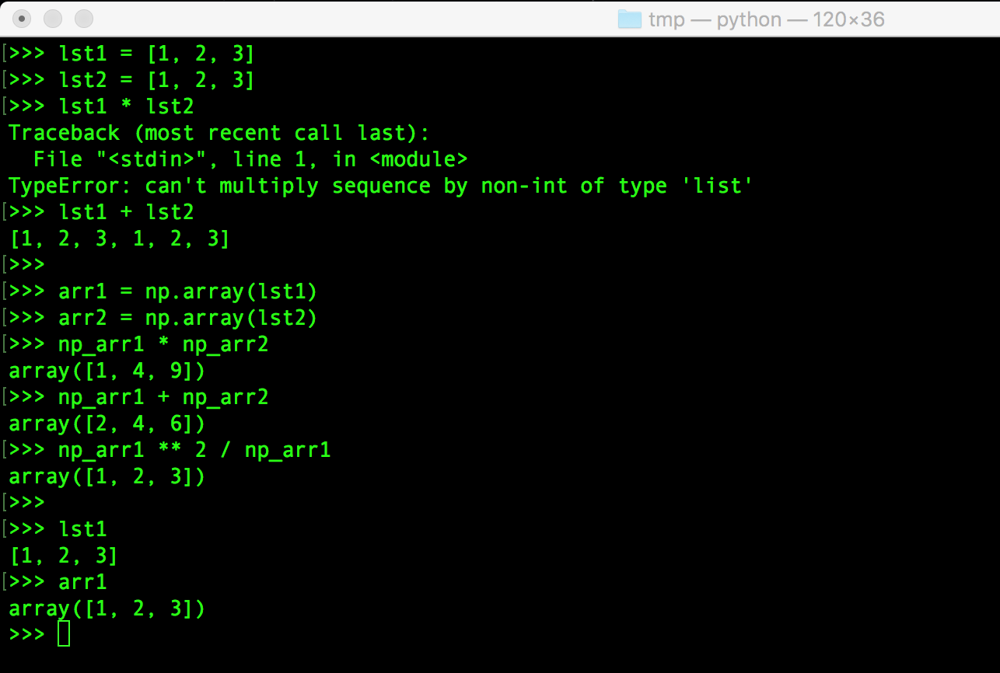
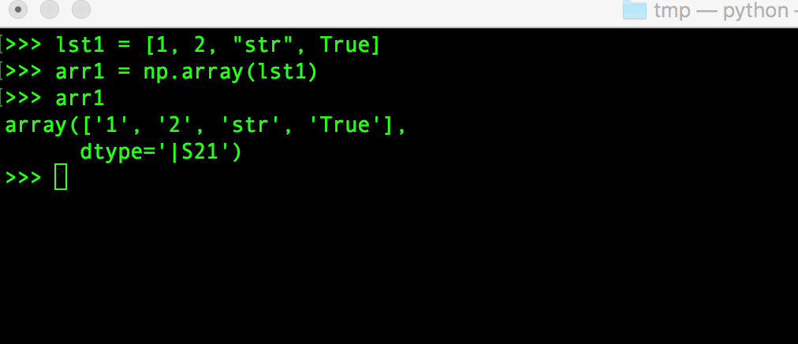
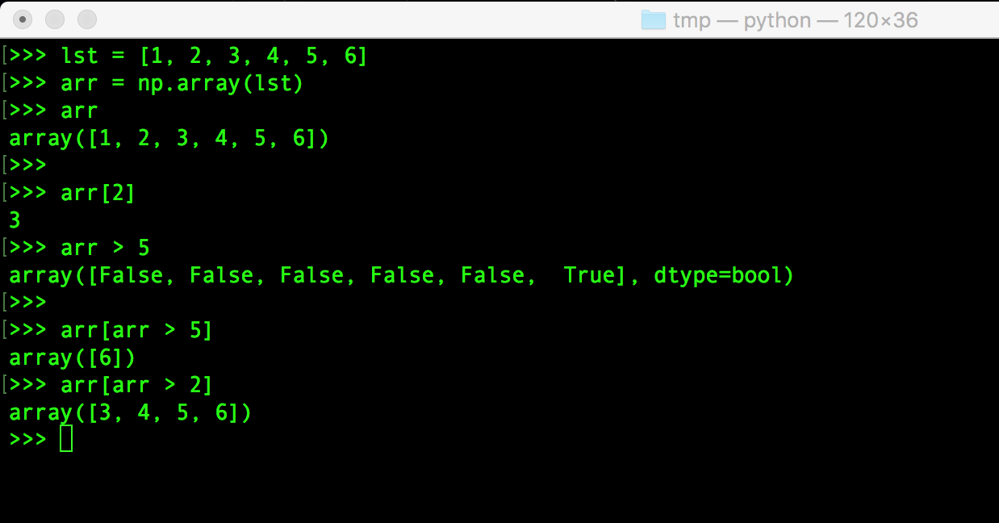
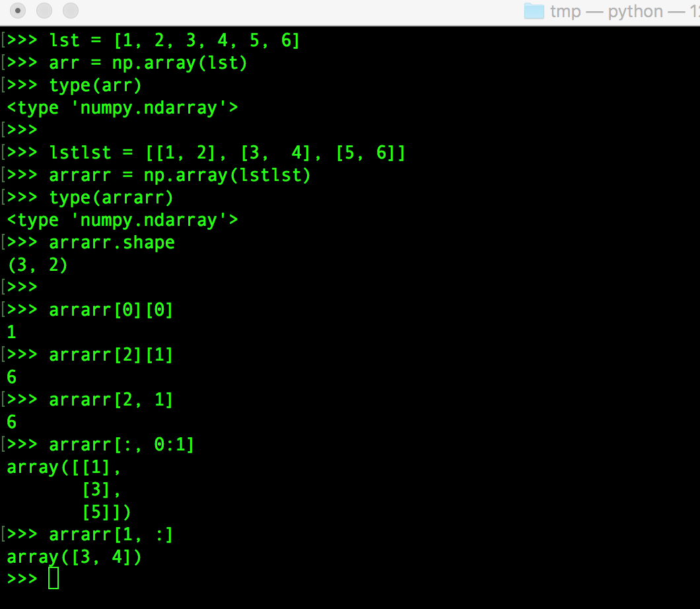
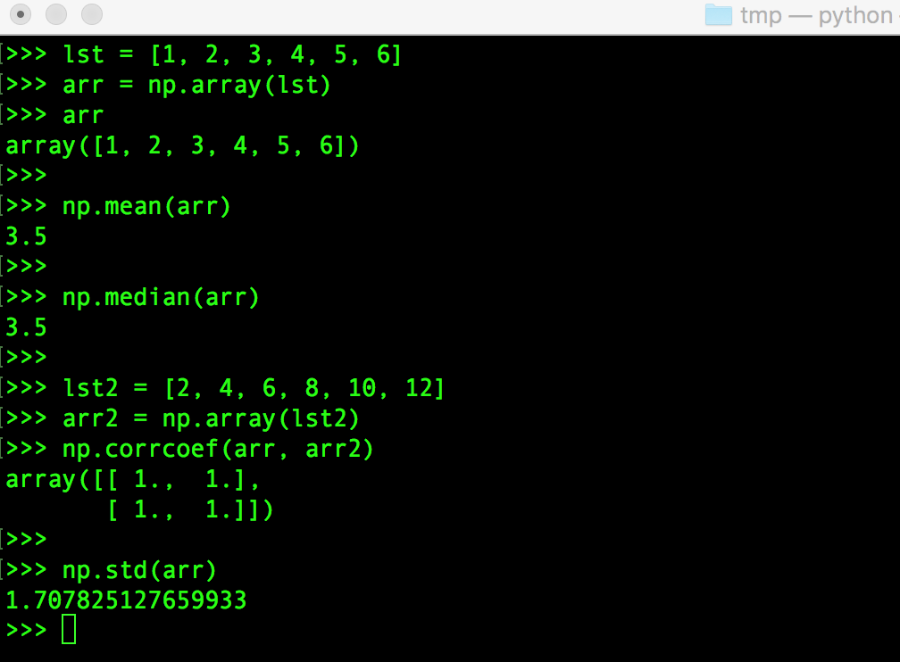
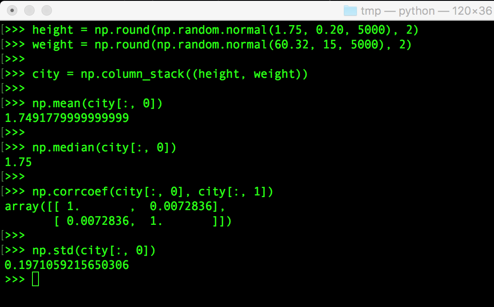

##Mac Python虚拟环境配置

上文搭建了简单的Python3开发环境。但是本文使用Python2来进行开发测试，不过上文中Python3的list的语法在Python2中也是一样的（本文中将会使用python命令，而不是python3，python2对应pip命令，而不是pip来管理相关的包！）

为了不影响整个Python的开发环境，我们使用虚拟环境来安装一些包（当然Python2、Python3有自己相应版本的virtualenv，参考[《Virtualenv Tutorial》](http://www.simononsoftware.com/virtualenv-tutorial/)）

```
$ sudo easy_install virtualenv
```

然后创建一个虚拟环境，并激活该虚拟环境

```
$ virtualenv data
$ source data/bin/activate
```

虚拟环境非常有用，可以在系统的Python解释器中避免包的混乱和版本的冲突。为每个程序单独创建虚拟环境可以保证程序只能访问虚拟环境中的包，从而保持全局解释器的干净整洁，使其只作为创建（更多）虚拟环境的源

然后在改虚拟环境下安装Numpy、matplotlib、pandas的包

```
$ sudo pip install -U numpy
$ sudo pip install -U matplotlib
$ sudo pip install -U pandas
```

##Numpy包

Python自带的list类型很强大，其表示元素的集合、可以包含不同类型的元素、可以增删改查元素等。但分析数据时经常要对整个数据集进行操作、希望操作尽可能快，这时候list就有些心有余而力不足了，而Numpy就是一个很好的替代工具

两个array相乘相当于逐个对所有元素相乘



不过使用Numpy的array代替list也需要注意，array要求所有的元素必须相同的类型！如果既有int又有string类型，array就会将int转换成string类型！这也是为什么array可以直接进行相乘、相加的原因



Numpy构造子集，比如下面的例子：获取array中大于2的元素等操作。通过比较运算符的结果来进行元素的选择，在Numpy中时很常见的



多维数组



计算平均值、计算中位数、检测相关性、计算标准差



模拟大批量数据进行简单分析



##matplotlib包

数据分析很重要的一环是将分析的结果使用图表的形式展示给人类看

下面的例子是简单的画出全球人口随时间的变化数据的分析结果图

##pandas

在数据分析时，必然是要和成千上万的海量数据打交道的。Numpy的array存在一个缺陷，比如一个array中的元素只能是相同类型的，但是实际应用中却常常要面对由不同类型元素组成的数据集，既可能有整型数据，也可能有字符串数据……

pandas包是一个高级的数据操作工具，被广泛的使用。在pandas中把数据存储成dataframe的结构

比如现在与一个csv文件，其内容是

```

```

然后使用pandas处理该csv文件中的数据


