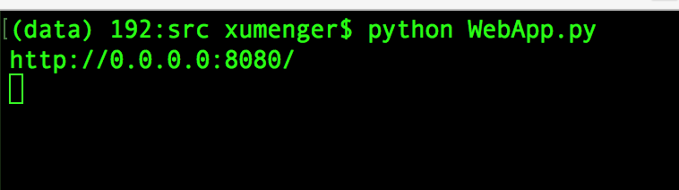
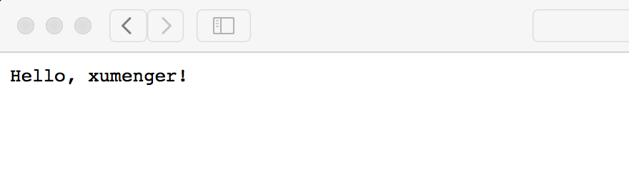
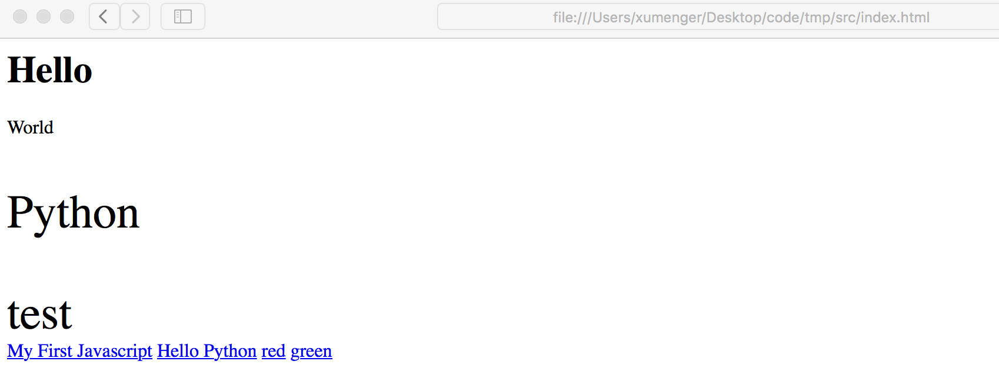
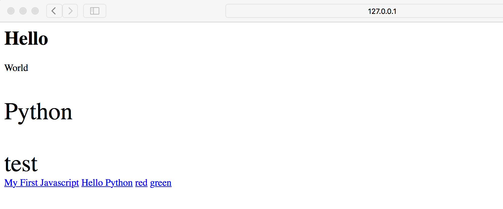
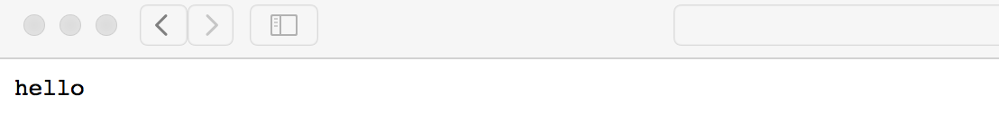
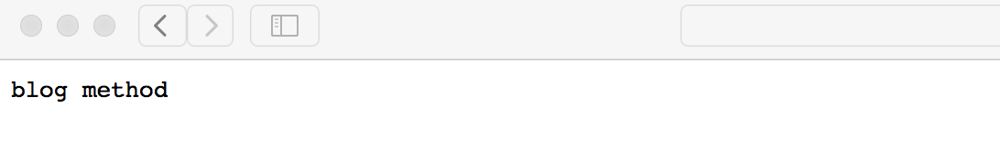
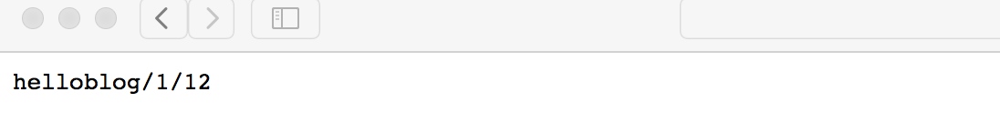

参考自：[http://www.imooc.com/learn/753](http://www.imooc.com/learn/753)

>对应使用的Python版本是Python2

##简介与安装

Web.py是一个非常轻量级的Python Web框架，简单但功能强大，很多自带的组件都可以灵活地被第三方组件替换

执行`pip install web.py`即可安装web.py框架

编写一个简单的测试程序（文件名为WebApp.py）

```
# -*- coding: utf-8 -*-
import web

urls = (
	'/(.*)', 'hello'
)

app = web.application(urls, globals())

class hello:
	def GET(self, name):
		if not name:
			name = 'World'
		return 'Hello, ' + name + '!'

if __name__ == '__main__':
	app.run()

```

执行`python WebApp.py`即可启动服务器



在浏览器中输入'127.0.0.1:8080/xumenger'即可访问



##使用web.py展示web网页

现在有一个包含HTML、CSS、JavaScript的静态Web页面如下

```
<html>
	<head>
		<title>Hello</title>
		<script>
			function show_text(id, text){
				document.getElementById(id).innerHTML = text;
			}
			function show_color(id, color){
				document.getElementById(id).style.color = color;
			}
		</script>
		<style>
			div p { color : #f00; }
			.py { font-size : 40px; }
			#l1 { width : 200px; font-size : 40px; }
		</style>
	</head>
	<body>
		<h1>Hello</h1>
		<div>World</div>
		<p class="py">Python</p>
		<label id="l1">test</label>
		<div>
			<a href="javascript:void(0);" onclick='javascript:show_text("l1", "My First Javascript");'>My First Javascript</a>
			<a href="javascript:void(0);" onclick='javascript:show_text("l1", "Hello Python");'>Hello Python</a>
			
			<a href="javascript:void(0);" onclick='javascript:show_color("l1", "#f00");'>red</a>
			<a href="javascript:void(0);" onclick='javascript:show_color("l1", "#0f0");'>green</a>
		</div>
	</body>
</html>
```

直接在本地打开的效果如下，可以点击这些链接得到不同的展示效果（这里涉及到最简单的HTML、CSS、JavaScript的基础知识）



对应WebApp.py源码修改如下

```
# -*- coding: utf-8 -*-
import web

urls = (
	'/(.*)', 'hello'
)

app = web.application(urls, globals())

class hello:
	def GET(self, name):
		#读取index.html中的内容直接返回给客户端
		return open(r'./index.html', 'r').read()
		

if __name__ == '__main__':
	app.run()

```

同样，执行`python WebApp.py`即可启动服务器，然后浏览器中输入'127.0.0.1:8080'访问即可看到下面的输出



其实直接在本地用浏览器打开index.html也是一样的效果，不过上面的方式才是真正的互联网访问web的方式：

* 客户端发起请求，通过网络传给服务端
* 服务端收到请求，根据请求URL和Method(Get or Post ..)，获取对应的信息比如这里是将index.html中的文本获取，或者修改服务端的信息
* 然后服务端将处理结果以应答的方式通过互联网再发送给客户端
* 客户端获取应答信息，比如这里获取到HTML格式的信息
* 由客户端比如浏览器解析HTML/CSS/JavaScript，将其展示在浏览器上

##URL映射

web.py中的URL映射有3中方式：

* URL完全匹配：`/index`
* URL模糊匹配：`/post/\d+`，也就是正则表达式的匹配方式，不会传递给对应的处理函数
* URL带组匹配：`/post/(\d+)`，也就是带组的模糊匹配，它会把组里获取的内容传递给对应的处理函数

修改WebApp.py的源码如下

```
# -*- coding: utf-8 -*-
import web

#URL映射，URL后面对应的就是请求处理类名
urls = (
	#URL完全匹配
	'/index', 'index',
	#URL模糊匹配
	'/blog/\d+', 'blog',
	#URL带组匹配
	'/(.*)', 'hello',
)

app = web.application(urls, globals())

class index:
	def GET(self):
		return 'index method'

class blog:
	def GET(self):
		return 'blog method'
	def POST(self):
		return 'blog post method'

class hello:
	def GET(self, name):
		return 'hello' + name 
		

if __name__ == '__main__':
	app.run()

```

使用URL'http://127.0.0.1:8080'访问



使用URL'http://127.0.0.1:8080/blog/1'访问



使用URL'http://127.0.0.1:8080/blog/1/12'访问



URL匹配的时候，会按照程序中列举的URL顺序依次匹配，当第一个URL映射可以匹配成功的时候，就不会继续匹配下面的其他URL，所以建议在排列URL匹配规则的时候，按照URL匹配范围排列，匹配范围小的在上面，匹配范围大的在下面

##请求处理

其实在上面讲URL映射的时候，其实比较清楚的可以看到，要先在urls中维护好URL以及对应的处理类，然后处理类内部分别实现GET、POST等方法，当请求来到时，根据请求URL找到对应的处理类，再根据请求的方法，找到处理类的GET或POST或其他方法来进行处理，或者是修改数据，或者是获取相关信息

##响应处理


##简单总结

经过以上的整理，再结合[《什么是Web框架？》](http://www.xumenger.com/web-framework-20160727/)，谈谈我对简单Web开发的认知！

