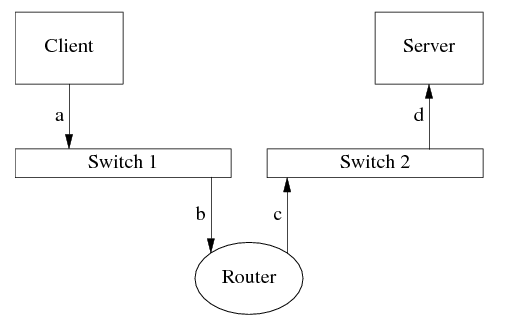

工作需要，做过几次简单的网络编程相关的小项目，主要是应用Delphi编程语言，并且自己也对其用法进行了简单的整理

* [《Delphi网络编程：使用IdTcpServer/IdTcpClient》](http://www.xumenger.com/windows-delphi-socket-20160929/)
* [《Delphi网络编程：使用ServerSocket/ClientSocket》](http://www.xumenger.com/windows-delphi-socket-20161010/)
* [《Delphi网络编程：阻塞和非阻塞》](http://www.xumenger.com/windows-delphi-socket-20161011/)
* [《Delphi网络编程：FIX网络协议》](http://www.xumenger.com/delphi-network-fix-20161221/)
* [《Delphi网络编程：发送和接收二进制数据》](http://www.xumenger.com/delphi-binary-socket-20161222/)
* [《Delphi网络编程：ServerSocket/ClientSocket的线程分布》](http://www.xumenger.com/01-delphi-socket-thread-20170103/)
* [《Delphi网络编程：ScktComp源码解析初步》](http://www.xumenger.com/02-delphi-socket-source-20170103/)

也通过一些资料简单的整理了TCP/IP相关的文章

* [《TCP/IP学习笔记：网络协议的层结构》](http://www.xumenger.com/network-1-20161021/)
* [《TCP/IP学习笔记：初识TCP协议》](http://www.xumenger.com/network-2-20161023/)

但是到目前为止，对于网络编程还是存在诸多的疑问，加之后续应该和网络会有更多的接触，所以必须系统化学习了

深入地学习某项技术知识之前，如果能通过看书、查阅资料对其知识体系、应用场景、简单的原理逻辑等进行一个了解，那么后续再去对其中逐个具体的技术点深究就会顺利很多

在网络上找到一些不错的文章先做一个入门的了解，主要参考以下的技术文章：

* [《谈一谈网络编程学习经验(06-08更新)》](http://blog.csdn.net/solstice/article/details/6527585)
* [《IOCP , kqueue , epoll ... 有多重要？》](http://blog.codingnow.com/2006/04/iocp_kqueue_epoll.html)
* [《再谈select, iocp, epoll,kqueue及各种I/O复用机制》](http://blog.csdn.net/shallwake/article/details/5265287)
* [《高性能IO模型浅析》](http://www.cnblogs.com/fanzhidongyzby/p/4098546.html)
* [《7种网络编程I/O模型代码实现实例》](http://blog.csdn.net/woshinia/article/details/8585930)
* [《DELPHI下的SOCK编程(转)》](http://www.cnblogs.com/linyawen/archive/2010/12/16/1908564.html)
* [《Linux Socket编程（不限Linux）》](http://www.cnblogs.com/skynet/archive/2010/12/12/1903949.html)
* [《socket阻塞与非阻塞，同步与异步》](http://blog.csdn.net/hguisu/article/details/7453390)

>不可避免的，可能我的理解有错误，也有可能这些文章本身也存在一些错误，所以“怀疑一切”

##网络编程中的各种任务角色

计算机网络是一个big topic，涉及到很多任务和角色，既有开发人员，也有运维人员。比方说：公司内部两台机器之间ping不通，通常由网络运维人员解决，看看是布线有问题还是路由器设置不对；两台机器能ping通，但程序连不上，经检查是本机防火墙设置有问题，通常由系统管理员解决；两台机器能连上，但是丢包严重，发现是网卡或者交换机的网口缺陷，由硬件维护人员解决；两台机器的程序能连上，但是偶尔发过去的请求得不到响应，通常是程序bug，应该由开发人员解决

以下是可能的和网络打交道的编程任务，其中前三项是面向网络本身，后面几项是在计算机网络之上构建信息系统，而我主要能涉及的就是第7项：在TCP/IP协议之上开发业务软件

* 开发网络设备，编写防火墙、交换机、路由器的固件firmware
* 开发或移植网卡的驱动
* 移植或维护TCP/IP的协议栈（特别是在嵌入式系统上）
* 开发或维护标准的网络协议程序：HTTP、FTP、DNS、SMTP、POP3、NFS
* 开发标准网络协议的“附加品”，比如HAProxy、squid、varnish等web load balancer
* 开发标准或非标准网络服务的客户端库，比如ZooKeeper客户端库、memcached客户端库
* 开发与公司业务直接相关的网络服务程序，比如即时聊天软件的后台服务器、网游服务器、金融交易系统、互联网企业用的分布式海量存储、微博发帖的内部广播通知等等
* 客户端程序中涉及网络的部分，比如邮件客户端中与POR3、SMTP通信的部分，以及网游的客户端程序中与服务器通信的部分

##协议设计是网络编程的核心 

对于专用的业务系统，协议设计是核心任务，决定了系统的开发难度与可靠性，但这个领域还没有形成大家公认的设计流程

系统中哪个程序发起连接，哪个程序接受连接？如果写标准的网络服务，那么都不是问题，按RFC来就行了。自己设计业务系统，有没有章法可循？以网游为例，到底是连接服务器主动连接逻辑服务器，还是逻辑服务器主动连接“连接服务器”、似乎还没有定论，两种做法都可以。一般可以按照“依赖-->被依赖”的关系来设计发起连接的方向

>[《IOCP , kqueue , epoll ... 有多重要？》](http://blog.codingnow.com/2006/04/iocp_kqueue_epoll.html)中提到连接服务器、逻辑服务器的概念：主要是通过连接服务器来处理客户端连接，连接服务器和逻辑服务器之间只有一个连接，逻辑服务器专注于业务逻辑，处理结果给到连接服务器，再由连接服务器返回给对应的客户端

比新建连接难的是关闭连接。在传统的网络哦服务中（特别是短连接服务），不少是服务端主动关闭连接，比如daytime、HTTP/1.0。也有少部分是客户端主动关闭连接，通常是些长连接服务，比如echo、chargen等。我们自己的业务系统如何设计连接关闭协议呢？

服务器主动关闭连接的缺点之一是会多占用服务器资源。服务端主动关闭连接之后会进入TIME_WAIT状态，在一段时间之内hold住一些内核资源。如果编发访问量很高，这会影响服务端的处理能力。这似乎暗示我们应该把协议设计为客户端主动关闭，让TIME_WAIT状态分散到多台客户机上，化整为零

这又有另外的问题：客户端赖着不走怎么办？会不会遭造成拒绝服务攻击？或许有一个两者结合的方案：客户端在收到响应之后应该主动关闭，这样把TIME_WAIT留在客户端。服务端有一个定时器，如果客户端若干秒之内没有主动断开，就踢开它。这样善意的客户端会把TIME_WAIT留给自己，buggy的客户端会把TIME_WAIT留给服务端。或者干脆使用长连接协议，这样避免频繁创建销毁连接

比连接的建立和断开更重要的是设计消息协议。消息格式很好办，XML、JSON、Protobuf、FIX、二进制等都是很好的选择；难的是消息内容。一个消息应该包含哪些内容？多个程序相互通信如何避免race condition（见《分布式系统的工程化开发方法》p.16的例子）？系统的全局状态该如何跃迁？可惜这方面可供参考的例子不多，也没有太多通用的指导原则，，我知道的只有30年前提出的end-to-end principle和happens-before relationship。只能从实践中慢慢积累了

>STL的三个档次：会用STL、对STL原理有所了解、追踪过STL源码；网络编程的三个层次：读过教程和文档、熟悉本系统TCP/IP协议的脾气、自己写过一个简单的TCP/IP stack

##TCP的可靠性有多高？

TCP是“面向连接的、可靠的、字节流传输协议”，这里的“可靠”究竟是什么意思？《Effective TCP/IP Programming》第9条说：Realize That TCP Is a Reliable Protocol, Not an Infallible Protocol，那么TCP在哪种情况下会出错？这里说的“出错”指的是收到的数据与发送的数据不一致，而不是数据不可达

我在《一种自动反射消息类型的 Google Protobuf 网络传输方案》中设计了带check sum的消息格式，很多人表示不理解，认为是多余的。IP header里面有check sum，TCP header也有check sum，链路层以太网还有CRC32校验，那么为什么还需要在应用层做校验？什么情况下TCP传送得到数据会出错？

IP header和TCP header的check sum是一种非常弱的16-bit check sum算法，把数据当成反码表示的16-bit Integers，再加到一起。这种check sum算法能检查出一些简单的错误，而对某些错误无能为力，由于是简单的加法，遇到“和”不变的情况就无法检查出错误（比如交换两个16-bit整数，加法满足交换律，结果不变）。以太网的CRC32比较强，但它只能保证同一个网段上的通信不会出错（两台机器的网线插到同一个交换机上，这时候以太网的CCRC32是有用的）。但是，如果两台机器之间经过多级路由器呢？



上图中的Client向Server发送一个TCP segment，这个segment先被封装成一个IP packet，再被封装成ethernet frame，发送到路由器（图中消息a）。Router收到ethernet frame（b），转发给另一个网段（c），最后Server收到（d），通知应用程序。Ethernet CRC能保证a和b是相同的，c和d是相同的；TCP header check sum的强度不足以保证收发payload的内容一样。另外，如果把Router换成NAT，那么NAT会自己构造c（替换掉源地址），这时候a和c的payload不能用tcp header check sum校验

路由器可能出现硬件故障，比如说它的内存故障（或偶然故障）导致收发IP报文出现多bit的反转或双字节交换，这个反转如果发生在payload区，那么无法用链路层、网络层、传输层的check sum查出来，只能通过应用层的check sum来监测。这个现象在开发对的时候不会遇到，因为开发用的几台机器可能都连到同一个交换机，ethernet CRC能防止错误。开发和测试的时候数据量不大，错误很难发生。之后大规模部署到生产环境，网络环境复杂，这时候出个错就让人措手不及。有一篇论文《When the CRC and TCP checksum disagree》分析了这个问题。另外《The Limitations of the Ethernet CRC and TCP/IP checksums for error detection》(http://noahdavids.org/self_published/CRC_and_checksum.html)也值得一读

>记载着信息的那部分数据。通常在传输数据时，为了使数据传输更可靠，要把原始数据分批传输，并且在每一批数据的头和尾都加上一定的辅助信息，比如这一批数据量的大小，校验位等，这样就相当于给已经分批原始数据加一些外套，这些外套起到标示作用，使得原始数据不易丢失。一批数据加上它的“外套”，就形成了传输通道中基本的传输单元，叫做数据帧或者数据包（有的地方数据帧和数据包不是同一概念比如网络传输）。这些数据帧中的记录信息的原始数据就是有效载荷数据，即payload data

这个情况真的会发生吗？会的，Amazon S3 在2008年7月就遇到过，单bit反转导致了一次严重线上事故，所以他们吸取教训加了 check sum。见http://status.aws.amazon.com/s3-20080720.html

另外一个例证：下载大文件的时候一般都会附上MD5，这除了有安全方面的考虑（防止篡改），也说明应用层应该自己设法校验数据的正确性。这是end-to-end principle的一个例证

以上内容都来自[《谈一谈网络编程学习经验(06-08更新)》](http://blog.csdn.net/solstice/article/details/6527585)

##网络编程模型

在[《Delphi网络编程：阻塞和非阻塞》](http://www.xumenger.com/windows-delphi-socket-20161011/)对于网络编程的同步/异步、阻塞/非阻塞这些概念有了简单的了解

服务器端编程经常需要构造高性能的IO模型，常见的IO模型有4种：

* 同步阻塞IO（Blocking IO）：即传统的IO模型
* 同步非阻塞IO（Non-blocking IO）：默认创建的socket都是阻塞的，非阻塞IO要求socket被设置为NONBLOCK。注意这里所说的NIO并未Java的NIO（New IO）库
* IO多路复用（IO Multiplexing）：即经典的Reactor设计模式，有时也被成为异步阻塞IO，Java中的Selectot和Linux中的epoll都是这种模型
* 异步IO（Asynchronous IO）：即经典的Proactor，也成为异步非阻塞IO

**异步和同步**的概念描述的是用户线程与内核的交互方式：同步是指用户线程发起IO请求之后需等待或轮询内核IO操作后才能继续执行；而异步是指用户线程发起IO请求之后仍继续执行，当内核IO操作完成后会通知用户线程，或者调用用户线程注册的回调函数

**阻塞和非阻塞**的概念描述的是用户线程调用内核IO操作的方式：阻塞是指IO操作需要彻底完成后才返回到用户空间；而非阻塞是指IO操作被调用后立即返回给用户一个状态值，无需等到IO操作彻底完成

以下内容主要参考[《高性能IO模型浅析》](http://www.cnblogs.com/fanzhidongyzby/p/4098546.html)、[《socket阻塞与非阻塞，同步与异步、I/O模型》](http://blog.csdn.net/hguisu/article/details/7453390)、[《再谈select, iocp, epoll,kqueue及各种I/O复用机制》](http://blog.csdn.net/shallwake/article/details/5265287)

图片主要来源[《高性能IO模型浅析》](http://www.cnblogs.com/fanzhidongyzby/p/4098546.html)

##同步阻塞IO

同步阻塞IO模型是最简答的IO模型，用户线程在内核进行IO操作时被阻塞


如上图所示，用户线程通过系统调用read发起IO读操作，由用户空间转入内核空间。内核等到数据包到达后，然后将接收到的数据拷贝到用户空间，完成read操作

用户线程使用同步阻塞IO模型的伪代码可以描述为

```
{
	read(socket, buffer);
	process(buffer);
}
```

即用户需要等待read将socket中的数据读取到buffer后，才继续处理接收的数据。整个IO请求的过程中，用户线程是被阻塞的，这导致用户在发起IO请求时，不能做任何事情，对CPU的资源利用率不够

>关于阻塞我们可以这样对比进行理解：当你在一个Windows进程中通过Application.MessageBox()弹出框，这时候其实就是把当前弹出框的线程给阻塞了，因为这个线程不能在继续运行，只有等到用户将弹出框关闭后该线程才能继续运行

##同步非阻塞IO

同步非阻塞是在同步阻塞IO的基础上，将socket设置为NONBLOCK，这样用户线程可以在发送IO请求后立即返回


如上图，由于socket是非阻塞的方式，因此用户发起IO请求时立即返回，订单并没有读取到任何数据，用户线程需要不断地发起IO请求，知道数据到达后，才真正读取数据，继续执行

用户线程使用同步非阻塞IO模型的伪代码描述为：

```
{
	while(read(socket, buffer) != SUCCESS)
		;
	process(buffer);
}
```

即用户需要不断调用read，尝试读取socket中的数据，直到读取成功后，才继续处理接收的数据。整个IO请求的过程中，虽然用户线程每次发起IO请求后可以立即返回，但是为了等到数据，仍然需要不断的轮询、重复请求，消耗大量的CPU资源。一般很少直接使用这种模型，而是在其他IO模型中使用非阻塞IO这一特性

##IO多路复用

IO多路复用模型是建立在内核提供的多路分离函数select基础之上的，使用select函数可以避免同步非阻塞IO模型中轮询等待的问题


如上图，用户首先将需要进行IO操作的多个socket添加到select中，然后阻塞等待select系统调用返回。当数据到达时，socket被激活，select函数返回，用户线程正式发起read请求，读取数据并继续执行

从流程上来看，使用select函数进行IO请求和同步阻塞模型没有太大的区别，甚至还多了添加监视socket，以及调用select函数的额外操作，效率更差。但是使用select以后的最大优势是用户可以在一个线程内同时处理多个socket的IO请求。用户可以注册成多个socket，然后不断地调用select读取被激活的socket，即可达到在**同一个线程内同时处理多个IO请求的目的**。而在同步阻塞模型中，必须通过多线程的方式才能达到这个目的

用户线程使用select函数的伪代码描述为：

```
{
	select(socket);
	while(1){
		sockets = select();
		for(socket in sockets){
			if(can_read(socket)){
				read(socket, buffer);
				process(buffer);
			}
		}
	}
}
```

其中while循环前将socket添加到select监视中，然后在while内一直调用select获取被激活的socket，一旦socket可读，便调用read函数将socket中的数据读取出来

然而，使用select函数的优点并不仅限于此。虽然上述方式允许单线程内处理多个IO请求，但每个IO请求的过程还是阻塞的（在select函数上阻塞），平均时间甚至比同步阻塞IO模型还要长。如果用户线程只注册自己感兴趣的socket或者IO请求，然后去做自己的事情，等到数据到来时再进行处理，则可以提高CPU的利用率

IO多路复用模型使用了Reactor设计模式实现了这一机制


如上图，EventHandler抽象类表示IO事件处理器，它拥有IO文件句柄Handle（通过get_handle获取），以及对Handle的操作handle_event（读/写等）。继承于EventHandler的子类可以对事件处理器的行为进行定制。Reactor类用于管理EventHandler（注册、删除等），并使用handle_events实现事件循环，不断调用同步事件多路分离器（一般是内核）的多路分离函数select，只要某个文件句柄被激活（可读/可写等），select就返回（阻塞），handle_events就会调用与文件句柄关联的事件处理器的handle_event进行相关操作


如上图，通过Reactor的方式，可以将用户线程轮询IO操作状态的工作统一交给handle_events事件循环进行处理。用户线程注册事件处理器之后可以继续执行做其他的工作（异步），而Reactor线程负责调用内核的select函数检查socket状态。当socket被激活时，则通知相应的用户线程（或执行用户线程的回调函数），执行handle_event进行数据读取、处理的工作。由于select函数是阻塞的，因此多路IO复用模型也被称为异步阻塞IO模型。注意，这里所说的阻塞是指select函数执行时线程被阻塞，而不是指socket。一般在使用IO多路复用模型时，socket都是设置为NONBLOCK的，不过这并不会产生影响，因为用户发起IO请求时，数据已经达到了，用户线程一定不会被阻塞

用户线程使用IO多路复用模型的伪代码描述为

```
void UserEventHandler::handle_event(){
	if(can_read(socket)){
		read(socket, buffer);
		proess(buffer);
	}
}

{
	Reactor.register(new UserEventHandler(socket))
}
```

用户需要重写EventHandler的handle_event函数进行读取数据、处理数据的工作，用户线程只需要将自己的EventHandler注册到Reactor即可。Reactor中的handle_events事件循环的伪代码大致如下

```
Reactor::handle_events(){
	while(1){
		sockets = select();
		for(socket in sockets){
			get_event_handler(socket).handle_event();
		}
	}
}
```

事件循环不断地调用select获取被激活的socket，然后根据获取的socket对应的EventHandler，执行其handle_event函数即可

IO多路复用是最常使用的IO模型，但其异步程度还不够“彻底”，因为它使用了阻塞线程的select系统调用，因此IO多路复用只能成为异步阻塞IO，而非真正的异步IO

>在[《Windows I/O模型之一：Select模型》](http://www.cnblogs.com/Mr-Zhong/p/4160988.html)中有一个简单的select函数调用的例程

##异步IO

真正异步的IO需要操作系统更强的支持。在IO多路复用模型中，事件循环将文件句柄的状态事件通知给用户线程，由用户线程中自行读取数据、处理数据。而在异步IO模型中，当用户线程收到通知时，数据已经被内核都区完成，并且放在了用户线程指定的缓冲区内，内核在IO完成后通知用户线程直接使用即可

异步IO模型使用了Proactor设计模式实现了这一机制


如上图，Proactor模式和Reactor模式在结构上比较相似，不过在用户（Client）使用方式上差别较大。Reactor模式中，用户线程通过Reactor对象注册感兴趣的事件监听，然后事件触发时调用事件处理函数。而Proactor模式中，用户线程将AsynchronousOperation（读/写等）、Proactor以及操作完成时的CompletionHandler注册到AsynchronousOperationProcessor

AsynchronousOperationProcessor使用Facade模式提供了一组异步操作API*读/写等）供用户使用，当用户线程调用异步API后，便继续执行自己的任务。**AsynchronousOperationProcessor会开启独立的内核线程执行异步操作，实现真正的异步。**当异步IO操作完成时，AsynchronousOperationProcessor将用户线程与AsynchronousOperation一起注册的Proactor和CompletionHandler取出，然后将CompletionHandler与IO操作的结果数据一起转发给Proactor，Proactor负责回调每一个异步操作的事件完成处理函数handle_event。虽然Proactor模式中每个异步操作都可以绑定为一个Proactor对象，但是在一般操作系统中，Proactor被实现为Singleton模式，以便于集中化分发操作完成事件


如上图，异步IO模型中，用户线程直接使用内核提供的异步IO API发起read请求，且发起后立即返回，继续执行用户线程代码。不过此时用户线程已经被调用的AsynchronousOperation和CompletionHandler注册到内核，然后操作系统开启独立的内核线程去处理IO请求。当read请求的数据达到时，由内核负责读取socket中的数据，并写入用户指定的缓冲区中。最后内核将read的数据和用户线程注册的CompletionHandler分发给内部的Proactor，Proactor将IO完成的信息通知给用户线程（一般通过调用用户线程注册的完成事件处理函数），完成异步IO

用户线程使用异步IO模型的伪代码描述为

```
void UserCompletionHandler::handle_event(buffer){
	proecss(buffer);
}

{
	aio_read(socket, new UserCompletionHandler);
}
```

用户需要重写CompletionHandler的handle_event函数进行处理数据的工作，参数buffer表示Proactor已经准备好的数据，用户线程直接调用内核提供的异步IO API，并将重写的CompletionHandler注册即可

相比于IO多路复用模型，异步IO并不常用，不少高性能并发服务程序使用IO多路复用模型 + 多线程任务处理的架构基本可以满足需求。况且目前操作系统对异步IO的支持并非特别完善，更多的是采用IO多路复用模型模拟异步IO的方式（IO事件触发时不直接通知用户线程，而是将数据读写完毕后放到用户指定的缓冲区中）。Java7之后已经支持了异步IO
