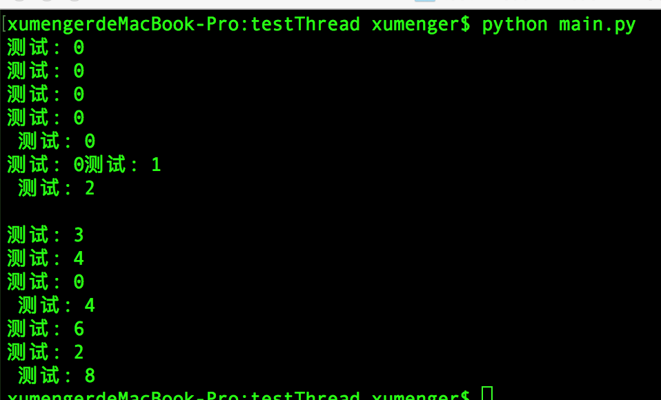
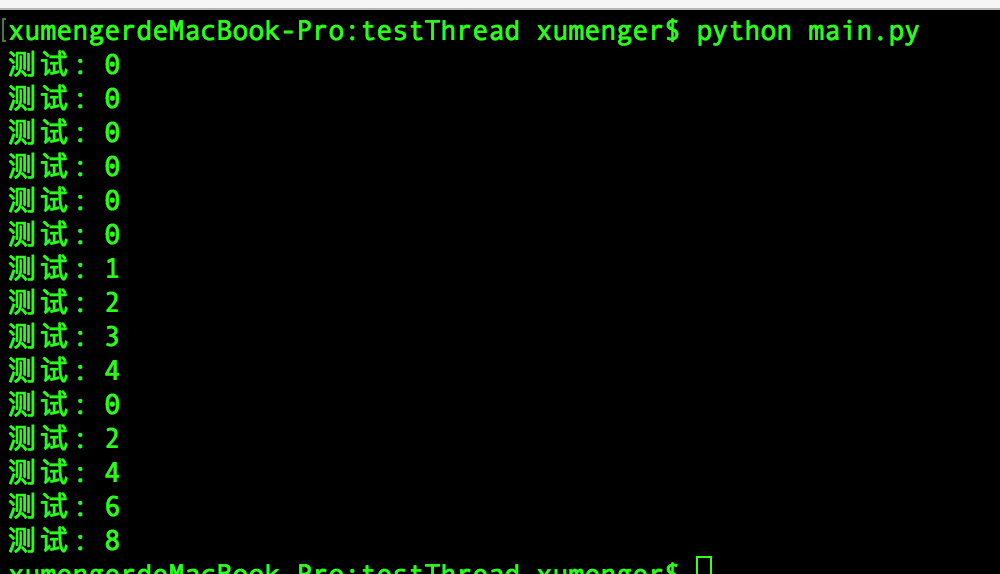
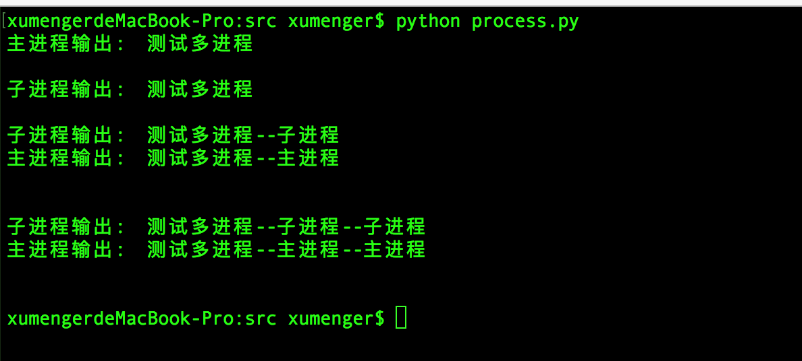
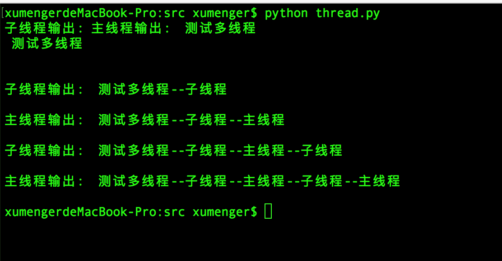
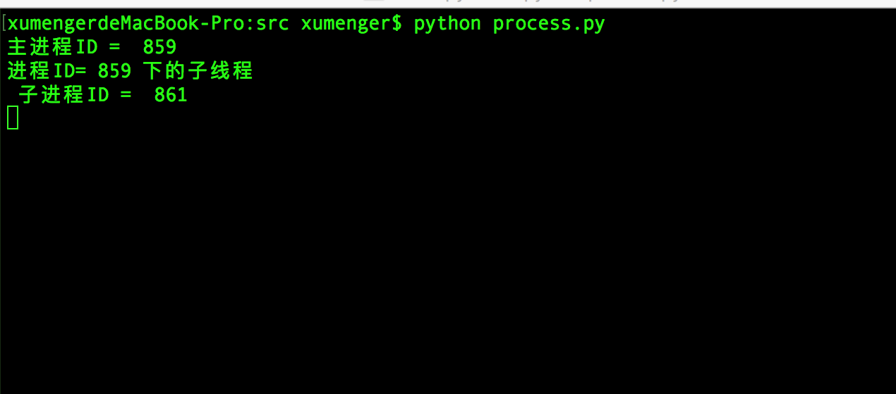
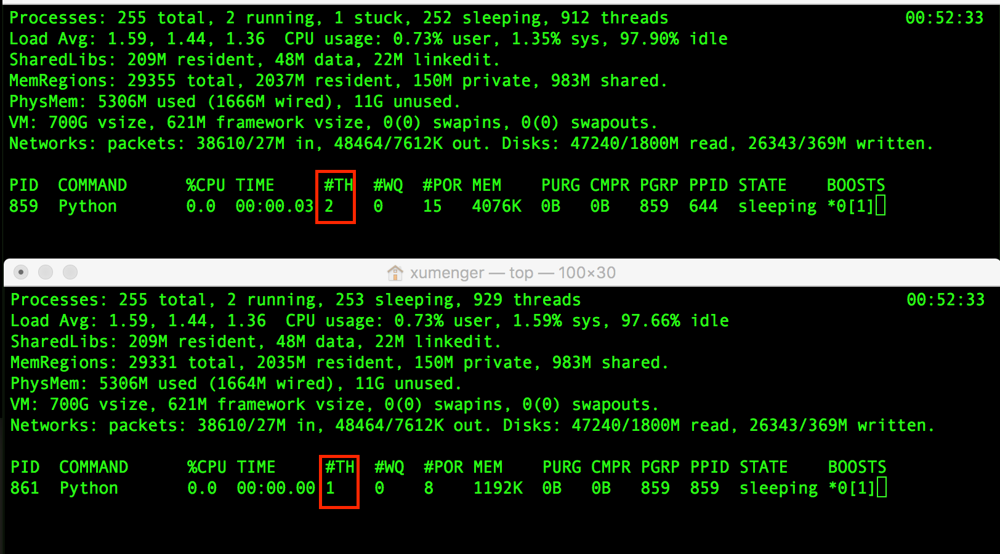

[《Python2系列基础语法》](http://www.xumenger.com/python2-20170204/)是讲到了最简单的如何创建和启动多线程、多进程，但在并发编程时远不止这些，在实际的并发编程中需要考虑多线程/多进程之间的通信，需要考虑并发情况下数据的安全性。这里统一进行一个总结

同样的，正如[《Python2系列基础语法》](http://www.xumenger.com/python2-20170204/)一文中无法将Python2的多线程、多进程的更多的底层原理、更多形式的语法一一列举，这里也无法做到将所有的线程/进程间通信、并发控制的语法一一讲解，重点列举一些常用的

##队列Queue

在[《Python2系列基础语法》](http://www.xumenger.com/python2-20170204/)中介绍了Queue.Queue的简单的用法，其可以实现单进程内的多线程之间数据传递。但是要想实现多进程传递数据的效果，就不能使用Queue.Queue，而应该使用multiprocessing.Queue

下面分别展示Queue.Queue在多线程场景下传递数据；multiprocessing.Queue在多进程场景下传递数据

**多线程应用Queue.Queue**

Python的Queue模块中提供了同步的、线程安全的队列类，包括FIFO的Queue、LIFO的LifoQueue、优先级队列PriorotyQueue。这些队列都实现了锁原语，能够在多线程中直接使用。可以使用Queue实现线程间的同步

下面给一个简单的生产者消费者模型展示Queue.Queue在多线程环境下的应用

```
# -*- coding: utf-8 -*-

import threading
import Queue

# class Queue.Queue(maxsize=0)  maxsize指定Queue中数据的上限
# 一旦达到上限，插入就会导致阻塞；0表示没有上限
q = Queue.Queue()

def get():
    while True:
        try:
            print q.get(False)
        # 当队列为空时继续get，会导致抛出Empty异常，这里捕获异常判读队列是否为空
        except Queue.Empty, e:
            break

def put(id):
    for i in range(5):
        q.put('测试: ' + str(id * i))

if __name__ == '__main__':
    # 创建3个往队列中写数据的线程
    for i in range(3):
        thread = threading.Thread(target = put, args = (i,))
        thread.start()
    # 创建5个从队列中取出数据的线程
    for i in range(5):
        thread = threading.Thread(target = get)
        thread.start()

```

运行效果如下



注意，上面的get()方法中通过判断是否触发Queue.Empty异常来判断是否队列为空，因为多个线程都通过Queue.empty()来判断队列是否为空并不准确。设想一下：当前Queue中还有一个元素，线程A调用empty()判断为False，准备执行get()方法获取该元素，但恰好在这个时候切换到线程B，线程B调用empty()判断也是False，也准备执行get()方法获取元素，显然接下来在只有一个元素的情况下却有两个线程调用get()获取元素，就会导致跑出Empty异常。所以这里通过异常的方式来处理，而不是通过Queue.empty()来判断

建议将get()方法修改为使用Queue.empty()判断队列是否为空，用多线程调用该方法的情况下多运行几次，其中就会有几次出现Queue.Empty异常的情况

另外关于Queue的更多的API如下：

* Queue.qsize() 返回队列的大小  
* Queue.empty() 如果队列为空，返回True,反之False  
* Queue.full() 如果队列满了，返回True,反之False 
* Queue.full 与 maxsize 大小对应  
* Queue.get([block[, timeout]]) 获取队列，timeout等待时间  
* Queue.get_nowait() 相当Queue.get(False) 
* Queue.put(item) 写入队列，timeout等待时间  
* Queue.put_nowait(item) 相当Queue.put(item, False) 
* Queue.task_done() 在完成一项工作之后，Queue.task_done() 函数向任务已经完成的队列发送一个信号 
* Queue.join() 实际上意味着等到队列为空，再执行别的操作

>关于线程间通信的方法当然不止Queue一种，其他的这里先不一一列举，等到具体用到的时候再整理

**多进程应用multiprocessing.Queue**

在传统的C/C++、Delphi语言中，实现进程间通信还是比较费事的，可以选择的方式有：共享内存(使用跨进程的互斥对象或事件对象控制并发情况下的数据安全)、网络、管道、数据库、文件等

在Python中当然也可以使用以上的方法，但Python还实现了其他的更好的封装，方便开发者实现进程间的通信，比如multiprocess模块的Queue

```
# -*- coding: utf-8 -*-

import multiprocessing
import Queue

# class multiprocessing.Queue(maxsize=0)  maxsize指定Queue中数据的上限
# 一旦达到上限，插入就会导致阻塞；0表示没有上限
q = multiprocessing.Queue()

def get():
    while True:
        try:
            print q.get(False)
        # 当队列为空时继续get，会导致抛出Empty异常，这里捕获异常判读队列是否为空
        # 虽然应用的是multiprocessing.Queue，但是异常还是Queue模块定义的Empty
        except Queue.Empty, e:
            break

def put(id):
    for i in range(5):
        q.put('测试: ' + str(id * i))

if __name__ == '__main__':
    # 创建3个往队列中写数据的进程
    for i in range(3):
        process = multiprocessing.Process(target = put, args = (i,))
        process.start()
    # 创建5个从队列中取出数据的进程
    for i in range(5):
        process = multiprocessing.Process(target = get)
        process.start()

```

运行效果如下



和使用Queue.Queue类似，multiprocessing.Queue不能在多线程情况下不能直接使用empty()来判断队列是否为空，也应该使用捕获异常的方式

Queue.Queue和multiprocessing.Queue在用法上有很多的相似之处，但只是接口层面的相似而已，底层的实现等诸多方面都是完全不同的。Queue.Queue是进程内非阻塞队列，可以实现一个进程内多线程的通信，并且本身是线程安全的；multiproessing.Queue是跨进程通信队列，**各子进程**共有，multiprocessing.Queue本身是基于Unix的pipe对象实现的

参考文章：[《python中的Queue与多进程（multiprocessing）》](https://my.oschina.net/yangyanxing/blog/296052)、[《PYTHON学习之路--进程，线程，协程》](http://www.cnblogs.com/Ajen-lq/p/5325827.html)、[《Python multiprocessing 使用手记[3] – 关于Queue》](http://blog.ftofficer.com/2009/12/Python-multiprocessing-3-about-queue/)

##集合set

以上展示了多线程使用Queue.Queue实现线程间通信、多进程使用multiprocessing.Queue实现进程间通信

另外在开发中会比较常用到的基础数据结构还有集合。Python自带的set，可以实现单进程内的多线程通信。但在多进程场景下，无法直接使用set实现跨进程传递数据

**多线程应用set**

[《Python2系列基础语法》](http://www.xumenger.com/python2-20170204/)有展示set的基础语法，这里就不具体实现代码展示set在多线程场景下的应用了

不过需要注意的一点是：set是非线程安全的，在多线程并发的场景下，需要加锁保护

推荐相关资料：[《Python多线程学习》](http://www.cnblogs.com/tqsummer/archive/2011/01/25/1944771.html)、[《Python有GIL为什么还需要线程同步？》](https://www.zhihu.com/question/23030421)、[《python类库32[多线程同步Lock+RLock+Semaphore+Event]》](http://www.cnblogs.com/itech/archive/2012/01/05/2312831.html)

**多进程**

Python2多线程没有类似set的模块，如果要想在多进程间实现类似set的功能，可能需要使用redis来实现

因为目前本人没有使用过redis，所以暂时不在本文中对此进行整理，后续再研究Python2如何应用redis，再进行针对性的总结整理

##全局变量

Linux平台提供了fork()系统调用来创建子进程，创建的子进程会继承父进程的文件描述符，拷贝父进程的数据空间、堆、栈等资源。注意是拷贝，并不是共享，所以假如父进程有一个全局变量g，调用了fork()创建子进程后，主子进程都有一个全局变量g，但分别在自己的内存空间中，是完全互不影响的

Python的multiprocessing创建多进程的时候也有相同的特点，比如下面这个例子：

```
# -*- coding: utf-8 -*-

import multiprocessing
import time

s = '测试多进程'

def func():
    for i in range(3):
        global s
        print '子进程输出: ', s
        print ''
        time.sleep(1)
        s = s + '--子进程'

if __name__ == '__main__':
    #创建子进程
    process = multiprocessing.Process(target=func)
    process.start()

    for i in range(3):
        print '主进程输出: ', s
        print ''
        time.sleep(1)
        s = s + '--主进程'
```

运行脚本输出如下：



可以看到上面的输出中，明显对于全局变量s，主进程和子进程之间的写操作是互不影响的，也就说明了在父子进程的内存空间中各自有自己的s变量，读写操作互不影响

>对于整数、浮点数、字符串、list、tuple、set、dict、Queue.Queue、自定义的普通类等简单类型的数据是这样的，但像multiprocessing.Queue等就比较特殊，其可以用于进行进程间传递数据

但多线程程序是运行在同一个进程中的，它们共用内存空间，同样共用变量，比如下面这个例子

```
# -*- coding: utf-8 -*-

import threading
import time

s = '测试多线程'

def func():
    for i in range(3):
        global s
        print '子线程输出: ', s
        print ''
        time.sleep(1)
        s = s + '--子线程'

if __name__ == '__main__':
    #创建子线程
    thread = threading.Thread(target=func)
    thread.start()

    for i in range(3):
        print '主线程输出: ', s
        print ''
        time.sleep(1)
        s = s + '--主线程'

```

运行程序后，可以看到主线程和子线程操作的s变量是同一个东西，和多进程明显不同



##多进程下的多线程

上面的例子中看到，当创建子进程的时候，子进程会从父进程那里继承全局变量。试想一下，如果父进程先创建了一个子线程，然后再去创建一个子进程，那么这个子进程会不会继承父进程的子线程呢

下面写一个小的demo去验证一下

```
# -*- coding: utf-8 -*-

import os
import multiprocessing
import threading
import time

def threadFunc():
    print '进程ID=', os.getpid(), '下的子线程',
    time.sleep(100)

def procFunc():
    print '子进程ID = ', os.getpid()
    time.sleep(100)

if __name__ == '__main__':
    print '主进程ID = ', os.getpid()

    #创建子线程
    thread = threading.Thread(target=threadFunc)
    thread.start()

    time.sleep(3)
    #创建子进程
    process = multiprocessing.Process(target=procFunc)
    process.start()

```

运行该脚本输出如下



其中有三个线程输出信息：主进程的主线程、主进程的子线程、子进程的主线程，所以可以认为子进程没有继承父进程的子线程

为了更稳妥，在mac下可以使用`top -pid [pid]`去查看进程下的线程数，如下图，在该demo运行的时候分别查看主进程和子进程的信息



的确，主进程有2条线程，但子进程只有一条！

说明在创建子进程时，子进程不会继承父进程的子线程！
