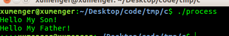
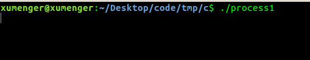
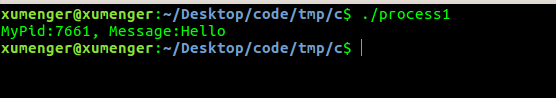
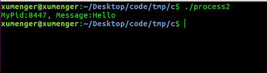
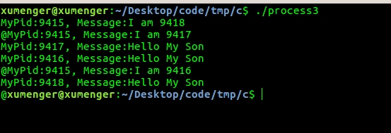
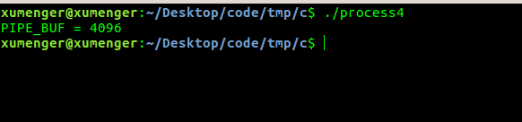

一个进程中的多个线程共享一个进程的堆等内存空间，所以实现数据交互是很方便的；但多进程架构中，要想实现多进程间的数据交互相对就困难很多！

进程间通信（IPC，InterProcess Communication）是指在不同进程之间传递或交换信息。IPC常见的方式有：管道（无名管道、命名管道）、消息队列、信号量、共享内存、磁盘文件、Socket等，其中Socket网络方式可以实现不同主机上的多进程IPC

就以我目前工作中维护的软件项目为例，其是在Windows平台上的多进程/多线程程序，使用共享内存来传递数据，使用事件对象来实现跨进程的通知，其大概的架构逻辑是这样的：

* 主进程中负责交互的线程往共享内存1中写入请求数据，通过事件对象通知子进程，同时主进程负责交互的线程卡住等待
* 子进程负责交互的线程通过事件对象得知主进程往共享内存1写入数据，则开始运行去读取数据
* 然后去处理请求数据，处理完成后，将应答数据写入共享内存1，同样通过事件对象通知主进程，同时子进程负责交互的线程卡住等待
* 主进程负责交互的线程通过事件对象状态变化得知子进程处理完成并返回应答，则开始运行去读取应答
* 如此循环....
* 以上是主进程请求，子进程应答的情况；很简单的，根据对称性，再增加一个共享内存2、事件对象2可以实现子进程请求，主进程应答！

Windows平台与进程相关的API有：CreateProcess、OpenProcess……

## 一个带坑的小例子

下面使用fork()、pipe()实现一个简单的Linux平台下的多进程、多进程通信的程序

```
#include <stdio.h>
#include <sys/wait.h>
#include <unistd.h>

int main()
{
  int pipefd[2];    //两个文件描述符
  pid_t pid;
  char buff[20];
  int i;

  //创建管道
  if(0 > pipe(pipefd)){
    printf("Create Pipe Error!\n");
  }

  //创建2个子进程
  for(i=0; i<2; i++){
    pid = fork();

    if((pid_t)0 >= pid){
      sleep(1);
      break;
    }
  }
  //如果fork返回值小于0，说明创建子进程失败
  if((pid_t)0 > pid){
    printf("Fork Error!\n");
    return 3;
  }
  
  //如果fork返回值为0，表示进入子进程的逻辑
  if((pid_t)0 == pid){
    //发送格式化数据给主进程
    FILE *f;
    f = fdopen(pipefd[1], "w");
    fprintf(f, "I am %d\n", getpid());
    fclose(f);

    sleep(1);

    //接收父进程发过来的数据
    read(pipefd[0], buff, 20);
    printf("MyPid:%d, Message:%s", getpid(), buff);
  }
  //进入父进程的逻辑
  else{
    //循环接收所有子进程发过来的数据，并且返回数据给子进程
    for(i=0; i<2; i++){
      //接收子进程发来的数据
      read(pipefd[0], buff, 20);
      printf("MyPid:%d, Message:%s", getpid(), buff);

      //发送数据给子进程
      write(pipefd[1], "Hello My Son\n", 14);
    }
    //这里调用sleep(3)主要的作用是等待子进程运行结束
    //当然这样并不是很规范！
    sleep(3);
  }

  return 0;
}
```

编译程序`gcc process.c -o process`，然后执行`./process`输入信息如下



但我们可以发现输出的内容有一些异常，比如第二行最开始怎么有一个@字符、最后一行明显丢失了一些字符信息等

上面的程序还不止是输出不符合预期这个表面的问题，还存在诸多的坑，都是因为一开始对于多进程、管道的深入机制理解不正确造成的！

下面针对Linux的管道进行比较深入的挖掘，就可以发现上面的小程序中存在很多的坑

## 管道是阻塞的

管道读写是阻塞的，当管道中没有数据，但进程尝试去读的时候就会阻塞进程，比如

```
#include <stdio.h>
#include <sys/wait.h>
#include <unistd.h>

int main()
{
  int pipefd[2];
  pid_t pid;
  char buff[20];
  int i;

  if(0 > pipe(pipefd)){
    printf("Create Pipe Error!\n");
  }

  pid = fork();

  if((pid_t)0 > pid){
    printf("Fork Error!\n");
    return 3;
  }
  
  if((pid_t)0 == pid){
    //write(pipefd[1], "Hello\n", 6);
  }
  else{
    read(pipefd[0], buff, 20);
    printf("MyPid:%d, Message:%s", getpid(), buff);
  }

  return 0;
}
```

其运行效果如下，可以看到主进程阻塞住了



可以修改让子进程往管道中写入数据，主进程再去读，这样就不会阻塞了

```
#include <stdio.h>
#include <sys/wait.h>
#include <unistd.h>

int main()
{
  int pipefd[2];
  pid_t pid;
  char buff[20];
  int i;

  if(0 > pipe(pipefd)){
    printf("Create Pipe Error!\n");
  }

  pid = fork();

  if((pid_t)0 > pid){
    printf("Fork Error!\n");
    return 3;
  }
  
  if((pid_t)0 == pid){
    
  }
  else{
    read(pipefd[0], buff, 20);
    printf("MyPid:%d, Message:%s", getpid(), buff);
  }

  return 0;
}
```

运行程序可以看到主进程没有阻塞



## 管道是半双工的

所谓半双工，意思就是只能在一个方向上传递数据，对于pipe，只能从pipe[1]写，从pipe[0]读，只能在一个方向传递数据；可以结合socket来理解，socket是全双工的，也就是针对一个socket既可以写又可以读

第一个例程中创建了一个管道，但却希望通过这个管道实现主进程传递数据给子进程、子进程传递数据给主进程，完全是想在两个方向传递数据，结果导致主进程和2个子进程同时既往管道里写，又从管道里读，所以出现了上述诡异的现象

比如下面这个例子，创建一个管道，但不创建子进程，可以在主进程既写又读管道！

```
#include <stdio.h>
#include <sys/wait.h>
#include <unistd.h>

int main()
{
  int pipefd[2];
  pid_t pid;
  char buff[20];
  int i;

  if(0 > pipe(pipefd)){
    printf("Create Pipe Error!\n");
  }

  write(pipefd[1], "Hello\n", 6);
  read(pipefd[0], buff, 20); 
  printf("MyPid:%d, Message:%s", getpid(), buff);

  return 0;
}
```



因为管道是半双工的，所以要想在保证数据不乱的情况下，不能在多进程应用中只使用一个管道，需要一套管道，有的是数据从主进程到子进程，有的是数据从子进程到主进程

## 完善后的程序

```
#include <stdio.h>
#include <sys/wait.h>
#include <unistd.h>

int main()
{
  //管道1,用于子进程发送数据给主进程
  int pipefd[2];
  //管道数组2,用于主进程分别发数据给子进程
  int pipearr[3][2];

  pid_t pid;
  char buff[20];
  int i;

  //创建管道
  if(0 > pipe(pipefd)){
    printf("Create Pipe Error!\n");
  }
  for(i=0; i<3; i++){
    if(0 > pipe(pipearr[i])){
      printf("Create Pipe Error!\n");
    }
  }

  //创建3个子进程
  for(i=0; i<3; i++){
    pid = fork();

    //创建子进程失败
    if((pid_t)0 > pid){
      printf("Fork Error!\n");
      return 3;
    }

    //子进程逻辑
    if((pid_t)0 == pid){
      //发送格式化数据给主进程
      FILE *f;
      f = fdopen(pipefd[1], "w");
      fprintf(f, "I am %d\n", getpid());
      fclose(f);

      //接收父进程发过来的数据
      read(pipearr[i][0], buff, 20);
      printf("MyPid:%d, Message:%s", getpid(), buff);

      //完成后及时退出循环，继续循环会出大问题，和fork的运行逻辑有关！
      break;
    }
  }

  //主进程逻辑
  if((pid_t)0 < pid){
    //循环接收所有子进程发过来的数据，并且返回数据给子进程
    for(i=0; i<3; i++){
      //接收子进程发来的数据
      read(pipefd[0], buff, 20);
      printf("MyPid:%d, Message:%s", getpid(), buff);

      //发送数据给子进程
      write(pipearr[i][1], "Hello My Son\n", 14);
    }
    sleep(3);
  }

  return 0;
}
```

编译后的运行效果如下：



简单说一下上面的程序逻辑：

首先是有两种管道

* 第一种只有一个：创建的3个子进程都往这里面写，主进程从这里面读取数据
* 第二种有一组，每个子进程一个：主进程分别往3个管道中写，每个子进程对应从属于自己的管道中读

针对第二种，很明显一个写，一个读，可以保证并发安全。但第一种呢，多个子进程都往一个管道里面写，会不会有问题，这个需要特别注意：

* 当要写入的数据量不大于PIPE\_BUF时，Linux将保证写入的原子性
* 当要写入的数据量大于PIPE\_BUF时，Linux将不再保证写入的原子性

上面多个子进程同时往pipefd中写入的数据小于PIPE\_BUF，所以是原子性的，另外只有主进程一个进程在读，所以可以保证数据的完整性。在webbench中其实就是这样使用管道的

针对上面的这个程序，还是存在一些疑问：

* 子进程每次往pipefd中写入的字节远远不到20，但主进程每次读着字节，会不会导致问题
* 为什么上面的第2、5条输出前面还是会多一个@字符？

可以编译下面的程序，查看PIPE\_BUF的值

```
#include <stdio.h>
#include <limits.h>

int main()
{
  printf("PIPE_BUF = %d\n", PIPE_BUF);

  return 0;
}
```

编译后运行效果如下：



