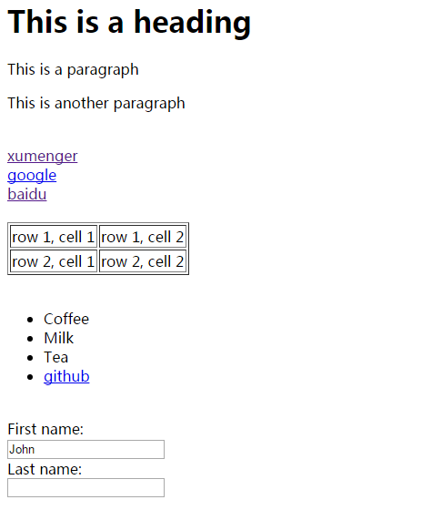
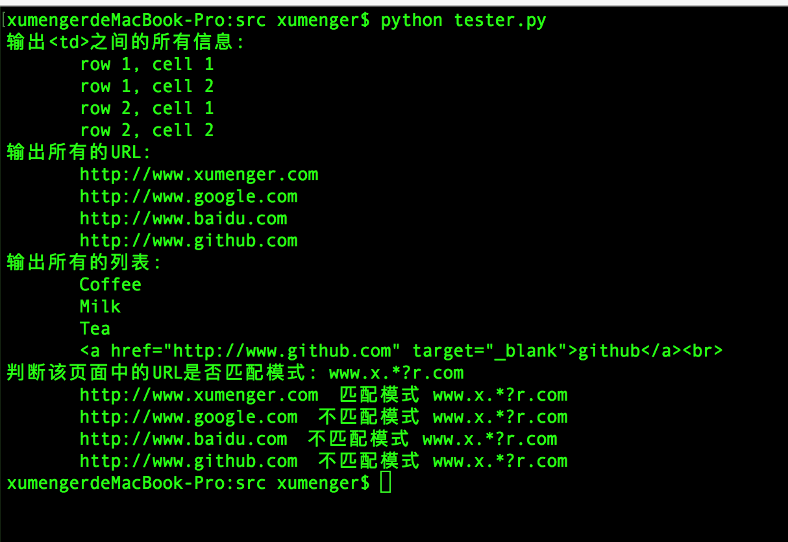

>正则表达式不只可用于解析网页，它可以处理所有的字符串，而网页无非是html格式的一个长字符串罢了。最近读了一本书，其实正则表达式也可以用于编译器的词法分析

[《正则表达式与文件格式化处理》](http://www.xumenger.com/regex-20160904/)中介绍过正则表达式的基础语法

本文展示Python使用正则表达式解析一个典型的HTML网页，获取其中的重要数据，其在网络爬虫中有着比较重要的应用。如此来了解常用的正则表达式

## 正则表达式基础

以下内容转载自[《Python正则表达式指南》](http://www.cnblogs.com/huxi/archive/2010/07/04/1771073.html)的一部分。另外推荐[《Python正则表达式》](http://www.runoob.com/python/python-reg-expressions.html)

正则表达式并不是Python的一部分。正则表达式是用于处理字符串的强大工具，拥有自己独特的语法以及一个独立的处理引擎，效率上可能不如str自带的方法，但功能十分强大。得益于这一点，在提供了正则表达式的语言中，正则表达式的语法都是一样的，区别只是在于不同的编程语言实现支持的语法数量不同。但不用担心，不被支持的语法通常是不常用的部分。如果已经在其他语言里使用过正则表达式，只需要简单看一看就可以上手了

下图展示了使用正则表达式进行匹配的流程


正则表达式的大致匹配过程是：

* 依次拿出表达式和文本中的字符进行比较，如果每一个字符都能匹配成功，则匹配成功
* 一旦有匹配不成功的字符则匹配失败
* 如果表达式中有量词或边界，这个过程会稍微有一些不同，但也是很好理解的，看最后的《Python支持的正则表达式元字符和语法》附件以及多练习即可理解

正则表达式通常用于在文本中查找匹配的字符串。Python里数量词默认是贪婪的（在少数语言里也可能是默认非贪婪），总是尝试匹配尽可能多的字符；非贪婪的则相反，总是尝试匹配尽可能少的字符。例如：正则表达式"ab\*"如果用于查找"abbbc"，将找到"abbb"。而如果使用非贪婪的数量词"ab\*?"，将找到"a"

与大多数编程语言相同，正则表达式里使用"\"作为转义字符，这就可能造成反斜杠困扰。假如你需要匹配文本中的字符"\"，那么使用编程语言表示的正则表达式里将需要4个反斜杠"\\\\\\\\"：前两个和后两个分别用于在编程语言里转义成反斜杠，转换成两个反斜杠后再在正则表达式里转义成一个反斜杠。Python里的原生字符串很好地解决了这个问题，这个例子中的正则表达式可以使用r"\\\\"表示。同样，匹配一个数字的"\\\\d"可以写成r"\d"。有了原生字符串，再也不用担心是不是漏写了反斜杠，写出来的表达式也更直观

## Python正则表达式简单语法

Python通过re模块提供对正则表达式的支持。使用re的一般步骤是将正则表达式的字符串形编译为pattern实例，然后使用pattern实例处理文本并获得一个匹配结果（一个Match实例），最后使用Match实例获得信息，进行其他的操作

一个最简单的例子

```
# encoding: UTF-8
import re
 
# 将正则表达式编译成Pattern对象
pattern = re.compile(r'hello')
 
# 使用Pattern匹配文本，获得匹配结果，无法匹配时将返回None
match = pattern.match('hello world!')
 
if match is not None:
    # 使用Match获得分组信息
    print match.group()
```

re提供了众多模块方法用于完成正则表达式的功能。这些方法可以使用Pattern实例的相应方法替代，唯一的好处是少写一行re.compile()代码，但同时也无法复用编译后的pattern对象。如上面这个例子可以简写为：

```
m = re.match(r'hello', 'hello world!')
print m.group()
```

>显然之前的编译一次一直使用比这里每次匹配时都再去编译要好得多，让计算机不要做一些无关紧要的，或者已经做过的事，好在时间和空间层面都很好的节省计算机资源

另外对于findall()方法，也有两种编码方式

```
pattern = re.compile(r'(hel+o)')
print pattern.findall('hello world! hellllllo world')
```

其在功能上与下面的编码方式相同

```
re.findall(r'(hel+o)', 'hello world! hellllllo world')
```

下面的例子展示正则表达式模块涉及到的常用的方法、属性

```
# -*- coding: utf-8 -*-
import re

# 将正则表达式编译成pattern对象，第二个参数flag是可选参数
pattern = re.compile(r'(hel+o) (w.*).* (h.*o) (w.*d)')
# 使用pattern匹配文本，获得匹配结果，无法匹配时将返回None
match = pattern.match('hello world! hello world')
# match相关属性、方法
if match is not None:
    print '--------------match property--------------'
    print 'match.string:    ', match.string    #匹配时使用的文本
    print 'match.re:        ', match.re        #匹配时使用的Pattern对象
    print 'match.pos:       ', match.pos       #文本中正则表达式开始搜索的索引
    print 'match.endpos:    ', match.endpos    #文本中正则表达式结束搜索的索引
    print 'match.lastindex: ', match.lastindex #最后一个被捕获的分组在文本中的索引，如果没有被捕获到分组，将为None
    print 'match.lastgroup: ', match.lastgroup #最后一个被捕获的分组的别名，如果这个分组没有别名或没用被捕获的分组，将为None
    
    print '---------------match method---------------'
    #获得一个或多个分组截获的字符串；指定多个参数时将以元组形式返回。group1可以使用编号也可以使用别名；编号0代表整个匹配的子串；不填写参数时，返回group(0)；没有截获字符串的组返回None；截获了多次的组返回最后一次截获的子串
    print match.group(0, 1, 2, 3, 4)
    #以元组形式返回全部分组截获的字符串。相当于调用group(1,2,…last)。default表示没有截获字符串的组以这个值替代，默认为None
    print match.groups()


#####################################################
# 将正则表达式编译成pattern对象
pattern = re.compile(r'(hel+o) (w.*)')
print '-------------pattern property--------------'
print 'pattern.pattern:   ', pattern.pattern  #编译时使用的表达式字符串
print 'pattern.flags:     ', pattern.flags    #编译时用的匹配模式。数字形式
print 'pattern.groups:    ', pattern.groups   #表达式中分组的数量
print 'pattern.groupindex:', pattern.groupindex     #以表达式中有别名的组的别名为键、以该组对应的编号为值的字典，没有别名的组不包含在内

print '-------------pattern method--------------'
pattern = re.compile(r'(hel+o) (w.*)')
# 使用search()查找匹配的字符串，如果不存在能匹配的字符串将返回None
match = pattern.search('hello world! hello world')
if match is not None:
    print 'pattern.group: ', match.group(0, 1, 2)     #使用match获得分组信息

# 按照能够匹配的子串将string分割后返回列表
pattern = re.compile(r'\d+')
print 'pattern split: ', pattern.split('one1two2three3four4')

# 搜索string，以列表形式返回全部能匹配的子串
pattern = re.compile(r'(hel+o)')
print 'pattern.findall: ', pattern.findall('hello world! hellllllo world')

# 搜索string，返回一个顺序访问每一个匹配结果的迭代器
pattern = re.compile(r'(hel+o)')
print 'm.group:'
for m in pattern.finditer('hello world! hellllllo world'):
    print '      ', m.group()

```

运行该脚本的输出是



>被()括起来的表达式将作为分组，从表达式左边开始每遇到一个分组的左括号'('，编号+1。比如上面例程中的表达式`(hel+o) (w.*).* (h.*o) (w.*d)'`中就包含4个分组。表达式中的`|`仅在该组中有效，比如正则表达式`a(123|456)c`可以匹配a123c、a456c

## 用正则表达式处理一个典型网页

另外推荐下列文章：[《[python] 常用正则表达式爬取网页信息及分析HTML标签总结》](http://blog.csdn.net/eastmount/article/details/51082253)

下面这个Python源文件中，使用正则表达式解析一个简单的典型HTML网页，获取其中的信息，比如获取HTML网页中的URL、标题等信息，下面给出一个例子：

```
# -*- coding: utf-8 -*-

import re

html = """
  <html>
    <head>
      <title>Test Python re</title>
    </head>
    <body>
      <h1>This is a heading</h1>
      <p>This is a paragraph</p>
      <p>This is another paragraph</p>
      <br>

      <a href="http://www.xumenger.com" target="_blank">xumenger</a><br>
      <a href="http://www.google.com">google</a><br>
      <a href="http://www.baidu.com">baidu</a><br>
      <br>

      <table border="1">
        <tr>
          <td>row 1, cell 1</td>
          <td>row 1, cell 2</td>
        </tr>
        <tr>
          <td>row 2, cell 1</td>
          <td>row 2, cell 2</td>
        </tr>
      </table>
      <br>

      <ul>
        <li>Coffee</li>
        <li>Milk</li>
        <li>Tea</li>
        <li><a href="http://www.github.com" target="_blank">github</a><br></li>
      </ul>
      <br>

      <form action="">
        First name:<br>
        <input type="text" name="firstname" value="John" readonly>
        <br>
        Last name:<br>
        <input type="text" name="lastname">
       </form> 

    </body>
  </html>
"""

if __name__ == '__main__':
    re_td = r'<td>(.*?)</td>'
    tds = re.findall(re_td, html, re.S|re.M)
    print '输出<td>之间的所有信息: '
    for td in tds:
        print '      ', td

    re_url = r'<a[^>]+href=["\'](.*?)["\']'
    urls = re.findall(re_url, html, re.S|re.M)
    print '输出所有的URL: '
    for url in urls:
        print '      ', url

    re_li = r'<li>(.*?)</li>'
    lis = re.findall(re_li, html, re.S|re.M)
    print '输出所有的列表: '
    for li in lis:
        print '      ', li

    re_url = re_url = r'<a[^>]+href=["\'](.*?)["\']'
    urls = re.findall(re_url, html, re.S|re.M)
    pattern = re.compile('www.x.*?r.com')
    print '判断该页面中的URL是否匹配模式: www.x.*?r.com'
    for url in urls:
        match = pattern.search(url)
        if match is not None:
            print '      ', url, ' 匹配模式 www.x.*?r.com'
        else:
            print '      ', url, ' 不匹配模式 www.x.*?r.com'

```

其中上面的这个HTML在浏览器中显示的效果是


运行该脚本的输出是



## 附：Python支持的正则表达式元字符和语法


