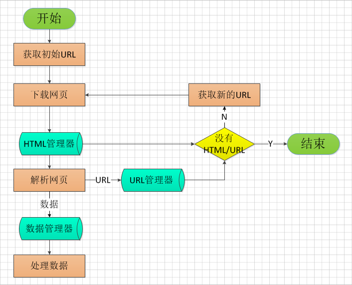

##项目简介

Python爬虫框架和使用该框架实现的各种爬虫。对应Python版本是Python2

编码规范参考：

* [《Python语言规范》](http://zh-google-styleguide.readthedocs.io/en/latest/google-python-styleguide/python_language_rules/)
* [《Python风格规范》](http://zh-google-styleguide.readthedocs.io/en/latest/google-python-styleguide/python_style_rules/)

扩展阅读：[《高质量的工程代码为什么难写》](http://hellojava.info/?p=508)

>做成一件事，使用的方法越简单越好，所以这个项目我坚持如下原则：在实现功能的基础上，代码量尽可能少、逻辑尽可能简单

##项目背景介绍

Python在互联网时代有很多天然的优势：

* 有诸多Python开发的Web框架：django、flask、web.py等，可以方便的拿来做Web开发
* Python开发爬虫也有天然的优势，比如自带的urllib、urllib2、htmlparser、re等模块，还有很多的第三方开发包，比如Requests、Beautiful Soup、lxml等，可以很方便的处理HTTP、下载网页、解析网页等
* Python在数据分析方面也有很强的优势，比如可以使用Numpy、matplotlib、pandas等包对爬下来的数据进行数据分析、处理，通过图表等方式进行人性化的展示
* 当然对于用爬虫爬取并分析的数据，还可以用Python进行Web开发来在网站上展示数据的分析结果

可以看到Python在爬虫、数据分析、开发Web网站展示数据等全流程上发挥作用

以上是我个人对于Python的一些思考，也正是基于如此的原因才激发我学习Python的兴趣

然而光学习而不动手的话，当时学到的东西很快就遗忘了，尤其是在计算机领域，单纯的学习Python语法、了解Python并没有什么用处，必须实实在在的用Python做出来东西才是最好的深刻学习Python的方法，不光是Python，计算机领域的诸多应用层面都应该如此：编程、调试、设计……

一直对Python爬虫比较感兴趣，在[《Python网络爬虫简单架构》](http://www.xumenger.com/python-spider-20160608/)、[《Python网络爬虫概述》](http://www.xumenger.com/python-crawler-20170102/)两篇文章中对于Python爬虫的简单逻辑、涉及到的各个方面进行了比较全面的讲述，所以计划基于这两篇文章的思想实现一个简单的爬虫框架

开发的过程中必然会遇到各种问题，必须去逐个针对性的解决，这也正是为什么实践是最好的学习方法的原因所在：遇到问题，思考应该用什么知识解决这个问题，再去针对性地学习这方面知识

##如何设计简单爬虫框架

计划实现的这个爬虫框架只用于抓取最简单的HTML页面，然后处理，不考虑Cookie、Session、验证码、AJAX、表单等复杂的东西

设计框架时需思考的问题：

* 多线程，其固有的Python GIL锁问题
* 多进程，进程间通信是个棘手的问题
* 解析网页属于CPU密集型的工作
* 下载网页属于网络IO
* 一般将网页解析结果保存到文件或数据库，所以其大都是磁盘IO

既然是爬虫框架，那么就需要先把所有爬虫的相同点、不同点摘取出来，在框架中将相同点封装起来，不同点可以通过开放接口的方式由每个具体的爬虫来实现

下面的总结是针对最简单的爬虫，暂不考虑登录、cookie、session、验证码、AJAX、表单等高级的东西

* 下载网页：简单的爬虫可以共用这部分逻辑，同
* 解析网页：不同的网页结构需要不同的解析方法，异
* 管理URL：爬虫可以共用这部分逻辑，同
* 输出内容：或者输出到数据库，或者输出到磁盘，异

开发大多数软件项目，有着相同的固定套路

* 普通业务程序的开发，需要弄清楚该程序对接的上游程序的接口、对接的下游程序的接口，然后按照接口对应实现内部功能逻辑
* 开发一个框架性的程序，需要先规划好开放出来的接口具体是什么样的，如何方便开发者调用，然后针对这个接口规划内部架构逻辑

综上而言，最重要的就是“接口”二字。接口是开发很好的切入点，从接口开始入手把整个流程逻辑梳理清楚。当然了这只是基于我现阶段知识和经验所产生的拙见

所以在没有开发之前我期望的爬虫框架的接口是这样的

* 有一个配置文件，配置URL正则表达式以及与之匹配的URL对应的处理类
* URL处理类中实现两个方法，Parse、Output
* Parse入参是[url, html]格式的数据，存储URL，以及URL对应网页的HTML字符串
* Parse方法内部实现对于HTML的解析
* Parse返回是[url, content]格式的数据，存储URL，以及该URL网页解析的结果
* Output入参是[url, content]格式的数据，Output内部用于将解析网页获取的内容进行输出

接口的初步设计粗略说明就是这样，接下来就是针对接口来规划框架内部应该如何实现了

对于[《Python网络爬虫简单架构》](http://www.xumenger.com/python-spider-20160608/)的框架做了一些完善，设计的爬虫框架逻辑如下

以上图是针对爬虫框架流程的设计，那各个功能如何分模块、分类组织呢？如何保证开发者基于框架开发出自己的爬虫？

这部分涉及到Python面向对象的设计，所以可能先要去补充一下设计模式相关的知识，然后看能不能选择一个或几个合适的设计模式应用其中

##设计模式简介

>首先推荐以下资料：王垠的[《解密“设计模式”》](http://www.yinwang.org/blog-cn/2013/03/07/design-patterns)、[《设计模式有何不妥，所谓的荼毒体现在哪？》](https://www.zhihu.com/question/23757237)，在了解设计模式之前先看看关于它的另一种态度

>黑设计模式主要是黑很多人为了使用设计模式而使用设计模式，最后为了输出Hello World，可能要编写数百行代码，获取一些完全不必要的灵活性，简直是自己找罪受。确实，不是代码越多你越牛逼，而应该是为了做出同样的功能，越简单越好，简单意味着代码好理解，好维护，自然扩展起来相对也就容易

>一个人的学习能力应该体现在如何将看似复杂、看似牛逼的东西用自己的思考去解构、简单化，去掉被众人谣传而产生的神秘面纱，看到知识最本质的样子

我不管是盲目吹捧，还是讽刺。我只知道这玩意儿是有用的，那么就有必要去花些时间精力研究它

学习最怕不知道学的东西有什么用，这也往往是初学者难以坚持、学习不深刻的原因。现在既然越来越感受到设计模式的重要，不妨依次为契机好好学习、梳理、应用

以下关于设计模式的内容大多参考[《设计模式》](http://www.runoob.com/design-pattern/design-pattern-tutorial.html)。设计模式主要基于以下的面向对象设计原则：

* 对接口编程而不是对实现编程
* 优先使用对象组合而不是继承

针对23种设计模式，大概可以分为三大类，另外还有J2EE模式

**创建型模式**。这些设计模式提供了一种在创建对象的同时隐藏创建逻辑的方式，而不是使用新的运算符直接实例化对象。这使得程序在判断针对某个给定实例需要创建哪些对象时更加灵活

包括：工厂模式、抽象工厂模式、单例模式、建造者模式、原型模式

**结构性模式**。这些设计模式关注类和对象的组合。继承的概念被用来组合接口和定义组合对象获得新功能的方式

包括：适配器模式、桥接模式、过滤器模式、组合模式、装饰器模式、外观模式、享元模式、代理模式

**行为模式**。这些设计模式特别关注对象之间的通信

包括：责任链模式、命令模式、解释器模式、迭代器模式、中介者模式、备忘录模式、观察者模式、状态模式、空对象模式、策略模式、模板模式、访问者模式

**J2EE模式**。这些设计模式特别关注表示层。这些模式是由Sun Java Center鉴定的

包括：MVC模式、业务代表模式、组合实体模式、数据访问对象模式、前端控制器模式、拦截过滤器模式、服务定位器模式、传输对象模式

##设计模式的六大原则

**开闭原则**。对扩展开放，对修改关闭。在程序需要进行扩展的时候，不用去修改原有的代码，实现一个热插拔的效果。简而言之，是为了使我们的程序的扩展性好，易于维护和升级。想要达到这样的效果，我们需要使用接口和抽象类

**里氏代换原则（LSP）**。任何基类可以出现的地方，子类一定可以出现。LSP是继承复用的基石，只有当派生类可以替换掉基类，且软件单位的功能不受到影响时，基类才能真正被复用，而派生类也能够在基类的基础上增加新的行为。里氏代换原则是对开闭原则的补充。实现开闭原则的关键步骤就是抽象化，而基类与子类的继承关系就是抽象化的具体实现，所以里氏代换原则是对实现抽象化的具体步骤的规范

**依赖倒置原则**。这个原则是开闭原则的基础，具体内容是：针对接口编程，依赖抽象而不依赖于具体

**接口隔离原则**。使用多个隔离的接口，笔使用单个接口要好。它还有另外一个意思是：降低类之间的耦合度。由此可见，其实设计模式就是从大型软件架构出发、便于升级和维护的软件设计思想，它强调降低依赖，降低耦合

**迪米特法则（最少知道原则）**。一个实体应当尽量少地与其他实体之间发生相互作用，使得系统功能模块相对独立

**合成复用原则**。尽量使用合成/聚合的方式，而不是使用继承

>上面扯了这么多虚头巴脑的东西，那到底应该怎么设计这个爬虫框架呢？

