##WinDbg的使用

>本文使用的操作系统是Windows 7，以下的讲解可以帮助我更好的理解WinDbg的调试逻辑，同时可以参考[《汇编与逆向基础：使用IDA和OllyDbg分析C函数调用》](http://www.xumenger.com/c-assembly-ollydbg-ida-20161216/)和OllyDbg对比一下

在[《WinDbg小试牛刀》](http://www.xumenger.com/windbg-20170214/)中讲到了符号表路径的设置。其作用是Windows基础库比如ntdll的符号文件，其会根据操作系统的版本自动下载

Delphi的符号文件是map文件，在WinDbg中无法使用，因为WinDbg处理的符号文件需要是PDB格式的

WinDbg有以下三种调试方式：

* 新打开一个进程然后进行调试
* Attach到一个已经打开的进程上进行调试
* 分析进程转储Dump文件。所谓Dump就是将转储当时进程内存中的所有二进制内容（数据、指令）落地到磁盘得到的文件，它保存的是某一刻进程的内存状态

在调试进程的时候，会有一个复选框，是否侵入式

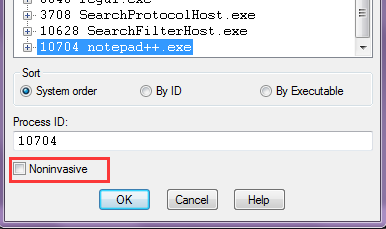

侵入式：可以跟踪程序，可以运行，如果关闭WinDbg，目标程序也会被关闭；非侵入式：只是查看当前程序的运行情况，如同查看Dump一样。如果有其它调试器已经在调试这个程序了，只能使用非侵入式Attach到进程上，而且原来的调试器也会卡住，只有当WinDbg退出调试时，原调试器才可以继续调试

使用WinDbg也可以生成Dump文件，比如现在将WinDbg Attach到Notepad++，然后执行下面的命令

```
.dump -ma d:\notepad++.dmp
```

如下图，其成功在D盘生成了一个Dump文件

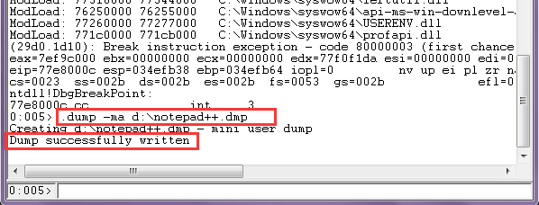

##WinDbg的N板斧

一个进程在操作系统（Windows）中运行起来有哪些要素？线程、dll、内存（数据、指令）等，使用WinDbg就可以很方便的查看进程的这些信息，下面还主要是通过WinDbg Attach到Notepad++展示其基础命令

[~] 命令可以显示当前，红框标注的是进程号，蓝框标注的是线程号，其都是16进制的，紫框标注的是当前线程是否挂起。其中最后一个线程一般是WinDbg的注入线程（Windows有专门的API创建远程线程，也就是在进程2中创建线程其实运行在进程1中）

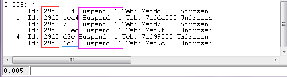

在[《Delphi的TThread类和WinAPI的线程方法》](http://www.xumenger.com/delphi-winapi-thread-20160516/)有讲到线程挂起、SuspendThread和ResumeThread的用法、以及挂起次数的概念。上图中紫框内Suspend: 1表示线程被挂起，挂起次数为1，只有当Suspend: 0时表示线程没有被挂起，是处于运行状态的

[~\*] 命令可以查看线程更详细的信息，比如线程的入口

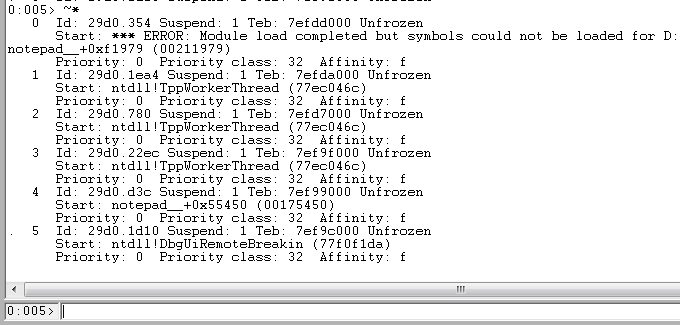

[kv 线程号] 命令可以查看线程的调用栈，每个线程有自己的调用栈，其中线程号不是操作系统的线程号概念，而是WinDbg标注线程的方式，进程中的所有线程从0开始标注，比如下面查看0号线程的调用栈

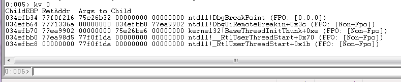

[~* kv] 用于查看所有线程的调用栈，根据每个函数输出的调用栈信息（也就是调用函数信息），可以知道现在这些线程分别在干什么，调用栈的输出顺序是最底下的输出是线程最先调用的函数，往上是依次调用的函数

如果有符号表，后面会显示函数名称，如果没有符号表，后面只会有主地址+当前偏移量

对于上面kv 输出的信息，第一列是栈地址，后面是地址对应的值（比如要调用的函数地址），可以认为是函数，在后面的三个认为是参数

>Delphi的bpl是升级的DLL，已经将函数导出

>WinDbg根据bpl的导出函数表，而不是符号表文件，可以知道偏移地址的函数名。如果偏移值比较小，说明是可能这个函数加一个偏移后面是call调用；如果偏移值比较大，说明计算得到的离得最近的函数（是导出函数），但可能并不是我们要找的函数，里面有些没有导出表的内部函数，实际可能是内部函数而不是导出函数

[dd 地址/符号名] 显示地址后面的值，就像在[《WinDbg小试牛刀》](http://www.xumenger.com/windbg-20170214/)中演示的，这里可以查看一下Notepad++进程内部的内存

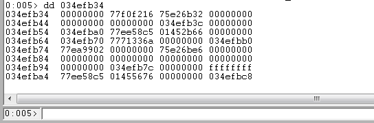

[~1s] 切换到1号线程，然后可以使用kv查看1号线程的调用栈

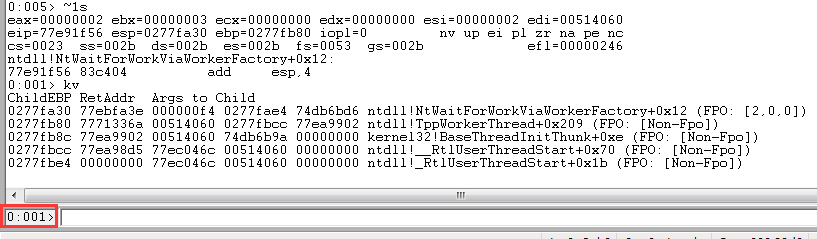

于此同时，可以看到命令输入框的0:005变成了0:001，说明从5号线程切换到了1号线程

[lm]和[lmf] 显示所有的模块（exe、dll等），其中lmf输出的信息更详细。可以看到各个模块的在内存中的起始地址、结束地址；可以查看模块是加载的哪些地址下的模块，会不会被侵入式替换了

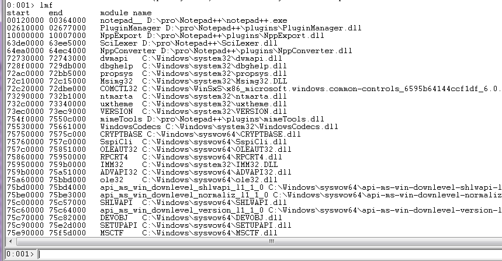

[bp 地址/符号名] 可以用于在某个地址下断点

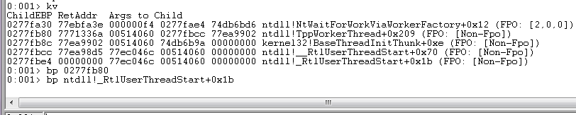

[!cs] 显示所有的临界区（Critical Section）信息

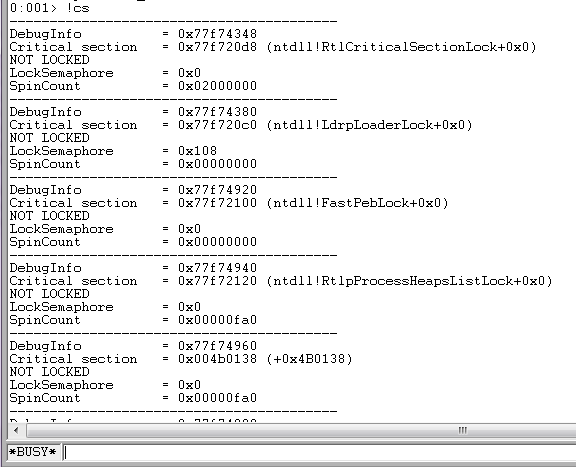

其中每个临界区信息的第三个字段是表示临界区是否处于锁住状态，NOT LOCKED表示当前未锁住，LOCKED表示当前处于锁住状态

针对临界区输出的第二个字段Critical section的值，可以执行[dt \_CRT\_CRITICAL\_SECTION 0x77f720d8]查看该临界区结构体的详细信息

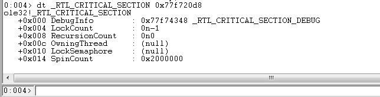

其中第一个字段DebugInfo是一个\_RTL\_CRITICAL\_SECTION\_DEBUG结构体的值，该结构体提供对于临界区调试的支持；LockCount字段，初始值为-1，被线程拥有后，大于等于0，反映等待和已经进入关键区的线程数；OwningThread字段，拥有线程（已经进入临界区）的句柄；等。了解该结构体的详细信息、每个字段的作用，有助于很好的理解Windows临界区的工作原理

>假如线程1在占用临界区时候没有释放临界区就直接退出了，这个临界区并不会自动释放，会导致其他线程永远无法获取这个临界区，永久等待

[!locks] 显示锁住的锁

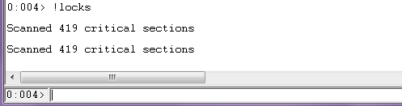

[!peb] 查看进程数据结构信息，可以按照加载顺序显示加载的模块，还有环境变量信息、模块（Exe、Dll）信息等


[!teb] 查看线程数据结构信息

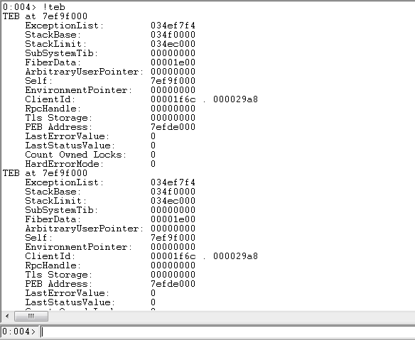

[!runaway 线程号] 显示线程的所有执行时间，启动了多久，用户态多久，内核态多久。看卡死，或性能分析的时候，可以找到是哪个线程在忙

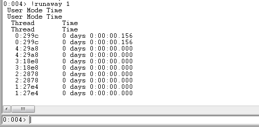

>当然这只是从WinDbg常用命令的角度做的整理，关于WinDbg更多更强大的命令、WinDbg如何同时调试多个进程、WinDbg的调试原理、如何与进程交互、操作系统如何支持的、编译器如何支持的、CPU如何支持的、操作系统层面如何表示进程、操作系统层面如何表示线程等更为底层的本文完全没有提及
