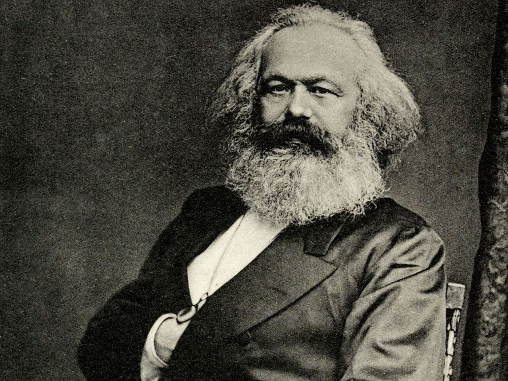
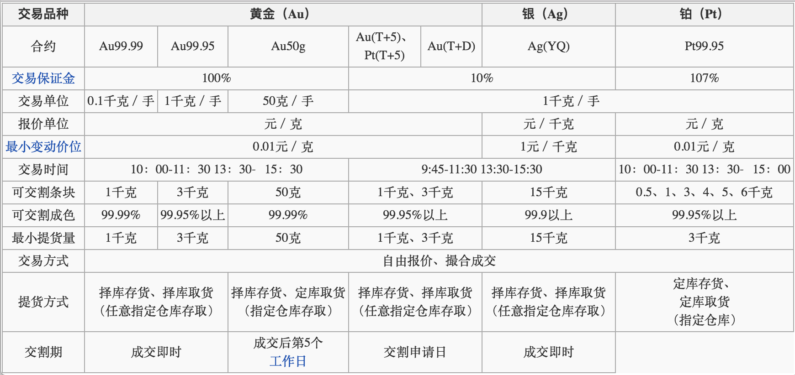
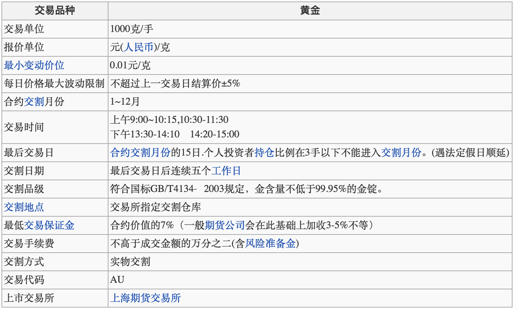

>“金银天然不是货币，但货币天然是金银”

##贵金属交易市场

贵金属主要包括金、银、铂族金属，有化学性质稳定、资源稀少，在金融市场、电子、通信、医疗等各个领域也有官方的应用，所以有很高的价值

又因为贵金属有很高的内在价值，所以在世界货币储备中占据很高的地位，尤其是黄金，在稳定国民经济、抑制通货膨胀方面有着不可替代的作用。截止2016年4月，我国黄金储备达1788.4吨，占外汇储备的2.2%。在通货膨胀或金融危机时期，为了避免持有的货币贬值，黄金等贵金属以其稳定的价值成为投资者争相投资的对象

另外，黄金、白银等还衍生出了各种贵金属投资方式。贵金属投资主要分为实物投资和电子盘交易投资。实物投资指的是买卖金银币、金银条、金银饰品等；而电子盘交易投资则是根据国际市场的实时行情，通过互联网进行交易，以黄金为例，就包括现货黄金、黄金期货、纸黄金等投资方式，这类交易一般都存在杠杆，可以用较小的成本套取较大的回报，但这也是一把双刃剑，因为高收益往往伴随着高风险

贵金属交易市场简单的说就是买卖黄金、白银、铂金、钯金等贵金属的场所。伦敦黄金交易市场最为悠久，其发展历史可以追溯到300多年以前，目前最有影响力的贵金属交易市场主要在英国和美国，因其成交活跃、交易量大，影响波及全球市场，交易价格也最具有参考性。亚洲的贵金属市场主要以中国香港为主，2002年上海黄金交易所的成立则标志着中国内地的贵金属市场走向全面开放

贵金属交易市场上主要有实物和电子交易两种方式。实物交易买卖的直接对象是贵金属本身，电子交易买卖的直接对象是贵金属的所有权，交易的是电子合同

贵金属的交易品种比较多，大多是从实物衍生而来的金融产品

目前贵金属交易市场主要分布在欧洲、亚洲、北美三个区域，各个区域相继开市、互相影响，形成了一个全球性的投资市场。我国贵金属市场起步较晚，相对于国际贵金属市场，还不够成熟和完善

##贵金属投资

Cu，铜。是一种有色金属，被广泛用于电气轻工、机械制造、和建筑工业等领域。目前市场上的铜主要通过现货、期货两种方式来交易，以期货铜为例，目前主要有三大交易中心：伦敦金融交易所（LME）、纽约商业交易所（COMEX）、上海期货交易所（SHFE），他们公布的铜定价被称为全球三大权威报价。无论现货铜还是期货铜都遵循T+0交易制度，而且二者都采用保证金交易制度，只是缴纳比例有所不同，投资者用少量资金就可以操纵大额交易，也就是所谓的杠杆

期货铜在一个交易日内有6%的涨跌幅限制

投资白银的方式多种多样，比如购买实物白银，比如银条、银锭、银章等，不过这些一般都是用于收藏和保值的；此外还可以通过白银T+D、现货白银、白银期货等方式进行投资，虽然交易方式不同，但其采用的价格均是国际银价，由伦敦黄金交易所的五大金行所定

和投资白银一样，可以通过购买实物投资黄金，还有另外比较主流的黄金投资形式：纸黄金、黄金期货、国际现货黄金等。黄金投资允许当天买入当天卖出，交易不受“隔夜”行情影响

同时，黄金投资遵循的双向交易可以让投资者在涨或跌的行情下都有机会获利。此外，黄金投资的保证金模式具有杠杆作用，即允许使用小额资金进行大额交易，不过凡是通过保证金交易的模式都有可能被追加保证金甚至强行平仓的情况，比如你的账户资金低于合同约定的最低保证金数额时，就意味着保证金不足，交易公司就会要求你追加保证金了，倘若未在规定时间内补足保证金，就会发生强行平仓的后果，交易合约就要被强行卖出了

贵金属交易成本，是指投资者进行贵金属交易时额外承担的所有手续费用。一般来说，交易平台会向投资者收取4种手续费：

* 下单买入贵金属支付的建仓费
* 决定卖出单子时支付的平仓费
* 单子没有当天卖出的持仓隔夜费
* 买卖差价产生的点差费

贵金属交易在交易成本上有一个显著区别，现货交易会产生持仓隔夜费，期货交易不会。不同的交易平台收取的费用比例或许不同，但基本差别不大，比较主流的交易成本计算方式是以全部交易金额为基数，分别收取0.08%的建仓费、平仓费、持仓隔夜费

如果每天频繁的交易，那么建仓费、平仓费会增加交易成本；如果长期持仓的话，每天都要计算的持仓隔夜费也会增加交易成本。所以如何在复杂的收费模式下通过投资黄金获利，还是很有难度的事情。投资者必须事先了解好交易规则，能熟练的计算收益、费用等重要的指标

##现货白银

现货白银，又称国际现货白银或伦敦银，是一种利用资金杠杆原理进行的一种合约式买卖。现货白银市国际商品市场的主流投资品种之一，每年交易额达数万亿美元

与普通的一手交钱，一手交货有所不同，现货白银的交易没有实物收付时间限制，投资者可以像炒股一样，择取合适的时机转让，赚取差额利润。从理论上来说，也可以提取白银实物，提前申请并补足相应金额即可

现货白银采取资金杠杆进行交易。此外现货白银价格无涨跌幅限制，因此投资者在操作时一定要注意止损

现货白银交易以美元作为货币单位，外汇市场上美元汇率的波动，对现货白银的价格有很大影响，一般情况下与美元的波动呈相反趋势

##伦敦金

伦敦金，是一种现货黄金交易方式，因最早起源于伦敦而得名，在国际市场上已经有300多年的历史。伦敦金是伦敦国际金融期货交易所提供的一种交易产品，交易对象是存放在伦敦城地下金库里99.5%纯度的400盎司金砖

如今伦敦金已经成为全球最重要的现货黄金交易方式，不像股市每天都有开盘收盘，在工作日，伦敦金24小时都可以交易，周末及国际节假日才休市

交易中，伦敦金以美元报价，以英制盎司为计量单位，最低交易量为1手，也就是1盎司，约等于3公斤黄金。而且投资者只需缴纳小额的保证金就可以进行大额交易，资金放大量约为100倍

伦敦金实行当天买入，当天即可卖出的T+0交易制度，并且不设涨跌幅限制

黄金交易量每天以万亿计算，很难有所谓的庄家能够操控如此巨大的市场

和股市不同，伦敦金市场没有牛市和熊市之分，投资者既可以买涨也可以买跌，无论金价走势如何，始终都有获利的机会

因为伦敦金的风险很大，如果没做好风险控制，倾家荡产也是分分钟的事

伦敦金作为一种国际现货黄金，目前并没有纳入我国的黄金交易品种，在国内也没有正规交易商

##纸黄金

所谓纸黄金，就是记账式黄金。投资者在银行预先开立一本“黄金存折账户”，存上一笔资金，就可以进行黄金买卖

目前国内只能在特定的银行开办纸黄金业务，其交易起点为10克黄金。纸黄金直接与国际金价挂钩，采取244小时不间断交易模式

纸黄金交易是无保证金交易，只能买涨不能买跌。也就是说投资者只能用足额资金买入等量黄金，等金价上涨后卖出，从差价中赚取利润

纸黄金交易的是黄金的所有权，并不需要对实物黄金进行提取。可以节省实物交易导致的储存费、运输费等，大大减少了交易产生的额外费用

因为其交易便捷、交易成本也相对低，所以吸引了大量投资者，从而加快了黄金市场上的资金流通，提高了黄金交易的速度

纸黄金也是要收取手续费的，所以要避免频繁进出

##黄金TD

黄金TD又称为“黄金延期交易”，是一种现货交易模式。由上海黄金交易所统一制定，以保证金方式进行交易。T是指Trade（交易），D是指Delay（延期），它的意思是投资者可以选择合约交易日当日交付，也可以无限期延长交付

以前的黄金TD交易是在交易大厅通过交易员口头喊价进行，目前大多数黄金TD交易都是通过电脑操作，由交易所的撮合系统进行撮合成交

其交易规则是，买卖双方都需要向交易所缴纳一笔资金作为保证金，保证金一般是买入等量实物黄金应付款项的10%，也就是说花费10万可以买入100万的资产

其交易时间也比较长，分别是9:00～11:30、13:00～15:30、21:00～2:30，共10个小时

它还可以进行实时交易，也就是只要在交易时间内都可以随时买卖。黄金TD交易可以买涨也可以买跌，还具有无限延期的特点，不用担心合约到期造成的损失

##黄金ETF

黄金ETF是一种开放式基金，由基金公司在证券交易所内公开发售，每一份基金对应一定数量的实物黄金。基金公司持有黄金的总数量就叫做黄金ETF的持仓量

目前全球最大的黄金ETF基金是美国SPDR Gold Trust，其持仓量可以在美国商品期货交易委员会（CFTC）查询，这个数据也被认为是黄金市场晴雨表，通常投资者会通过观察它来判断国际市场黄金价格走势

由于黄金ETF基金公司的资产规模较大，每当黄金ETF持仓量出现大幅增持或抛售时，往往也会导致黄金价格随之变动。而每一份黄金ETF基金都对应定量的实物黄金，所以黄金价格的每一次变化，同时也影响着黄金ETF持仓量的增持或减少

黄金ETF持仓量一般本认为是追踪金价波动的指标，因为黄金ETF持仓量是被动地跟踪黄金价格，其增减代表的是基金公司对黄金价格后市走势的一个判断，影响的只是现货黄金市场短期的波动

所以黄金ETF持仓量是黄金市场的一个重要指标

##上海黄金交易所

上海黄金交易所官网：[http://www.sge.com.cn/](http://www.sge.com.cn/)，上海黄金交易所简介点击[这里](http://wiki.mbalib.com/wiki/%E4%B8%8A%E6%B5%B7%E9%BB%84%E9%87%91%E4%BA%A4%E6%98%93%E6%89%80)查看

上海黄金交易所是经国务院批准，由中国人民银行组建，在国家工商行政管理局登记注册的，不以营利为目的的，实行自律性管理的法人。遵循公开、公平、公正和诚实信用的原则组织黄金、白银、铂等贵金属交易

上海黄金交易所的建立，将与货币市场、证券市场、外汇市场等一起构筑成我国完整的金融市场体系

上海黄金交易所的交易方式是：标准黄金、铂金交易通过交易所的集中竞价方式进行，实行价格优先、时间优先撮合成交；非标准品种通过询价等方式进行，实行自主报价、协商成交。会员可自行选择通过现场货远程方式进行交易

交易所主要实行标准化撮合交易方式。目前，交易的商品有黄金、白银、铂，交易标的必须符合交易所规定的标准。黄金有Au99.95、Au99.99和Au50g三个现货实盘交易品种，和Au(T+5)与延期交收两个现货保证金交易品种；铂金有Pt99.95现货实盘交易品种，和Pt(T+5)现货保证金交易品种；白银准备挂牌延期交收合约

接着说一下黄金交易所的账户结构：

* 会员：黄金交易所实行会员制组织形式
* 席位：一个会员下有多个席位
* 交易员：交易员从属于席位
* 客户

##上海期货交易所

上海期货交易所官网：[http://www.shfe.com.cn/](http://www.shfe.com.cn/)，上海期货交易所简介点击[这里](http://wiki.mbalib.com/wiki/%E4%B8%8A%E6%B5%B7%E6%9C%9F%E8%B4%A7%E4%BA%A4%E6%98%93%E6%89%80)查看

黄金期货并不是在上海黄金交易所而是在上海期货交易所进行的，下面是上海期货交易所黄金期货标准合约

##贵金属交易相关网址

* [金投网](http://www.cngold.org/gold_td/)
* [黄金网](http://gold.cnfol.com/)
* [鑫汇宝贵金属](http://www.91pme.com/?utm_source=baidupmepc&utm_medium=baidu&utm_campaign=pc&utm_content=c7068&utm_term=20170302)
* [析金法：贵金属](http://www.xijinfa.com/wiki/filter?page=1&tag_id=51176)

