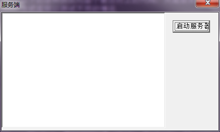
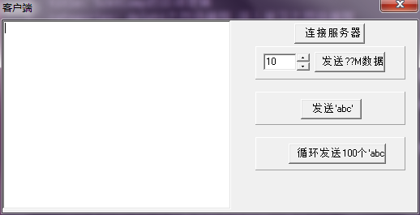
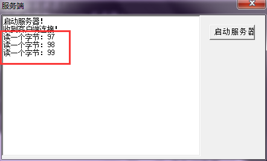
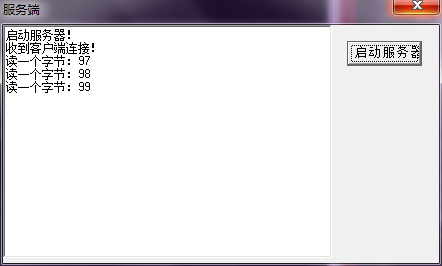
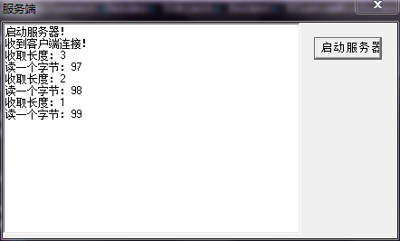

在阻塞编程中，在接收缓冲区中没有数据的情况下去读网络数据会阻塞，在发送缓冲区满了的情况下去发送数据也会阻塞。因为阻塞的特性，往往每个连接需要专门的线程来处理，这样很不灵活。使用非阻塞IO模型编程的话，就省去了创建大量线程的麻烦，不过开发难度也增加了很多

之前针对Delphi的网络编程、ScktComp整理过一些有的没的文章：

* [《Delphi网络编程：ScktComp源码解析初步》](http://www.xumenger.com/02-delphi-socket-source-20170103/)
* [《Delphi网络编程：ServerSocket/ClientSocket的线程分布》](http://www.xumenger.com/01-delphi-socket-thread-20170103/)
* [《Delphi网络编程：发送和接收二进制数据》](http://www.xumenger.com/delphi-binary-socket-20161222/)
* [《Delphi网络编程：FIX网络协议》](http://www.xumenger.com/delphi-network-fix-20161221/)
* [《Delphi网络编程：阻塞和非阻塞》](http://www.xumenger.com/windows-delphi-socket-20161011/)
* [《Delphi网络编程：使用ServerSocket/ClientSocket》](http://www.xumenger.com/windows-delphi-socket-20161010/)
* [《Delphi网络编程：使用IdTcpServer/IdTcpClient》](http://www.xumenger.com/windows-delphi-socket-20160929/)

目前还没有针对性的研究过ScktComp封装代码的逻辑，但是因为使用的比较多，所以还是有必要研究一下其在应用层面的逻辑

以下的测试中，客户端、服务端均在一台机器上

以下的各种测试均基于最后附上的代码，只是服务端的OnRead方法以不同的方式实现以测试不同的情况

服务端启动后界面如下



客户端启动后界面如下



##什么情况下会回调OnRead

```
procedure TForm1.SocketRead(Sender: TObject; Socket: TCustomWinSocket);
var
  buf: array of Byte;
begin
  SetLength(buf, 1);
  Socket.ReceiveBuf(buf[0], 1);
  sRet := IntToStr(buf[0]);
  mmoMsg.Lines.Add('读一个字节：' + sRet);
end;
```

启动服务器后，客户端发起连接，然后客户端发送数据'abc'，按照上面的数据，服务端每次在OnRead中读取一个字节，并将该字节的ASCII码输出

客户端发送'abc'后，服务端的运行情况如下



>效果很明显，并不是在只有客户端发送数据的情况下触发服务端的OnRead，而是当服务端的缓冲区中有数据时，就必然触发OnRead

##OnRead的回调顺序

```
procedure TForm1.SocketRead(Sender: TObject; Socket: TCustomWinSocket);
var
  buf: array of Byte;
  i: Integer;
  sRet: string;
begin
  SetLength(buf, 1);
  Socket.ReceiveBuf(buf[0], 1);
  sRet := IntToStr(buf[0]);
  mmoMsg.Lines.Add('读一个字节：' + sRet);
  for i:=0 to 1000 do
  begin
    Sleep(10);
    Application.ProcessMessages();
  end;
end;
```

因为OnRead是启动服务端或客户端的线程中回调的，但又因为其是基于消息机制的，所以编写上面的程序验证是不是第一个OnRead回调完，才会触发第二个回调，在读完数据后加一个循环，如此让一个OnRead时间比较长，另外加Application.ProcessMessages()是为了可以响应消息

启动服务端，客户端发起连接，然后发送'abc'，服务端的运行情况如下



在第一个OnRead读1个字节数据后，进入循环，但是因为缓冲区中还有网络数据，并且因为循环中有Application.ProcessMessages()，所以继续产生消息，并且OnRead被触发，继续读下一个字节，同样的，直到读完缓冲区内的三个字节

除了这个运行现象，还可以发现，在服务端将数据打印出来后，尝试去通过点击X来关闭服务端是关不了的，因为此时主线程还在循环中，只有循环结束了才可以关闭它

>通过这个现象去深刻理解ScktComp的消息机制！

##ReceiveLength()函数返回值是什么

```
procedure TForm1.SocketRead(Sender: TObject; Socket: TCustomWinSocket);
var
  buf: array of Byte;
  Length, i: Integer;
  sRet: string;
begin
  Length := Socket.ReceiveLength();
  mmoMsg.Lines.Add('收取长度：' + IntToStr(Length));
  SetLength(buf, 1);
  Socket.ReceiveBuf(buf[0], 1);
  sRet := IntToStr(buf[0]);
  mmoMsg.Lines.Add('读一个字节：' + sRet);
end;
```

同样的测试操作：启动服务端，客户端连接上服务端，客户端给服务端发送数据'abc'，然后服务端的运行现象如下



所以ReceiveLength返回的应该是当前缓冲区中还有多少字节的数据！

##客户端程序

```
unit MainForm;

interface

uses
  Windows, Messages, SysUtils, Variants, Classes, Graphics, Controls, Forms,
  Dialogs, ScktComp, StdCtrls, ComCtrls, ExtCtrls;

type
  TForm1 = class(TForm)
    mmoMsg: TMemo;
    btnConnect: TButton;
    pnlTest1: TPanel;
    btnSend: TButton;
    edtMB: TEdit;
    udMB: TUpDown;
    pnlTest2: TPanel;
    btnSend2: TButton;
    pnlTest3: TPanel;
    btnSend3: TButton;
    procedure FormCreate(Sender: TObject);
    procedure FormDestroy(Sender: TObject); 
    procedure btnConnectClick(Sender: TObject);
    procedure btnSendClick(Sender: TObject);
    procedure btnSend2Click(Sender: TObject);
    procedure btnSend3Click(Sender: TObject);
  private
    procedure SocketConnect(Sender: TObject; Socket: TCustomWinSocket);
  public
    { Public declarations }
  end;

var
  Form1: TForm1;
  Client: TClientSocket;

implementation

{$R *.dfm}

procedure TForm1.FormCreate(Sender: TObject);
begin
  Client := TClientSocket.Create(nil);
end;

procedure TForm1.FormDestroy(Sender: TObject);
begin
  Client.Close();
  Client.Free();
end;

procedure TForm1.btnConnectClick(Sender: TObject);
begin
  Client.Address := '127.0.0.1';
  Client.Port := 8877;
  Client.OnConnect := SocketConnect;
  Client.Open();
end;

procedure TForm1.btnSendClick(Sender: TObject);
var
  buf: array of Byte;
  src: string;
  i: Integer;
  MB: Integer;
begin
  try
    src := 'a';
    MB := StrToIntDef(edtMB.Text, 10) * 1024 * 1024;
    
    SetLength(buf, MB);
    for i:=0 to MB-1 do
    begin
      Move(src[1], buf[i], 1);
    end;
    Client.Socket.SendBuf(buf[0], MB);
    mmoMsg.Lines.Add('成功发送' + IntToStr(MB div 1024 div 1024) + 'MB字节数据');
  except
    on E: Exception do
    begin
      Application.MessageBox(PChar(E.Message), '发送数据出现异常', MB_ICONERROR)
    end;
  end;
end;

procedure TForm1.SocketConnect(Sender: TObject; Socket: TCustomWinSocket);
begin
  mmoMsg.Lines.Add('成功连接到服务端！')
end;


procedure TForm1.btnSend2Click(Sender: TObject);
var
  buf: array of Byte;
  src: string;
begin
  src := 'abc';
  SetLength(buf, 3);
  Move(src[1], buf[0], 3);
  Client.Socket.SendBuf(buf[0], 3);

  mmoMsg.Lines.Add('发送内容''abc''');
end;

procedure TForm1.btnSend3Click(Sender: TObject);
var
  buf: array of Byte;
  src: string;
  i: Integer;
begin
  for i:=0 to 99 do
  begin
    src := 'abc';
    SetLength(buf, 3);
    Move(src[1], buf[0], 3);
    Client.Socket.SendBuf(buf[0], 3);
  end;

  mmoMsg.Lines.Add('发送完100个''abc''');
end;

end.
```

##服务端程序

```
unit MainForm;

interface

uses
  Windows, Messages, SysUtils, Variants, Classes, Graphics, Controls, Forms,
  Dialogs, ScktComp, StdCtrls;

type
  TForm1 = class(TForm)
    btnOpen: TButton;
    mmoMsg: TMemo;
    procedure FormCreate(Sender: TObject);
    procedure FormDestroy(Sender: TObject);
    procedure btnOpenClick(Sender: TObject);
  private
    procedure SocketConnect(Sender: TObject; Socket: TCustomWinSocket);
    procedure SocketRead(Sender: TObject; Socket: TCustomWinSocket);
  public
    { Public declarations }
  end;

var
  Form1: TForm1;
  Server: TServerSocket;

implementation

{$R *.dfm}

procedure TForm1.FormCreate(Sender: TObject);
begin
  Server := TServerSocket.Create(nil);
end;

procedure TForm1.FormDestroy(Sender: TObject);
begin
  Server.Free();
end;

procedure TForm1.btnOpenClick(Sender: TObject);
begin
  Server.Port := 8877;
  Server.OnClientConnect := SocketConnect;
  Server.OnClientRead := SocketRead;
  Server.Open();
  mmoMsg.Lines.Add('启动服务器！');
end;

procedure TForm1.SocketConnect(Sender: TObject; Socket: TCustomWinSocket);
begin
  mmoMsg.Lines.Add('收到客户端连接！')
end;

//以上的测试程序只需要修改这里的代码去进行测试即可
procedure TForm1.SocketRead(Sender: TObject; Socket: TCustomWinSocket);
begin
  ...
  ...
end;

end.
```

对应的程序点击[这里](../download/20170329/testScktComp.zip)下载

之前在[《Delphi网络编程：ServerSocket/ClientSocket的线程分布》](http://www.xumenger.com/01-delphi-socket-thread-20170103/)讲到回调并不是在主线程中。对于ClientSocket、ServerSocket，其是在哪个线程启动（Open）的，就会在哪个线程中回调，其是通过消息机制的方式实现回调的！

所以如果使用ScktComp做网络开发的时候，注意不要在一个特别繁忙的线程中启动服务器或客户端，因为可能这个线程会太繁忙处理其他事情，而来不及处理ScktComp网络事件！