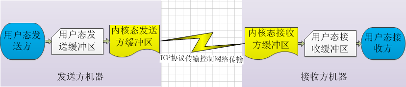
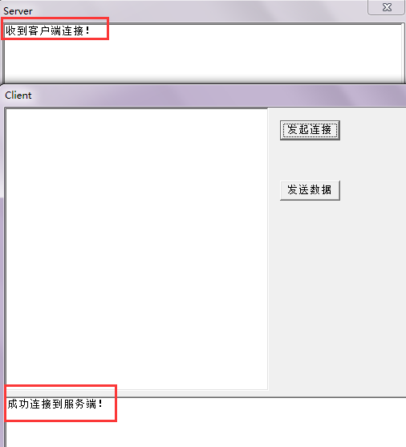
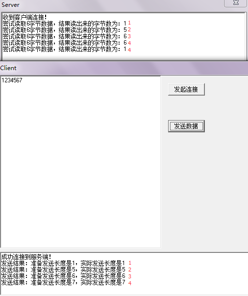
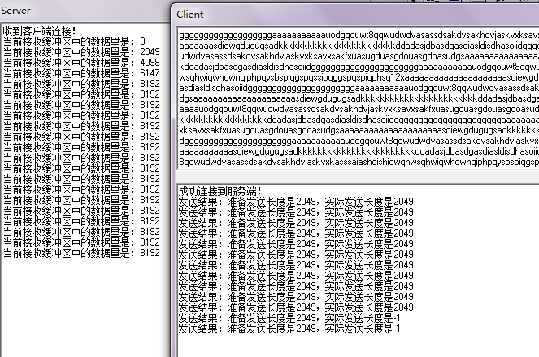
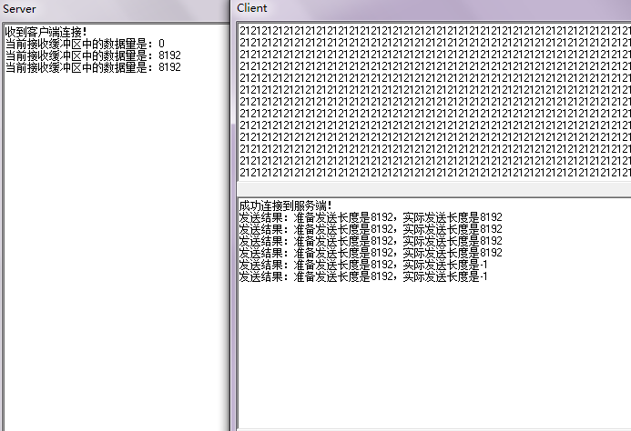
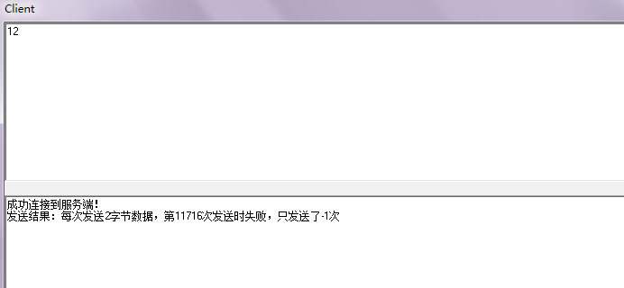
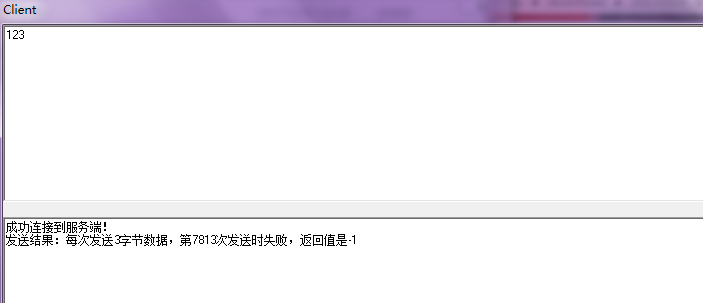

之前在[《Delphi网络编程：阻塞和非阻塞》](http://www.xumenger.com/windows-delphi-socket-20161011/)第一次研究阻塞和非阻塞网络编程的时候说到推荐使用非阻塞IO模式的网络编程，不推荐阻塞式的！

难道真像那里说的那么简单吗？非阻塞虽然节省了线程资源，但就没有其他坑了吗。一般我们在生活或者软件开发领域，对比两个事物或者两个方案，很难说某一个完全优于另一个（当然也有），大部分的情况是A在这方面优于B，但是在另外方面相比于B就有缺陷。其实这里也不例外，虽然非阻塞式IO节省了线程资源，但是其复杂度相比于阻塞式IO网络编程要复杂得多

下面就展示一下最近在使用ScktComp进行非阻塞网络编程时遇到的一些坑！

##Socket API简介

使用Socket API直接接收和发送数据的逻辑大概如下图


调用send()其实并不是直接将数据发送出去，而是将数据从用户态拷贝到内核态的发送缓冲区，然后内核态的TCP协议栈来进行发送；与之对应的是接收，调用recv()并不是直接从网络上收数据，而是TCP协议栈收到数据将数据放到内核态的接收缓冲区中，用户态调用recv()其实是从内核态接收缓冲区中读数据！

阻塞式IO和非阻塞式IO的很重要的区别就是读写数据的不同：

* 阻塞式网络编程
	* 发送数据时，如果调用send()要发送n字节数据，但内核态发送缓冲区只有n-m空间，那么就会阻塞当前线程，直到内核将发送缓冲区中的数据发出去，发送缓冲区中腾出n字节的空间，这时候send()方法才会成功将数据写到内核缓冲区，并且返回
	* 对应的，如果调用recv()要读取n字节数据，但内核态接收缓冲区中只收到n-m字节数据，那么就会阻塞当前线程，直到内核继续收齐n字节数据，recv()才会成功读到n字节数据并且返回
* 非阻塞式网络编程
	* 发送数据的时候，如果调用send()发送n字节数据，但内核态发送缓冲区只有n-m空间，其不会阻塞当前线程，而是直接将n-m字节数据写入，剩下的m字节没有写入，通过send()的返回值可以知道具体写入了多少数据。对于剩下的没有写到内核态缓冲区中的数据，就需要开发者控制等到下次可写的时候继续写入
	* 接收数据的时候，如果调用recv()要接收n字节数据，但内核态接收缓冲区只有n-m字节数据，其不会阻塞当前线程，而是直接读出n-m字节数据，通过recv()的返回值可以知道到底本次“收到”多少数据

对于阻塞式IO，当条件不满足时，会阻塞当前线程等待，虽然导致线程阻塞不工作，但是开发者不需要做其他额外的控制就可以保证数据的完整性；可是对于非阻塞式IO，会出现实际“发送”数据比想要“发送”数据少、实际“接收”数据比想要“接收”数据少的情况，那么就需要开发者针对这些情况进行很复杂的处理以保证数据的完整性

##ScktComp简介

ScktComp支持阻塞IO和非阻塞IO两种，非阻塞IO是使用select、WSAAsyncSelect配合事件回调机制来工作的，在[《ScktComp的回调逻辑》](http://www.xumenger.com/scktcomp-test-20170329/)一文中对于这部分的运行现象已经做了简单的介绍

如果是一个完善的非阻塞式网络库，针对上面提到的两种特殊情况（内核态发送缓冲区空间不足以放下要发送的数据、内核态接收区中的数据比要收的数据少）不应该让开发者进行特殊处理，而应该在网络库里面进行封装以方便开发者直接调用，一个简单的处理办法就是：

* 当内核态发送缓冲区空间不足时，应该由网络库申请用户态缓冲区，将剩下的未写入内核态发送缓冲区的数据先放到用户态缓冲区中，等到合适的机会再进行发送，这时候返回“发送成功”；或者发现发送的数据太多导致用户态发送缓冲区也太大，那么就返回发送失败。对于调用网络库发送接口的用户来说只需要关注发送是否成功，处理的数据粒度是每次发送的数据大小，而不需要考虑某次发送数据，前n个字节发送成功，剩下的m个字节发送失败的情况
* 接收部分，应该是由网络库持续先将数据从内核态接收缓冲区中读到用户态接收缓冲区中，然后开发者调用网络库的接收API是直接从用户态接收缓冲区中读数据，如果用户态接收缓冲区中有足够多的数据，那么调用成功，一旦用户态接收缓冲区中的数据不够，哪怕少一个字节都直接返回调用失败，并且不返回任何数据。如此将接收的粒度也控制在每次读的数据大小，而不需要考虑接收一部分的情况

就像下图，增加一个用户态发送缓冲区和用户态接收缓冲区。这就是典型的通过增加一层的方法来解决大多数计算机领域的问题



但是我们看一下ScktComp这个网络库的发送和接收API是怎么实现的？！

比如发送数据的sendbuf函数，其中就只是直接调用send()这个Socket API而已，完全没有考虑如果内核发送缓冲区满了的情况去自己在用户态缓冲数据等到合适的时机再发送，还需要开发者自己去处理内核发送缓冲区满了的情况！

```
function TCustomWinSocket.SendBuf(var Buf; Count: Integer): Integer;
var
  ErrorCode: Integer;
begin
  Lock;
  try
    Result := 0;
    if not FConnected then Exit;
    Result := send(FSocket, Buf, Count, 0);
    if Result = SOCKET_ERROR then
    begin
      ErrorCode := WSAGetLastError;
      if (ErrorCode <> WSAEWOULDBLOCK) then
      begin
        Error(Self, eeSend, ErrorCode);
        Disconnect(FSocket);
        if ErrorCode <> 0 then
          raise ESocketError.CreateResFmt(@sWindowsSocketError, [SysErrorMessage(ErrorCode), ErrorCode, 'send']);
      end;
    end;
  finally
    Unlock;
  end;
end;
```

接收倒是通过OnRead回调通知开发者，但实际读还是需要开发者通过调用ReceiveBuf来读取内核接收缓冲区中的数据。ReceiveBuf其实还是直接调用recv()这个API，如果内核接收缓冲区中的数据量不足，那么还需要开发者自己做一些特殊处理

```
function TCustomWinSocket.ReceiveBuf(var Buf; Count: Integer): Integer;
var
  ErrorCode: Integer;
begin
  Lock;
  try
    Result := 0;
    if (Count = -1) and FConnected then
      ioctlsocket(FSocket, FIONREAD, Longint(Result))
    else begin
      if not FConnected then Exit;
      Result := recv(FSocket, Buf, Count, 0);
      if Result = SOCKET_ERROR then
      begin
        ErrorCode := WSAGetLastError;
        if ErrorCode <> WSAEWOULDBLOCK then
        begin
          Error(Self, eeReceive, ErrorCode);
          Disconnect(FSocket);
          if ErrorCode <> 0 then
            raise ESocketError.CreateResFmt(@sWindowsSocketError, [SysErrorMessage(ErrorCode), ErrorCode, 'recv']);
        end;
      end;
    end;
  finally
    Unlock;
  end;
end;
```

所以我们可以看到ScktComp这个网络库是一个封装不充分的网络库，太多的非阻塞网络处理的细节还需要使用网络库的开发者来进行考虑！

##发送方发送3字节，接收方尝试读6字节

在[《ScktComp的回调逻辑》](http://www.xumenger.com/scktcomp-test-20170329/)中讲到过这个场景的实验，但是没有讲到开发者怎么知道这种情况的出现

这里就继续探讨一下：很简单，在调用ReceiveBuf之后，将返回值和入参中想要收取的数量进行对比

下面就编写一个程序来实验一下：接收方收到3个字节的数据，但是尝试调用ReceiveBuf读6个字节。对应的程序点击[这里](../download/20170404/01.zip)下载

先启动服务端，然后启动客户端发起连接



然后客户端发送数据分别发送1、5、6、7个字节，对应看到服务端尝试读6个字节会是什么样的结果



* 第一次客户端发送1个字节，服务端尝试读6个字节但只读到1个字节
* 第一次客户端发送5个字节，服务端尝试读6个字节但只读到5个字节
* 第一次客户端发送6个字节，服务端尝试读6个字节成功读到6个字节
* 第一次客户端发送7个字节，服务端尝试读6个字节成功读到6个字节
	* 但接收端缓冲区中还剩下1个字节，导致OnRead又被回调
	* 这次尝试读6个字节，但是只读到1个字节！

很显然，结合[《ScktComp的回调逻辑》](http://www.xumenger.com/scktcomp-test-20170329/)中的实验，非阻塞IO下，假如接收方缓冲区内只有1个字节，接收方尝试读6个字节，并没有阻塞，只是实际上只读出1个字节（通过返回值可知）

>使用非阻塞IO读写，会出现实际结果和预期不同的情况，针对这种情况的处理相比于阻塞式IO会复杂很多

##发送方一直发送，接收方不接收

将上面的程序做一下简单的修改，对应的程序点击[这里](../download/20170404/02.zip)下载。在服务端不收取数据，但添加一个Timer，每隔 5s时间输出当前内核态接收缓冲区中的数据数量，以方便进行监控

我想测试一下，如果接收端一直不收数据，发送端一直发送数据会有什么样的结果

之前查资料，说Windows的内核态缓冲区默认大小是8192字节，所以为了测试效果，选择发送端每次发送 2048 + 1，也就是2049字节的数据

发送端也每隔5s发送一次数据，保证和接收端有大概一直的频率

运行结果如下



可以看到，对于接收端，因为缓冲区的大小只有8192字节，其实当接收端的数据因为程序没有读而堆积到8192字节后，就不在收数据了

另外对于发送端，可以看到其前11次发送都是成功的（send），然后就发送失败了。可以理解为当发送端发出的数据因为对方没有接收而导致对方的接收缓冲区和本方的发送缓冲区都堆积满了之后

再试着每次发送8192字节会是什么样的效果呢？



这次是前4次发送成功，到了第5次就失败。上面确定了接收端缓冲区大小是8192字节，但是为什么2049\*11的值和8192\*4的值不同呢？到底接收端缓冲区是多少呢？我们修改一下[程序](../download/20170404/03.zip)继续测试一下

修改后的程序，循环每次调用SendBuf的时候都只发送n个字节，看循环到第几次的时候出现错误？运行效果如下

每次发送2个字节，在第11716次失败，也就是成功发送了11715次，2\*11715=23430字节，23430-8192=15238字节，那么这时候当发送缓冲区中有15238字节数据后，再往里写就会导致发送失败（经过多次测试，循环发送2个字节都是在第11716次失败）



每次发送1个字节呢，在第23431次失败，也就是成功发送了23430次，23430-8192=15238字节，那么这时候当发送缓冲区内有15238字节数据后，再往里写就会导致失败（经测试，也有时候是在第23430次失败）


每次尝试发送3个字节，在第7813次失败，成功发送了7812次，7812\*3-8192=15244，那么这种情况下，当发送缓冲区内部有15244字节数据后，再往里写就会导致失败



下面列一个不同情况的表格

| 每次发送字节数 | 第几次失败 | 成功多少次 | 发送端缓冲区堆积数据量 |  
| -------------- | ---------- | ---------- | ---------------------- |  
|       1        |   23431    |  23430     |   15238   |
|       2        |   11716    |  11715     |   15238   |
|       3        |   7813     |  7812      |   15244   |
|       4        |   5859     |  5858      |   15240   |
|       5        |   4688     |  4687      |   15243   |
|       6        |   3910     |  3909      |   15262   |
|       7        |   3351     |  3350      |   15258   |
|       8        |   2933     |  2932      |   15264   |
|       9        |   2609     |  2608      |   15280   |
|       20       |   1173     |  1172      |   15248   |
|       100      |   238      |  237       |   15508   |
|       1000     |   26       |  25        |   16808   |
|       2000     |   14       |  13        |   17808   |
|       3000     |   9        |  8         |   15808   |
|       4000     |   8        |  7         |   19808   |
|       8000     |   5        |  4         |   23808   |
|       10000    |   4        |  3         |   21808   |

