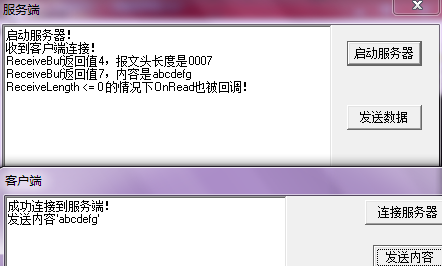
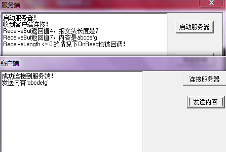
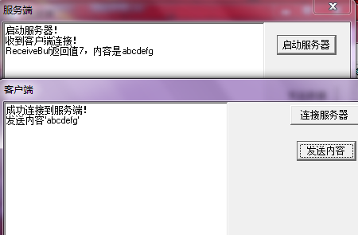
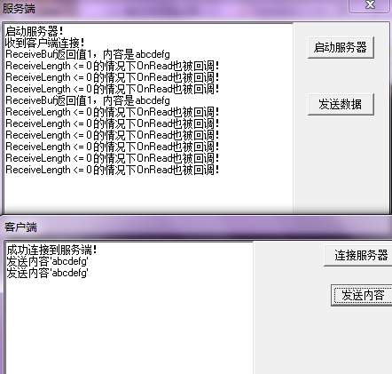
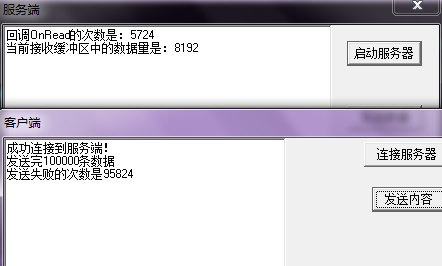
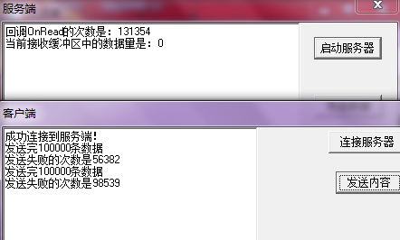
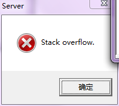

在[《ScktComp的回调逻辑》](http://www.xumenger.com/scktcomp-test-20170329/)中测试过这样的一个场景：ScktComp在非阻塞模式下，如果在OnRead回调中没有去调用ReceiveBuf之类的函数读数据，结果后续就不会再回调OnRead了，这样就会导致内核接收缓冲区数据堆积

这个现象本身是清楚了，但背后的原因目前还解释不了。最近在使用ScktComp非阻塞模式开发的时候，发现了很多的坑，也在[《ScktComp非阻塞网络编程的坑》](http://www.xumenger.com/socketapi-error-usage-20170404/)中整理过非阻塞模式下的坑（这些坑在现有的代码中都得一个一个修复）。除了这些问题，还发现ScktComp的OnRead在运行过程中还会有其他的一些诡异的现象，这里分别梳理一下

##接收缓冲区中没数据也会回调OnRead

开发过程中，不同的协议方式会有不同的现象：

* 纯文本协议
* 协议中包括二进制数据

**纯文本协议**

规定协议如下：协议头 + 内容。其中协议头是4字节的文本，表示后续内容的长度，比如'9989'表示后续内容的长度是9989字节，因为这里规定协议头是4个字节，所以内容最大只能有9999个字节

对应[测试程序](../download/20170406/01.zip)的逻辑如下：

* 发送方每次发送内容"abcdefg"，先打包报文头再发送
* 接收端OnRead被回调的时候，先读4个字节（文本），获取后续内容的长度
* 然后再根据长度读后续的内容

其运行现象如下：



发现接收端正确接收到数据，**但是还有一个现象，就是在ReceiveLength <= 0 的情况下OnRead也被回调！**

**包含二进制的协议**

规定协议如下：协议头 + 内容。其中协议头是4字节的数据，表示后续内容的长度，但不是文本，而是二进制的Integer内容，假如后续内容的长度为9999，那么这里并不像上面那样存储'9999'，而是二进制内容00000000 00000000 00100111 00001111，显然使用二进制能表示更长的内容

对应[测试程序](../download/20170406/02.zip)的逻辑如下：

* 发送方每次发送内容"abcdefg"，先打包报文头再发送
* 接收端OnRead被回调的时候，先读4个字节（二进制），获取后续内容的长度
* 然后再根据长度读后续的内容

其运行现象如下：



能正确的收到数据。而且ReceiveLength <= 0 的情况下OnRead也被回调！

>看起来运行现象和协议是二进制模式还是纯文本模式无关！

**OnRead里面只调用一次ReceiveBuf**

上面无论是使用纯文本协议，还是二进制协议，都会导致OnRead被回调两次。不过仔细看两个程序的代码，其都是在OnRead里面调用了两次ReceiveBuf。所以接下来的[这个实验](../download/20170406/03.zip)中直接发送'abcdefg'内容，不包含报文头，而接收端的OnRead里面也只调用一次ReceiveBuf

其运行效果如下：



这次成功读取了数据，并且在接收缓冲区中没有数据的时候也不会回调OnRead

**OnRead里面只调用七次ReceiveBuf**

上面测试了在OnRead中调用1、2次ReceiveBuf的情况，现在直接来个更极端的，接下来的[这个实验](../download/20170406/04.zip)中直接发送'abcdefg'内容，不包含报文头，而接收端的OnRead里面调用7次ReceiveBuf来一个字节一个字节读数据

其运行效果如下：



这时候，在接收缓冲区中没有数据的情况下，OnRead被不止一次调用！但是看上面截图中的运行效果，有的时候是“错误”回调3次，有的时候是“错误”回调6次！

>接收缓冲区中无数据依然回调OnRead的次数和OnRead里面调用ReceiveBuf的次数是什么关系？！看起来不像是简单的线性关系

##接收缓冲区中有数据但OnRead没被回调

开发的过程中还遇到这样的一个现象，一开始接收缓冲区中有数据的时候OnRead会被正确回调；但运行一段时间后，发现接收缓冲区中有数据，可是OnRead没有再被回调！

编写一个[测试程序](../download/20170406/05.zip)来复现这个现象

这个程序在第四个实验的基础上修改：

* 发送方连续发送100000次
* 每次尝试发送400字节数据
* 发送端发送完成后，打印失败的次数等信息
* 接收端每次OnRead回调中调用4次ReceiveBuf，每次读100字节数据
* 接收端打印回调OnRead的次数和当前接收缓冲区中的数量（用一个Timer实时更新）
* 然后对比发送的次数和OnRead回调的次数

连续发送100000次数据，然后再等几分钟依然是下图这样，缓冲区中堆积了8192字节数据，但是OnRead依然没有回调，导致缓冲区只能一直堆积（注：这个现象并非必现，可能要多压几次）



可以看到复现了当缓冲区中有数据，但是OnRead没有去调用的情况。接收缓冲区的数据一直读不出来，不光影响了接收端，也会影响发送端发送数据，可以看到发送端因为接收端接收缓冲区数据堆积，导致发送失败很多次！

>根据[《ScktComp非阻塞网络编程的坑》](http://www.xumenger.com/socketapi-error-usage-20170404/)所说的，这个测试程序是有问题的，假如发送的过快，接收端处理不过来，而发送端有没有对SendBuf返回值进行判断和处理，可能会导致所谓的“丢包”现象

**原因和解决方案**

直接原因是因为在判断ReceiveLength的时候不能像下面这样

```
procedure TForm1.SocketRead(Sender: TObject; Socket: TCustomWinSocket);
var
  i: Integer;
  bufContent: array of Byte;
  iRet: Integer;

  x: Integer;
begin
  Inc(OnReadCount);
  if 0 < Socket.ReceiveLength then
  begin
    //循环4次，每次读100字节
    for i:=0 to 3 do
    begin
      SetLength(bufContent, 100);
      iRet := Socket.ReceiveBuf(bufContent[0], 100);
    end;
  end
  else
  begin
    //在判断ReceiveLength<=0的时候不做任何事情
  end;
end;
```

而应该修改成这个样子，在`Socket.ReceiveLength<=0`的分支里调用一次ReceiveBuf，只不过不去读取任何数据就好了

```
procedure TForm1.SocketRead(Sender: TObject; Socket: TCustomWinSocket);
var
  i: Integer;
  bufContent: array of Byte;
  iRet: Integer;

  x: Integer;
begin
  Inc(OnReadCount);
  if 0 < Socket.ReceiveLength then
  begin
    //循环4次，每次读100字节
    for i:=0 to 3 do
    begin
      SetLength(bufContent, 100);
      iRet := Socket.ReceiveBuf(bufContent[0], 100);
    end;
  end
  else
  begin
  	//在判断ReceiveLength<=0的时候还是去调用ReceiveBuf，不过不读任何数据（也就是读0）
    Socket.ReceiveBuf(x, 0);
  end;
end;
```

对应的程序点击[这里](../download/20170406/06.zip)下载，运行现象如下：



可以看到接收缓冲区中不再堆积数据了。当然发送失败的情况还是存在，但这是两个范畴的问题，发送失败的原因在[《ScktComp非阻塞网络编程的坑》](http://www.xumenger.com/socketapi-error-usage-20170404/)中做过探讨！

##还发现另一个问题

大量使用Application.ProcessMessages()会导致栈溢出，像下面这样，如果在OnRead中使用Application.ProcessMessages()以响应其他消息，假如发送方发送大量数据导致这里OnRead被一直调用，那么就会大量调用Application.ProcessMessages()，导致栈溢出

```
procedure TForm1.SocketRead(Sender: TObject; Socket: TCustomWinSocket);
var
  i: Integer;
  bufContent: array of Byte;
  iRet: Integer;

  x: Integer;
begin
  Inc(OnReadCount);
  if 0 < Socket.ReceiveLength then
  begin
    //循环4次，每次读100字节
    for i:=0 to 3 do
    begin
      //让定时器可以响应消息，但是发现如果这里用Application.ProcessMessages()就会导致栈溢出
      Application.ProcessMessages;
      SetLength(bufContent, 100);
      iRet := Socket.ReceiveBuf(bufContent[0], 100);
    end;
  end
  else
  begin
    Socket.ReceiveBuf(x, 0);
  end;
end;
```

运行[程序](../download/20170406/07.zip)，出现栈溢出：



但是诡异的是，直接写一个死循环来调用Application.ProcessMessages()并不会导致问题，比如下面这样死循环调用Application.ProcessMessages()完全没问题

```
procedure TForm1.btn1Click(Sender: TObject);
begin
  while True do
  begin
    Application.ProcessMessages();
  end;
end;
```

##总结

>上面出现的这些诡异的现象，都分别给出了解决方案，但都不清楚为什么会是这样，最底层的原理还不清楚，蛋疼！
