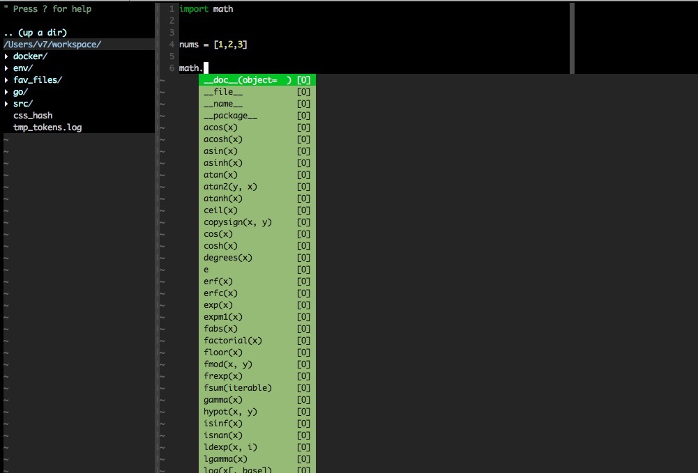

之前在[《配置一个强大的vim》](http://www.xumenger.com/vim/)中讲到如何配置Vim变成一个强大的开发工具，今天又发现一个好东西，让Vim在开发时更好用

首先是将下面的脚本保存到vim.sh中，随便放在那个某个目录下

```
#!/bin/bash
# install fisa vim config

echo '==============================='
echo 'start to install dependences...'
case "$OSTYPE" in
    darwin*)  brew install vim git pip curl;;
    linux*)   sudo apt-get install vim exuberant-ctags git pip curl;;
    *)        echo "unknown: OS: $OSTYPE, U should install dependences by yourself" ;;
esac
sudo pip install dbgp vim-debug pep8 flake8 pyflakes isort

echo '==============================='
echo 'start to download vimrc file...'
cp ~/.vimrc /tmp/vimrc.bak
curl -O https://raw.githubusercontent.com/fisadev/fisa-vim-config/master/.vimrc
mv .vimrc ~/.vimrc

echo '==============================='
echo 'start to install vim plugins...'
vim +BundleClean +BundleInstall! +qa

sudo chown $USER ~/.vim/
echo 'down! enjoy it!'
```

然后到这个目录下执行`bash vim.sh`

等待执行完成后重启一下bash终端，再输入vim命令就可以使用了，大致的效果如下




>每次运行本脚本，会把旧的 ~/.vimrc 文件备份到 /tmp/vimrc.bak ，并替换原来的 ~/.vimrc 文件

>目前支持MAC和Ubuntu系统。
