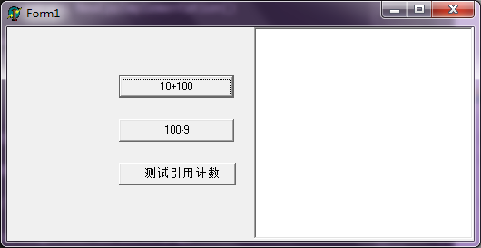
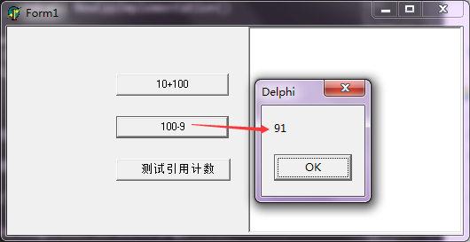
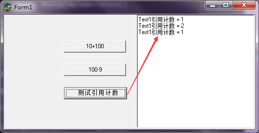
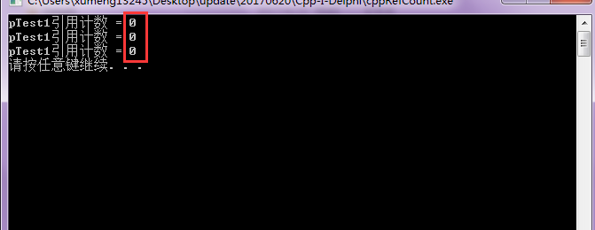

之前整理的文章[《Delphi对象内存模型：Delphi和VC++使用类进行对接》](http://www.xumenger.com/class-delphi-cpp-01-20161128/)中讲到C++通过纯虚方法如`virtual int __stdcall func()=0`定义的类、Delphi使用virtual; abstract;修饰的方法如`function func(): Integer; virtual; stdcall; abstract`定义的类可以实现对接，然后实现跨C++和Delphi的编程工作

这背后的原理其实很简单，就是Delphi的类内存模型是兼容C++的，所以Delphi可以通过定义好的接口来使用C++的实现！

之前的总结中，讲到Delphi和C++可以通过基础数据类型、数组、结构体、类进行对接，今天在这里再给出另一种对接模式：接口！不过本篇只将用法、实现、现象，背后更细节的原理不会讲到，会在后续再专门整理一篇文章来详细讲解

## Delphi端代码直接调用接口

对接C++实现的接口是这样定义的

```
unit InterfaceUnit;

interface

const
  CPPINTERFACE = 'cpp.dll';

type
  ITestInterface = interface(IInterface)
    function Add(const a: Integer; const b: Integer): Integer; stdcall;
    function Sub(const a: Integer; const b: Integer): Integer; stdcall;
    function GetRefCount(): Integer; stdcall;
  end;

function NewCppImplementation(): Pointer; stdcall; external CPPINTERFACE;

implementation

end.
```

对应的测试代码是这样的

```
procedure TForm1.btnAddClick(Sender: TObject);
var
  Test: ITestInterface;
  iRet: Integer;
begin
  Test := ITestInterface(NewCppImplementation());
  iRet := Test.Add(10, 100);
  ShowMessage(IntToStr(iRet));
end;

procedure TForm1.btnSubClick(Sender: TObject);
var
  Test: ITestInterface;
  iRet: Integer;
begin
  Test := ITestInterface(NewCppImplementation());
  iRet := Test.Sub(100, 9);
  ShowMessage(IntToStr(iRet));
end;

//C++内部实现引用计数，这里测试一下引用计数
procedure TForm1.btnRefCountClick(Sender: TObject);
var
  Test1, Test2: ITestInterface;
  iRet: Integer;
begin
  //第一次获取，引用计数为1
  Test1 := ITestInterface(NewCppImplementation());
  mmoRefCount.Lines.Add('Test1引用计数 = ' + IntToStr(Test1.GetRefCount()));

  //现在有两个指针指向这个对象，引用计数为2
  Test2 := Test1;
  mmoRefCount.Lines.Add('Test1引用计数 = ' + IntToStr(Test1.GetRefCount()));

  //将其中一个指针置为nil，引用计数减为1
  Test2 := nil;
  mmoRefCount.Lines.Add('Test1引用计数 = ' + IntToStr(Test1.GetRefCount()));

  //两个指针都置为nil，引用计数变为0，会自动释放
  Test1 := nil;
end;
```

## C++端对应代码实现

cpp.def中定义导出函数信息

```
LIBRARY		"cpp"

EXPORTS
	NewCppImplementation
```

cpp.h中定义导出函数的原型

```
#include "test_interface.h"
/**
实现一个获取C++内部实现的接口
**/
ITestInterface* __stdcall NewCppImplementation();
```

test_interface.h中给出接口（纯虚类）的定义

```
#include <stdio.h>
#include <string.h>
#include <windows.h>

#define I_OK 1

//管理引用计数
struct IUnKnown
{
	virtual unsigned long __stdcall QueryInterface( const char * iid, struct IUnKnown **ppv ) = 0;
	virtual unsigned long __stdcall AddRef() = 0;
	virtual unsigned long __stdcall Release() = 0;
};

class ITestInterface: public IUnKnown
{
public:
	virtual int __stdcall Add(const int a, const int b) = 0;
	virtual int __stdcall Sub(const int a, const int b) = 0;
};

class CTestImpl: public ITestInterface
{
protected:
	CRITICAL_SECTION m_RefLock;
	int m_iRefCount;
public:
	virtual unsigned long __stdcall QueryInterface( const char * iid, IUnKnown **ppv ){
		return I_OK;
	}
	virtual unsigned long __stdcall AddRef(){
		EnterCriticalSection(&m_RefLock);
		m_iRefCount++;
		LeaveCriticalSection(&m_RefLock);
		return I_OK;
	}
	virtual unsigned long __stdcall Release(){
		EnterCriticalSection(&m_RefLock);
		m_iRefCount--;
		LeaveCriticalSection(&m_RefLock);
		if(m_iRefCount <= 0)
			delete this;
		return I_OK;
	}
	
	CTestImpl();
	~CTestImpl();
	virtual int __stdcall Add(const int a, const int b);
	virtual int __stdcall Sub(const int a, const int b);
	virtual int __stdcall GetRefCount();
};
```

test_interface_impl.cpp中给出类的实现

```
#include "test_interface.h"

CTestImpl::CTestImpl()
{
	m_iRefCount = 0;
	InitializeCriticalSection(&m_RefLock);
}

CTestImpl::~CTestImpl()
{
	DeleteCriticalSection(&m_RefLock);
}

int __stdcall CTestImpl::Add(const int a, const int b)
{
	return (a + b);
}

int __stdcall CTestImpl::Sub(const int a, const int b)
{
	return (a - b);
}

int __stdcall CTestImpl::GetRefCount()
{
	return m_iRefCount;
}
```

cpp.cpp中给出导出函数的实现

```
#include "cpp.h"

ITestInterface* __stdcall NewCppImplementation()
{
	ITestInterface* pTest= NULL;
	pTest = new CTestImpl();
	return pTest;
}
```

>完成工程代码点击[这里](../download/20170620/Cpp-I-Delphi.zip)下载

## 运行Delphi的测试程序

任务启动时界面如下



下面分别测试加减法




然后是测试引用计数（详细在代码注释中有解释）



## C++引用计数 VS Delphi引用计数

上面的例子展示了在C++中实现有引用计数的类，在Delphi中创建的时候，会在构造、赋值、置为nil时自动调用AddRef、Release来增减引用计数

在[《浅谈引用计数》](http://www.xuebuyuan.com/1150521.html)中讲到了这样一点：

>Delphi中，不需要去考虑什么时候调用这两个方法，它会自动调用，但如果一旦脱离了Delphi，就必须考虑什么时候调用这两个方法，比如在纯C++编程时，必须自己显式调用这两个方法来管理引用计数

比如下面这个[例程](../download/20170620/cppRefCount.zip)，直接在C++中使用上面定义的C++类，来看一下引用计数变化情况

```
#include<stdio.h>
#include<stdlib.h>
#include "cpp.h"

int main()
{
	ITestInterface* pTest1;
	ITestInterface* pTest2;
	pTest1 = NewCppImplementation();
	printf("pTest1引用计数 = %d\n", pTest1->GetRefCount());

	pTest2 = pTest1;
	printf("pTest1引用计数 = %d\n", pTest1->GetRefCount());

	pTest2 = NULL;
	printf("pTest1引用计数 = %d\n", pTest1->GetRefCount());

	system("pause");
	return 0;
}
```

运行程序，可以看到引用计数一直为0，AddRef、Release不会像Delphi中自动被调用来管理引用计数



>C++可以对赋值号等运算符进行重载，比如可以对=进行重载，在重载实现中来调用AddRef或Release，实现类似的引用计数自动增减的效果
