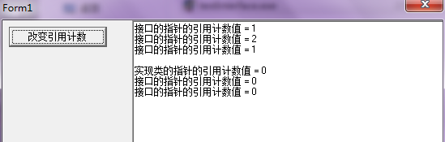

在[《Delphi通过接口和C++进行对接》](http://www.xumenger.com/cpp-delphi-interface-20170620/)提到了Delphi、C++的接口和引用计数等知识点，因为之前的系列文章[C++对象内存模型 ](http://www.xumenger.com/tags/#C++对象内存模型)已经对C++、Delphi类的内存模型进行探究了，对本文续接上一篇文章重点针对引用计数进行深入的研究和讲解！

Delphi的string、C++的是std::string都是引用计数应用的典型，本文会讲解引用计数

>本文的测试程序[代码](../download/20170621/testInterface.zip)

## 定义测试用的接口和类

```
unit TInfo;

interface
uses
  Windows, Dialogs, SysUtils, StrUtils;

type
  PPerson = ^RPerson;
  RPerson = record
    sName: string;
    iAge: Integer;
  end;

  IInfo = interface(IInterface)
  //Ctrl+Shift+G为定义的接口生成GUID
  ['{11BA9015-8463-4D7A-90BD-D66FF83E853C}']
    //接口定义以下接口，对应的类必须实现
    function GetName: string;
    function GetAge: Integer;
    function GetPerson(): PPerson;
    function GetRefCount(): Integer;
  end;

  TInfoDefault = class(TInterfacedObject, IInfo)
  public
    FPerson: PPerson;
  public
    constructor Create(sName: string = ''; iAge: Integer = 0);
    destructor Destroy; override;

    function GetName: string;
    function GetAge: Integer;
    function GetPerson(): PPerson;
    function GetRefCount(): Integer;
    function _AddRef: Integer; stdcall;
    function _Release: Integer; stdcall;
  end;

function GetInfoDefault(): IInfo;
function GetDefaultPerson(): PPerson;
function GetInfoDefaultV2(): IInfo;

implementation
var
  GInfoDefault: IInfo = nil;

function GetInfoDefault(): IInfo;
begin
  if (nil = GInfoDefault) then
  begin
    GInfoDefault := TInfoDefault.Create('Default单例', 100);
  end;
  Result := GInfoDefault;
end;

function GetDefaultPerson(): PPerson;
begin
  Result := GetInfoDefault().GetPerson();
end;

function GetInfoDefaultV2(): IInfo;
var
  aInfo: IInfo;
begin
  aInfo := TInfoDefault.Create('Default单例V2', 100);
  Result := aInfo;
end;

constructor TInfoDefault.Create(sName: string = ''; iAge: Integer = 0);
begin
  inherited Create;
  New(FPerson);
  if ('' <> sName) and (0 <> iAge) then
  begin
    FPerson.sName := sName;
    FPerson.iAge := iAge;
  end
  else
  begin
    FPerson.sName := 'Error';
    FPerson.iAge := 100;
  end;
end;

destructor TInfoDefault.Destroy();
begin
  Dispose(FPerson);
end;

function TInfoDefault.GetName: string;
begin
  Result := FPerson.sName;
end;

function TInfoDefault.GetAge: Integer;
begin
  Result := FPerson.iAge;
end;

function TInfoDefault.GetPerson(): PPerson;
begin
  Result := FPerson;
end;

function TInfoDefault.GetRefCount(): Integer;
begin
  Result := FRefCount;
end;

function TInfoDefault._AddRef: Integer;
begin
  Result := inherited _AddRef;
end;

function TInfoDefault._Release: Integer;
begin
  Result := inherited _Release;
end;

end.
```

## 什么情况下会改变引用计数？

```
procedure TForm1.btnChangeRefCountClick(Sender: TObject);
var
  Info1, Info2: IInfo;
  CInfo1, CInfo2: TInfoDefault;
begin
  //接口指针，通过实现类创建对象
  Info1 := TInfoDefault.Create('接口的指针', 10);
  mmoMessage.Lines.Add(Info1.GetName + '的引用计数值 = ' + IntToStr(Info1.GetRefCount));
  Info2 := Info1;
  mmoMessage.Lines.Add(Info1.GetName + '的引用计数值 = ' + IntToStr(Info1.GetRefCount));
  Info2 := nil;
  mmoMessage.Lines.Add(Info1.GetName + '的引用计数值 = ' + IntToStr(Info1.GetRefCount));

  mmoMessage.Lines.Add('');
  //实现类指针，通过实现类创建对象
  CInfo1 := TInfoDefault.Create('实现类的指针', 10);
  mmoMessage.Lines.Add(CInfo1.GetName + '的引用计数值 = ' + IntToStr(CInfo1.GetRefCount));
  CInfo2 := CInfo1;
  mmoMessage.Lines.Add(Info1.GetName + '的引用计数值 = ' + IntToStr(CInfo1.GetRefCount));
  CInfo2 := nil;
  mmoMessage.Lines.Add(Info1.GetName + '的引用计数值 = ' + IntToStr(CInfo1.GetRefCount));
  mmoMessage.Lines.Add('');
end;
```

点击按钮，输出信息如下



* Create的时候，引用计数+1
* 给一个指针赋值的时候，引用计数+1
* 将一个指针置为nil的时候，引用计数-1

## TInterfacedObject缺省的引用计数方法

上面展示了Delphi引用计数的规律和特点，对应看一下TInterfacedObject引用计数的缺省实现

```
interface

type
  TInterfacedObject = class(TObject, IInterface)
  protected
    FRefCount: Integer;
    function QueryInterface(const IID: TGUID; out Obj): HResult; stdcall;
    function _AddRef: Integer; stdcall;
    function _Release: Integer; stdcall;
  public
    procedure AfterConstruction; override;
    procedure BeforeDestruction; override;
    class function NewInstance: TObject; override;
    property RefCount: Integer read FRefCount;
  end;

implementation

function TInterfacedObject._AddRef: Integer;
begin
  Result := InterlockedIncrement(FRefCount);
end;

function TInterfacedObject._Release: Integer;
begin
  Result := InterlockedDecrement(FRefCount);
  if Result = 0 then
    Destroy;
end;

...
```

\_AddRef就是最简单的增加引用计数；但\_Release在减少引用计数的基础上，还会去判断，如果引用计数为0，则直接调用Destroy进行析构！可以修改引用计数的管理方法：

```
...

//增加引用计数还是使用缺省的方法
function TInfoChange._AddRef: Integer;
begin
  Result := inherited _AddRef;
end;

//减少引用计数修改为新的方法：减少引用计数但不做释放的处理
function TInfoChange._Release: Integer;
begin
  Result := InterlockedDecrement(FRefCount);
end;

...
```

## 顺便看看Python的引用计数

引用计数的应用还是很广泛的，其实在Python里面也是使用了引用计数的。比如下面这个例子可以看到a、b是指向同一个对象的两个引用

```
>>> a = 1
>>> print(id(a))
31294696
>>> b = a
>>> print(id(a))
31294696
>>> 
```

再看Python类对象的引用计数特点！`b = a`之后，引用计数就变大了，`del a`只是减少这个对象的引用计数，并没有释放其在内存中的资源，等到`del b`的时候，引用计数

```
>>> from sys import getrefcount
>>> class testClass(object):
  def __init__(self):
    print '构造方法'
  def __del__(self):
    print '析构方法'

    
>>> a = testClass()
构造方法
>>> print getrefcount(a)
2
>>> print getrefcount(a)
2
>>> b = a
>>> print getrefcount(a)
3
>>> del a
>>> del b
析构方法
>>> print getrefcount(a)

Traceback (most recent call last):
  File "<pyshell#23>", line 1, in <module>
    print getrefcount(a)
NameError: name 'a' is not defined
>>> 
```

>这里可能有点不符合我们直观上认知：第一次创建了对象后，使用getrefcount获取其引用计数是2而不是1！

## 参考资料

* [《Delphi使用FillChar时候如果有string可能导致内存泄漏》](http://www.xumenger.com/delphi-string-memory-20151118/)
* [《标准C++类std::string的内存共享和Copy-On-Write技术》](http://www.xumenger.com/cpp-string-copy-on-time-20151119/)
* [《C++浅拷贝、深拷贝及引用计数浅析》](http://blog.csdn.net/ieearth/article/details/49332709)
* [《浅谈引用计数》](http://www.xuebuyuan.com/1150521.html)
* [《COM编程——引用计数（1）》](http://www.jellythink.com/archives/232)
* [《Delphi通过接口和C++进行对接》](http://www.xumenger.com/cpp-delphi-interface-20170620/)
* [《Python深入06 Python的内存管理》](http://www.cnblogs.com/vamei/p/3232088.html)

