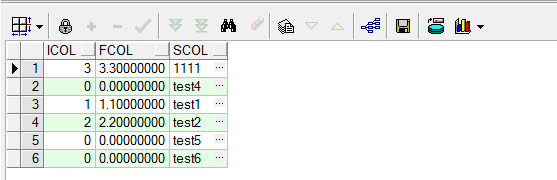
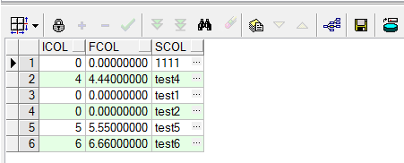
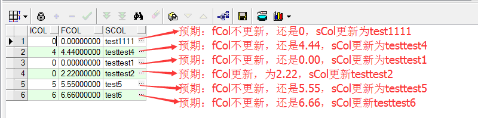

[《Delphi使用绑定变量法操作Oracle》](http://www.xumenger.com/z-delphi-oracle-parameter-20160711/)中有简单总结ADO绑定变量法的语法，但时至今日才发现后面有一些隐藏的坑。这里主要整理一下因为数据类型误用导致的坑！

首先准备一张测试用的数据表

```
CREATE TABLE testTable
(
iCol NUMBER(16),		--整型
fCol NUMBER(16, 8),		--浮点型
sCol VARCHAR(255)		--字符串
);
```

## 使用绑定变量法插入数据

对应的代码如下

```
var
  AdoConn: TADOConnection;
  AdoQry: TADOQuery;
  sSql, ConStr: string;
begin 
  sSql := 'insert into testTable(iCol, fCol, sCol) values(:iCol, :fCol, :sCol)';
  //测试过程中可能是因为自己没有安装OraOLEDB.Oracle.1驱动，如果用下面第一个连接串，会报错：未指定的错误
  //ConStr := 'Provider=OraOLEDB.Oracle.1; Persist Security Info=False; User ID=trade; Password=trade; Data Source=BAOPAN-PUB' ;
  ConStr := 'Provider=MSDAORA.1; Persist Security Info=False; User ID=trade; Password=trade; Data Source=BAOPAN-PUB' ;
  AdoConn := TADOConnection.Create(nil);
  AdoQry := TADOQuery.Create(nil);
  try
    try
      AdoConn.ConnectionString := ConStr;
      AdoConn.Open;
      AdoQry.Connection := AdoConn;
      
      AdoQry.SQL.Text := sSql;
      AdoQry.Parameters.ParamByName('iCol').Value:= 1;              //数据表整型，代码中也是整型
      AdoQry.Parameters.ParamByName('fCol').Value:= 1.1;            //数据表浮点型，代码中也是浮点型
      AdoQry.Parameters.ParamByName('sCol').Value:= 'test1';        //数据表是字符串，代码中也是字符串
      AdoQry.ExecSQL;

      AdoQry.Close;
      AdoQry.SQL.Text := sSql;
      AdoQry.Parameters.ParamByName('iCol').Value:= '2';            //数据表整型，代码中是字符串
      AdoQry.Parameters.ParamByName('fCol').Value:= '2.2';          //数据表浮点型，代码中是字符串
      AdoQry.Parameters.ParamByName('sCol').Value:= 'test2';        //数据表字符串，代码中也是字符串
      AdoQry.ExecSQL;

      AdoQry.Close;
      AdoQry.SQL.Text := sSql;
      AdoQry.Parameters.ParamByName('iCol').Value:= IntToStr(3);    //数据表整型，代码中IntToStr
      AdoQry.Parameters.ParamByName('fCol').Value:= FloatToStr(3.3);//数据表浮点型，代码中FloatToStr
      AdoQry.Parameters.ParamByName('sCol').Value:= 1111;           //数据表字符串，代码中是整型
      AdoQry.ExecSQL;

      AdoQry.Close;
      AdoQry.SQL.Text := sSql;
      AdoQry.Parameters.ParamByName('iCol').Value:= 0;
      AdoQry.Parameters.ParamByName('fCol').Value:= 0.0;
      AdoQry.Parameters.ParamByName('sCol').Value:= 'test4';
      AdoQry.ExecSQL;

      AdoQry.Close;
      AdoQry.SQL.Text := sSql;
      AdoQry.Parameters.ParamByName('iCol').Value:= IntToStr(0);
      AdoQry.Parameters.ParamByName('fCol').Value:= FloatToStr(0);
      AdoQry.Parameters.ParamByName('sCol').Value:= 'test5';
      AdoQry.ExecSQL;

      AdoQry.Close;
      AdoQry.SQL.Text := sSql;
      AdoQry.Parameters.ParamByName('iCol').Value:= IntToStr(0);
      AdoQry.Parameters.ParamByName('fCol').Value:= FloatToStr(0);
      AdoQry.Parameters.ParamByName('sCol').Value:= 'test6';
      AdoQry.ExecSQL;

      //绑定变量法插入新数据时使用Open会报错
      //AdoQry.Open;
    except
      on E: Exception do
      begin
        ShowMessage('绑定变量法插入报错：' + E.Message);
      end;
    end;
  finally
    AdoQry.Free;
    AdoConn.Free;
  end;
end;
```

然后执行`select * from testTable;`去看一下数据表，执行结果和预期都是一致的



## 绑定变量法执行普通更新操作

代码如下

```
var
  AdoConn: TADOConnection;
  AdoQry: TADOQuery;
  sSql, ConStr: string;
begin
  sSql := 'update testTable set iCol = :iCol1, fCol= :fCol1 where sCol = :sCol1 ';
  ConStr := 'Provider=MSDAORA.1; Persist Security Info=False; User ID=trade; Password=trade; Data Source=BAOPAN-PUB' ;
  AdoConn := TADOConnection.Create(nil);
  AdoQry := TADOQuery.Create(nil);
  try
    try
      AdoConn.ConnectionString := ConStr;
      AdoConn.Open;
      AdoQry.Connection := AdoConn;
      
      AdoQry.SQL.Text := sSql;
      AdoQry.Parameters.ParamByName('iCol1').Value:= FloatToStr(0);
      AdoQry.Parameters.ParamByName('fCol1').Value:= FloatToStr(0.0);
      AdoQry.Parameters.ParamByName('sCol1').Value:= 'test1';
      AdoQry.ExecSQL;

      AdoQry.Close;
      AdoQry.SQL.Text := sSql;
      AdoQry.Parameters.ParamByName('iCol1').Value:= 0;
      AdoQry.Parameters.ParamByName('fCol1').Value:= 0.00;
      AdoQry.Parameters.ParamByName('sCol1').Value:= 'test2';
      AdoQry.ExecSQL;

      AdoQry.Close;
      AdoQry.SQL.Text := sSql;
      AdoQry.Parameters.ParamByName('iCol1').Value:= 0;
      AdoQry.Parameters.ParamByName('fCol1').Value:= 0.00;
      AdoQry.Parameters.ParamByName('sCol1').Value:= 1111;
      AdoQry.ExecSQL;

      AdoQry.Close;
      AdoQry.SQL.Text := sSql;
      AdoQry.Parameters.ParamByName('iCol1').Value:= 4;
      AdoQry.Parameters.ParamByName('fCol1').Value:= 4.44;
      AdoQry.Parameters.ParamByName('sCol1').Value:= 'test4';
      AdoQry.ExecSQL;

      AdoQry.Close;
      AdoQry.SQL.Text := sSql;
      AdoQry.Parameters.ParamByName('iCol1').Value:= 5;
      AdoQry.Parameters.ParamByName('fCol1').Value:= 5.55;
      AdoQry.Parameters.ParamByName('sCol1').Value:= 'test5';
      AdoQry.ExecSQL;
    except
      on E: Exception do
      begin
        ShowMessage('绑定变量法更新报错：' + E.Message);
      end;
    end;
  finally
    AdoQry.Free;
    AdoConn.Free;
  end;
end;
```

执行完成后，看数据库中执行的结果，可以看到5条记录都是按照预期进行更新了的



## 绑定变量法执行条件更新操作

主要是SQL中有`fCol = case when :fCol1 > 0.000001 then :fCol2 else fCol end`这样的判断，另外分别测试数据库中的浮点型，如果分别使用在代码中用浮点型、字符串型会有什么样的现象？！

```
var
  AdoConn: TADOConnection;
  AdoQry: TADOQuery;
  sSql, ConStr: string;
begin
  sSql := 'update testTable set fCol = case when :fCol1 > 0.000001 then :fCol2 else fCol end, sCol= :sCol1 where sCol = :sCol2';
                           
  ConStr := 'Provider=MSDAORA.1; Persist Security Info=False; User ID=trade; Password=trade; Data Source=BAOPAN-PUB' ;
  AdoConn := TADOConnection.Create(nil);
  AdoQry := TADOQuery.Create(nil);
  try
    try
      AdoConn.ConnectionString := ConStr;
      AdoConn.Open;
      AdoQry.Connection := AdoConn;

      AdoQry.SQL.Text := sSql;
      AdoQry.Parameters.ParamByName('fCol1').Value:= 0.00;
      AdoQry.Parameters.ParamByName('fCol2').Value:= 1.11;
      AdoQry.Parameters.ParamByName('sCol1').Value:= 'testtest1';
      AdoQry.Parameters.ParamByName('sCol2').Value:= 'test1';
      AdoQry.ExecSQL;

      AdoQry.Close;
      AdoQry.SQL.Text := sSql;
      AdoQry.Parameters.ParamByName('fCol1').Value:= 2.22;
      AdoQry.Parameters.ParamByName('fCol2').Value:= 2.22;
      AdoQry.Parameters.ParamByName('sCol1').Value:= 'testtest2';
      AdoQry.Parameters.ParamByName('sCol2').Value:= 'test2';
      AdoQry.ExecSQL;

      AdoQry.Close;
      AdoQry.SQL.Text := sSql;
      AdoQry.Parameters.ParamByName('fCol1').Value:= 0.00;
      AdoQry.Parameters.ParamByName('fCol2').Value:= 0.00;
      AdoQry.Parameters.ParamByName('sCol1').Value:= 'test1111';
      AdoQry.Parameters.ParamByName('sCol2').Value:= '1111';
      AdoQry.ExecSQL;

      AdoQry.Close;
      AdoQry.SQL.Text := sSql;
      AdoQry.Parameters.ParamByName('fCol1').Value:= FloatToStr(0.00);
      AdoQry.Parameters.ParamByName('fCol2').Value:= FloatToStr(0.00);
      AdoQry.Parameters.ParamByName('sCol1').Value:= 'testtest4';
      AdoQry.Parameters.ParamByName('sCol2').Value:= 'test4';
      AdoQry.ExecSQL;
      {//上面的代码段如果改为下面这种，fCol会更新为444.444，sCol会更新为testtest4
        AdoQry.Close;
        AdoQry.SQL.Text := sSql;
        AdoQry.Parameters.ParamByName('fCol1').Value:= FloatToStr(444.444);
        AdoQry.Parameters.ParamByName('fCol2').Value:= FloatToStr(444.444);
        AdoQry.Parameters.ParamByName('sCol1').Value:= 'testtest4';
        AdoQry.Parameters.ParamByName('sCol2').Value:= 'test4';
        AdoQry.ExecSQL;
      }

      AdoQry.Close;
      AdoQry.SQL.Text := sSql;
      AdoQry.Parameters.ParamByName('fCol1').Value:= FloatToStr(0.00);
      AdoQry.Parameters.ParamByName('fCol2').Value:= 0.00;
      AdoQry.Parameters.ParamByName('sCol1').Value:= 'testtest5';
      AdoQry.Parameters.ParamByName('sCol1').Value:= 'test5';
      AdoQry.ExecSQL;
      {//上面的代码段如果改为下面这种，fCol不会更新，sCol也不会更新
        AdoQry.Close;
        AdoQry.SQL.Text := sSql;
        AdoQry.Parameters.ParamByName('fCol1').Value:= FloatToStr(555.555);
        AdoQry.Parameters.ParamByName('fCol2').Value:= 555.555;
        AdoQry.Parameters.ParamByName('sCol1').Value:= 'testtest5';
        AdoQry.Parameters.ParamByName('sCol1').Value:= 'test5';
        AdoQry.ExecSQL;
      }

      AdoQry.Close;
      AdoQry.SQL.Text := sSql;
      AdoQry.Parameters.ParamByName('fCol1').Value:= 0.00;
      AdoQry.Parameters.ParamByName('fCol2').Value:= FloatToStr(0.00);
      AdoQry.Parameters.ParamByName('sCol1').Value:= 'testtest6';
      AdoQry.Parameters.ParamByName('sCol1').Value:= 'test6';
      AdoQry.ExecSQL;
      {//上面的代码改成这样，fCol不会更新，sCol也不会更新
        AdoQry.Close;
        AdoQry.SQL.Text := sSql;
        AdoQry.Parameters.ParamByName('fCol1').Value:= 666.666;
        AdoQry.Parameters.ParamByName('fCol2').Value:= FloatToStr(666.666);
        AdoQry.Parameters.ParamByName('sCol1').Value:= 'testtest6';
        AdoQry.Parameters.ParamByName('sCol1').Value:= 'test6';
        AdoQry.ExecSQL;
      }
    except
      on E: Exception do
      begin
        ShowMessage('绑定变量法更新报错：' + E.Message);
      end;
    end;
  finally
    AdoQry.Free;
    AdoConn.Free;
  end;
end;
```

运行程序后，数据表中的记录值如下



可以看到下面两种情况下执行的结果和预期完全不符合，sCol没有被更新。按照上面的测试情况，如果前两个赋值都直接使用浮点型，或者都使用FloatToStr进行转换，就都可以更新，但如果像下面这样一个转一个不转就出错！

```
      AdoQry.Close;
      AdoQry.SQL.Text := sSql;
      AdoQry.Parameters.ParamByName('fCol1').Value:= FloatToStr(0.00);
      AdoQry.Parameters.ParamByName('fCol2').Value:= 0.00;
      AdoQry.Parameters.ParamByName('sCol1').Value:= 'testtest5';
      AdoQry.Parameters.ParamByName('sCol1').Value:= 'test5';
      AdoQry.ExecSQL;

      AdoQry.Close;
      AdoQry.SQL.Text := sSql;
      AdoQry.Parameters.ParamByName('fCol1').Value:= 0.00;
      AdoQry.Parameters.ParamByName('fCol2').Value:= FloatToStr(0.00);
      AdoQry.Parameters.ParamByName('sCol1').Value:= 'testtest6';
      AdoQry.Parameters.ParamByName('sCol1').Value:= 'test6';
      AdoQry.ExecSQL;
```

>除了上面发现的这种情况，是否其他的用法也会有坑；为什么会出现这样的异常现象，目前暂时都不得而知！为了保证不出错，直接在平时开发中强制要求开发人员在使用绑定变量法时，代码中的数据类型和数据表中对应字段的数据类型保持一致！

## 探究一下原因

使用绑定变量法，通过下面的语句赋值

```
AdoQry.Parameters.ParamByName('fCol1').Value:= 0.00;
```

去看Value的实现

```
    property Value: Variant read GetValue write SetValue;
```

再去看SetValue的实现

```
procedure TParameter.SetValue(const Value: Variant);
const
  SizedDataTypes = [ftUnknown, ftString, ftFixedChar, ftWideString, ftMemo,
    ftBlob, ftBytes, ftVarBytes];
var
  NewSize: Integer;
  NewValue: OleVariant;
begin
  if VarIsClear(Value) or VarIsNull(Value) then
    NewValue := Null
  else
  begin
    if DataType = ftUnknown then
      SetDataType(VarTypeToDataType(VarType(Value)));
    { Convert blob data stored in AnsiStrings into variant arrays first }
    if (DataType = ftBlob) and (VarType(Value) = varString) then
      NewValue := StringToVarArray(Value) else
      NewValue := Value;
  end;
  if DataType in SizedDataTypes then
  begin
    NewSize := VarDataSize(NewValue);
    if (Size = 0) or (NewSize > Size) then
      Size := NewSize;
  end;
  ParameterObject.Value := NewValue;
end;
```

>暂时不得其解！！

补充：测试过程中还发现，如果数据库中是Number(10)之类的整型，而绑定变量法给其赋类似12.09的浮点型，最终写到数据库中的值会自动做四舍五入处理！

## 参考文章

* [《Delphi使用绑定变量法操作Oracle》](http://www.xumenger.com/z-delphi-oracle-parameter-20160711/)
* [《Oracle SQL 使用绑定变量bind variable》](http://www.askmaclean.com/archives/oracle-sql-%E4%BD%BF%E7%94%A8%E7%BB%91%E5%AE%9A%E5%8F%98%E9%87%8Fbind-variable.html)
