## Mac搭建Python3虚拟环境

之前在[《搭建Python虚拟环境》](http://www.xumenger.com/python-environment-20160801/)、[《Python数据科学基础：Python3基础数据类型》](http://www.xumenger.com/python-data-science-01-20170109/)、[《Python数据科学基础：用Numpy、matplotlib、pandas包简单分析数据》](http://www.xumenger.com/python-data-science-02-20170109/)讲解了如何搭建Python的虚拟环境，但都是针对Python2的，接下来使用Scrapy进行的开发是基于Python3.X的，所以还是先弄一下Python3的虚拟环境

Python、virtualenv的安装不再赘言。直接执行`virtualenv _LAB3 --python=python3`创建一个虚拟环境

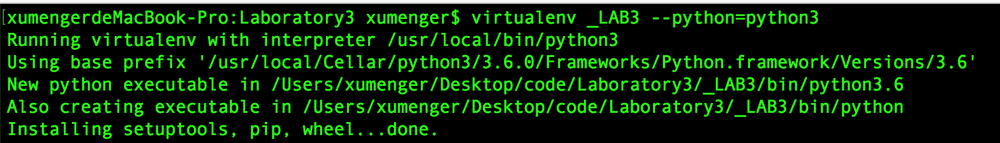

然后执行`source _LAB3/bin/activate`进入虚拟环境


## 安装Scrapy

如果直接使用pip安装，那么默认是Python2版本，所以执行`python3 -m pip install ...`来进行Python库的安装

先执行`python3 -m pip install -U pip`将Python3对应的pip版本进行升级

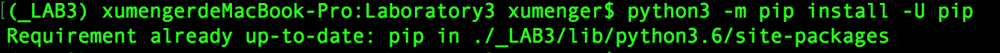

然后执行`python3 -m pip install scrapy==1.1.0rc3`安装对应版本的Scrapy

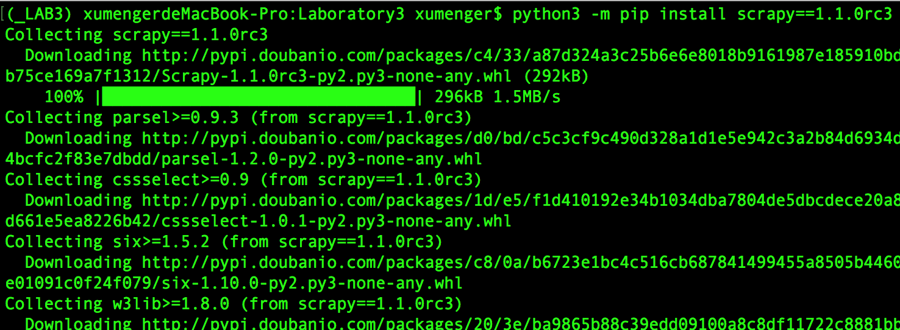

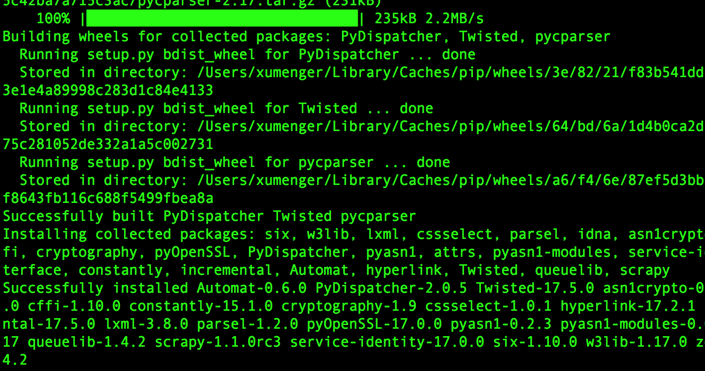

然后执行`scrapy startproject testScrapy`创建一个爬虫项目成功，说明Scrapy安装成功

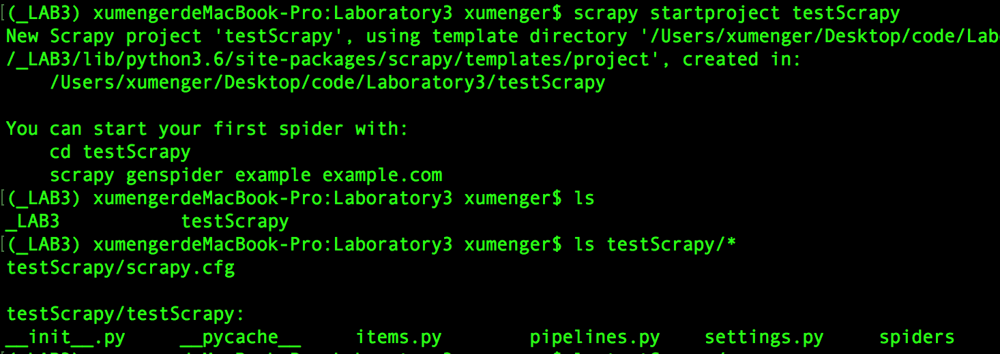

## 编写一个简单的爬虫项目

上面的步骤中已经创建了一个testScrapy爬虫项目，接下来就继续这个项目，爬取我的个人网站[www.xumenge.com](www.xumenge.com)来展示Scrapy的用法。以[《NumPy数组和矢量运算》](http://www.xumenger.com/python-numpy-20170625/)为例，先去看一下页面的HTML结构

首先是标题部分

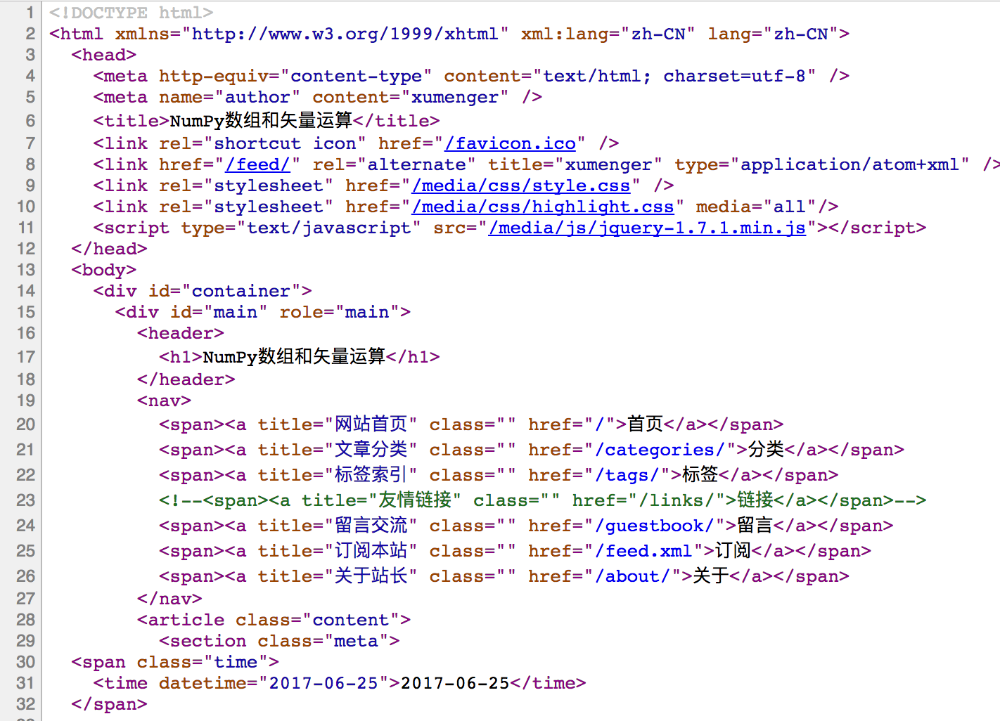

然后是分类、标签、正文部分

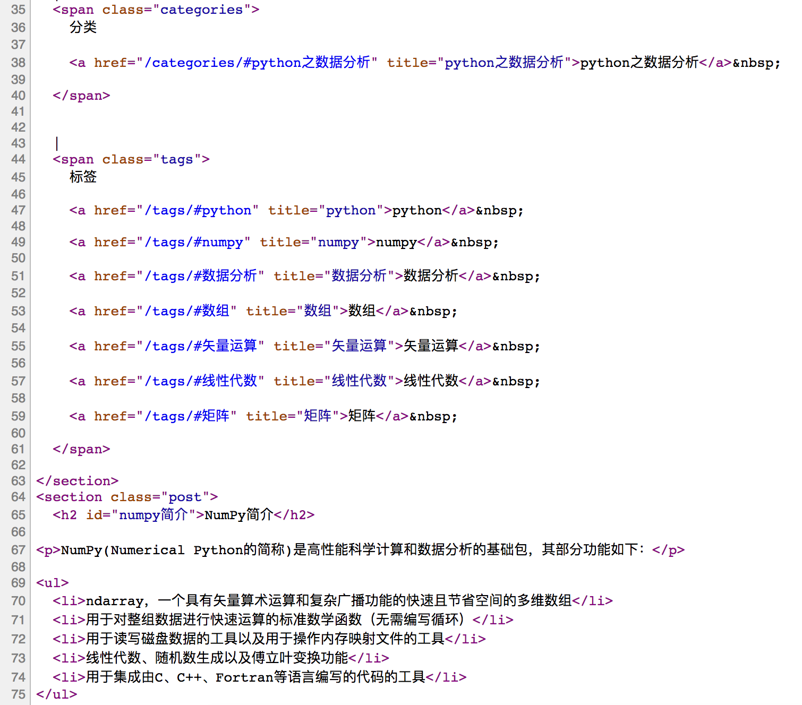

首先进入到这个项目的爬虫文件夹下`cd testScrapy/testScrapy/`

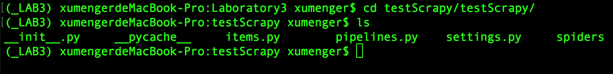

然后在该目录创建items.py，`vim items.py`编写Items部分。使用Scrapy中的Item对象可以保存爬取到的数据，相当于存储爬取到的数据的容器

>一般来说，互联网网页中的信息比较庞大，基本上都是非结构化信息，这样的非结构化信息不太利于我们对信息的管理，所以需要定义自己关心的结构化信息，然后从庞大的互联网信息体系中提取出我们关注的结构化信息，这样就更利于我们对数据的管理。提取之后，这些数据信息需要一个存储的地方，此时，可以将提取到的结构化数据存储到Item对象中

```
# -*- coding: utf-8 -*-
import scrapy

class XumengerItem(scrapy.Item):
    #文章标题
    articleTitle = scrapy.Field()
    #文章分类
    articleCategories = scrapy.Field()
    #文章标签
    articleTags = scrapy.Field()

```

然后`cd spiders`进入爬虫文件目录，执行Scrapy的genspider命令基于现有爬虫模版直接生成一个新的爬虫文件`scrapy genspider -t basic XumengerSpider xumenger.com`

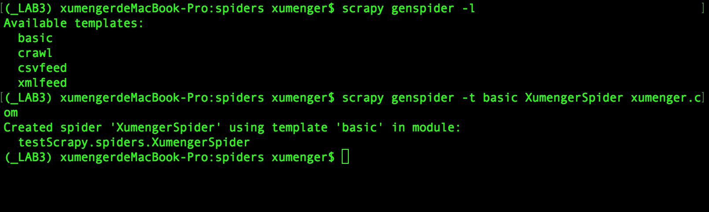

直接生成的爬虫文件的内容是这样的

```
# -*- coding: utf-8 -*-
import scrapy


class XumengerspiderSpider(scrapy.Spider):
    name = "XumengerSpider"
    allowed_domains = ["xumenger.com"]
    start_urls = (
        'http://www.xumenger.com/',
    )

    def parse(self, response):
        pass
```

在此基础上完善爬虫程序

```
# -*- coding: utf-8 -*-
import scrapy
#除了导入scrapy模块之外，还从testScrapy.items导入XumengerItem，这样就可以使用之前定义的Item了
from testScrapy.items import XumengerItem

class XumengerspiderSpider(scrapy.Spider):
    #name属性是爬虫的名字
    name = "XumengerSpider"
    
    #allowed_domains属性代表的是允许爬行的域名，如果启动OffsiteMiddleware
    #非允许的域名对应的网址会自动过滤掉，不再跟进！
    allowed_domains = ["xumenger.com"]
    
    #start_urls属性代表的是爬行的起始地址
    start_urls = (
        'http://www.xumenger.com/python-numpy-20170625/',
        'http://www.xumenger.com/ipython-notebook-20170623/',
        'http://www.xumenger.com/linux-pc-20170516/'
    )

    def parse(self, response):
        item = XumengerItem()
        item['articleTitle'] = response.xpath("/html/head/title/text()")
        print(item['articleTitle'])
```

然后执行命令`scrapy crawl XumengerSpider --nolog`执行爬虫程序

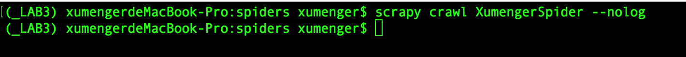

发现程序没有任何输出，和预期不符，那么开启日志级别`scrapy crawl XumengerSpider`再运行程序，看到输出中有如下错误信息

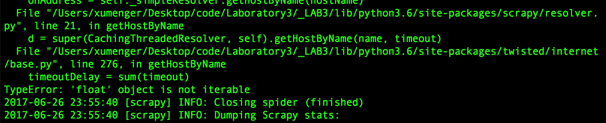

摘取其中一部分信息如下

```
  File "/Users/xumenger/Desktop/code/Laboratory3/_LAB3/lib/python3.6/site-packages/twisted/internet/base.py", line 276, in getHostByName
    timeoutDelay = sum(timeout)
TypeError: 'float' object is not iterable
2017-06-26 23:57:07 [scrapy] ERROR: Error downloading <GET http://www.xumenger.com/ipython-notebook-20170623/>
```

所以可以控制日志的输出来排查爬虫的bug

参考[《python框架Scrapy报错TypeError: 'float' object is not iterable解决》](http://blog.csdn.net/ziven2012/article/details/60959518)，原因是本地的Twisted库的版本过高，是17.5.0

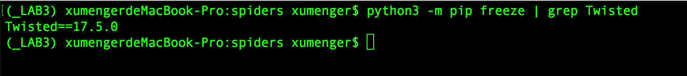

只要执行`python3 -m pip install Twisted==16.6.0`把Twisted库降级到16.6.0即可

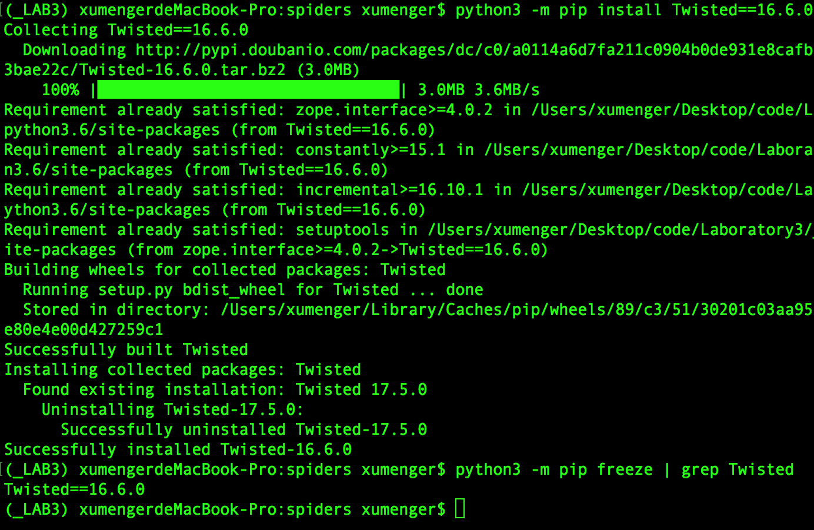

然后再执行`scrapy crawl XumengerSpider --nolog`，可以看到这次按照预期将网页爬取并解析了标题内容！

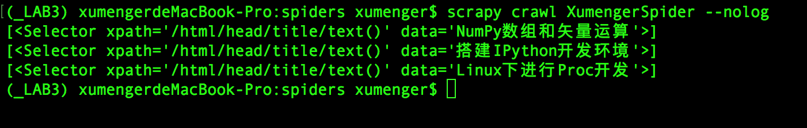
