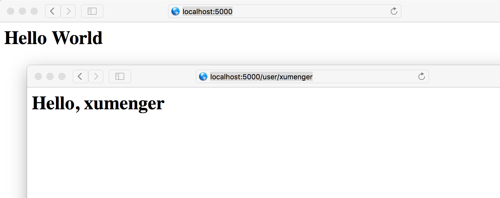
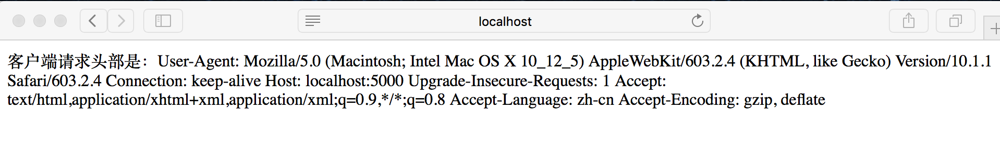
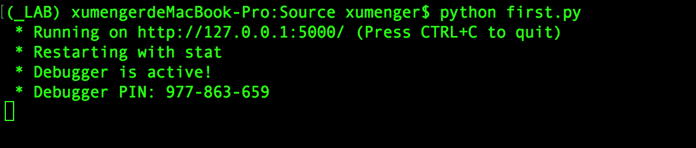
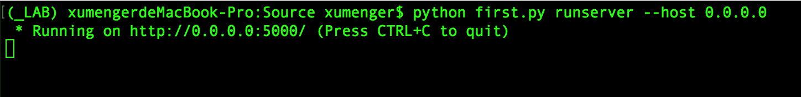
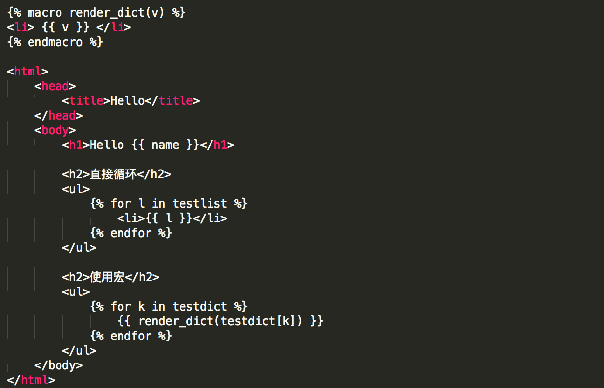

之前整理过[《Python使用web.py进行简单Web开发》](http://www.xumenger.com/python-webpy-20170115/)，本文一方面梳理Flask的用法，同时也会和Web.py的用法进行简单的对比

## 一个最简单的Web应用

关于Python2、Flask环境的搭建这里不赘言，直接虚拟环境、pip就可以了。然后直接上代码，保存在文件first.py中

```
# -*- coding: utf-8 -*-
from flask import Flask
app = Flask(__name__)

# 主页
@app.route('/')
def index():
    return '<h1>Hello World</h1>'

# 用户URL
@app.route('/user/<name>')
def user(name):
    return '<h1>Hello, %s</h1>' % name

if __name__ == '__main__':
    app.run(debug = True)
```

执行`python first.py`


然后在浏览器中可以输入对应的网址进行访问



这里可以看出web.py是使用元组进行路由的，比如

```
# -*- coding: utf-8 -*-
import web

urls = (
	'/(.*)', 'hello'
)

app = web.application(urls, globals())

class hello:
	def GET(self, name):
		#读取index.html中的内容直接返回给客户端
		return open(r'./index.html', 'r').read()
		

if __name__ == '__main__':
	app.run()
```

而Flask是使用装饰器来进行路由的！

## Flask请求对象

Flask从客户端收到请求时，要让视图函数能访问一些对象，这样才能处理请求。请求对象就是一个很好的例子，它封装了客户端发送的HTTP请求。要让视图函数能够访问请求对象，一个显而易见的方式是将其作为参数传给视图函数，不过这会导致程序中的每个视图函数都增加了一个参数。除了访问请求对象，如果视图函数在请求时还要访问其他对象，情况会变得很糟

为了避免大量可有可无的参数把视图函数弄的一团糟，Flask使用`上下文`临时把某些对象变为全局可访问。有了上下文，就可以写出这样的视图函数

```
# -*- coding: utf-8 -*-
from flask import Flask
from flask import request
app = Flask(__name__)

@app.route('/')
def index():
    return '客户端请求头部是：' + str(request.headers)

if __name__ == '__main__':
    app.run(debug = True)
```

然后访问`http://localhost:5000`，看到如下输出信息



>事实上，request不可能是全局变量。试想，在多线程服务器中，多个线程同时处理不同客户端发送的不同请求时，每个线程看到的request对象必然不同。Flask使用上下文让特定的变量在一个线程中全局可访问，与此同时却不干扰其他线程

处理request，Flask还有current_app、g、session等其他上下文

## Flask响应对象

HTTP是一种典型的`请求--响应`式的网络协议，上面讲了Flask封装了request对象，那么作为一个web框架，那么也一定提供给了对应的响应对象！

最简单的返回应答就是这样直接返回一个字符串

```
# -*- coding: utf-8 -*-
from flask import Flask
app = Flask(__name__)

@app.route('/')
def index():
    return '<h1>Hello, World</h1>'

if __name__ == '__main__':
    app.run(debug = True)
```

但是如果想要返回一个比较标准的HTTP响应，那么可以使用Flask提供的Response对象，比如下面创建一个响应对象，然后设置cookie

```
# -*- coding: utf-8 -*-
from flask import Flask
from flask import make_response
app = Flask(__name__)

@app.route('/')
def index:
	response = make_response('<h1>Hello, World</h1>')
	response.set_cookie('answer', 42)
	return response

if __name__ == '__main__':
    app.run(debug = True)
```

## 监听公共网络接口上的所有连接

如上面所示，执行`python first.py`之后的输出如下，它只会监听`localhost`上的连接



如果想要监听公共网络上的连接，允许同网中的其他计算机连接服务器，那么就需要用到flask-script这个扩展了，先执行`pip install flask-script`安装，然后编写如下代码

```
# -*- coding: utf-8 -*-
from flask import Flask
from flask.ext.script import Manager
app = Flask(__name__)
manager = Manager(app)

@app.route('/')
def index():
    return 'flask-script'

if __name__ == '__main__':
    manager.run()
```

执行`python first.py runserver --host a.b.c.d`启动程序后，即可使用`http://a.b.c.d:5000/`网络中的任一台电脑进行访问，其中a.b.c.d是服务器所在计算机的外网IP地址



## Flask模板引擎

[《Python使用web.py进行简单Web开发》](http://www.xumenger.com/python-webpy-20170115/)讲到web.py使用模版引擎可以有效地将前端代码和后端代码解耦，当然Flask里面也有类似的功能。这里展示其最简单的用法

在当前目录创建templates/文件夹，然后分别创建index.html文件

```
<html>
    <head>
        <title>Hello</title>
    </head>
    <body>
        <h1>Hello World</h1>
    </body>
</html>
```

和user.html文件

```

```

>注意这里和web.py模版引擎的语法不一样

然后修改first.py文件源码为

```
# -*- coding: utf-8 -*-
from flask import Flask, render_template
from flask_script import Manager
app = Flask(__name__)
manager = Manager(app)

@app.route('/')
def index():
    return render_template('index.html')

@app.route('/user/<name>')
def user(name):
    alist = ['xumenger', 'flask', 'web.py']
    adict = {'x': 'xumenger', 'f':' flask'}
    return render_template('user.html', name=name, testlist=alist, testdict=adict)

if __name__ == '__main__':
    manager.run()
```

执行`python first.py runserver --host a.b.c.d`启动服务器，然后即可在浏览器上进行访问



## 简单总结

本文只是最简单的展示Flask的一些用法和特性，更为全面、详细的还是要去参见其[官方文档](http://flask.pocoo.org)，或者[中文版](http://docs.jinkan.org/docs/flask/)
