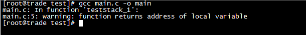
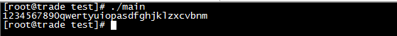
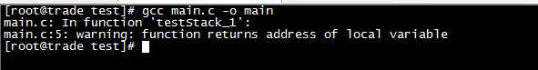
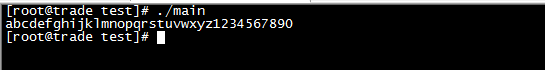
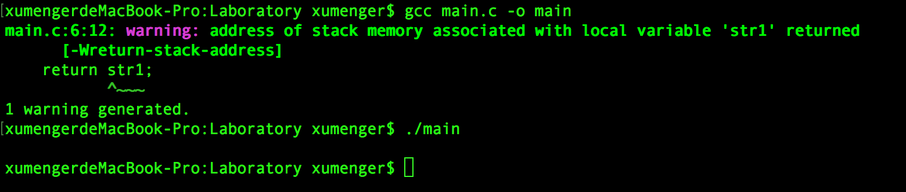

编写下面这样的函数

```
#include <stdio.h>

char *testStack_1(){
   char str1[1000] = "1234567890qwertyuiopasdfghjklzxcvbnm";
   return str1;
}

int main(){
    char *str = testStack_1();

    printf("%s\n", str);

    return 0;
}
```

`gcc main.c -o main`发现会有报错：`warning: function returns address of local variable`



很多人只要编译能通过也就不关心这些编译警告，好，运行程序，可以看到确实按照预期输出



但是这个程序真的就没有问题吗？继续实现下面这个例子

```
#include <stdio.h>

char *testStack_1(){
   char str1[1000] = "1234567890qwertyuiopasdfghjklzxcvbnm";
   return str1;
}

void testStack_2(){
    char str2[1000] = "abcdefghijklmnopqrstuvwxyz1234567890";
    return;
}

int main(){
    char *str = testStack_1();
    testStack_2();
    testStack_2();

    printf("%s\n", str);

    return 0;
}
```

执行`gcc main.c -o main`，当然还是同样的警告（还是和原来一样，既然能编译通过，不管什么警告！），然后运行，发现这次的输出竟然不是testStack\_1这个函数中的字符串，而是testStack\_2这个函数中的字符串





解释这个现象很简单：

* 调用testStack_1()，会将str1[1000]="1234567890qwertyuiopasdfghjklzxcvbnm"压入堆栈
* 然后返回str1这个指针，地址指向堆栈上对应的地址
* 调用完成后，这个数据出栈（其实并不是真正的出栈，只是栈指针往高地址移动）
    * 推荐[《Linux下32位进程内存模型》](http://www.xumenger.com/02-linux-process-memory-20170101/)
    * 该值还在堆栈上，只是栈指针变化，所以第一个程序，通过返回的指针还可以访问到这个数据
* 而在第二个程序中，接着调用testStack_2()
    * str2[1000]="abcdefghijklmnopqrstuvwxyz1234567890"压入栈
    * 正好替换了原来str1[1000]="1234567890qwertyuiopasdfghjklzxcvbnm"的值
* 但上面调用testStack_1()返回的指针还是指向同样的内存地址
* 所以第二个程序中通过返回指针获取的字符串就是写入堆栈上的数据

通过这个简单的例子可以清楚进程堆栈的一些特性，也清楚该怎样写出合理的、安全的程序（显然上面的程序是不合理的也不安全的）。对于上面这个例子一方面是返回指针指向的栈内存上的数据可能在后续的出栈入栈中被修改，更危险的是如果你提供了像testStack_1()这样的函数，调用者可以通过返回值去修改堆栈上的数据，这是很不安全的（关于对堆栈的攻击方法属于比较高级的技术领域，这里不进行更进一步的讲解）

也许你会说，这种用法明显和我希望的运行效果不一致，为什么编译器只是警告而不是报错？很简单，这种用法虽然和大多数人的预期不一致，但在原理上和语法上是没有问题的，而且也有些高级开发者想利用这种语法规则实现一些高级的功能！

## 补充

当然上面的现象不是在所有的机器、操作系统上都能出现的（和编译器的规则、不同操作系统上进程的内存模型等都有关系），我在一台Mac上编译运行第一个程序，运行结果如下



不过编译警告和上面一样都是有的
