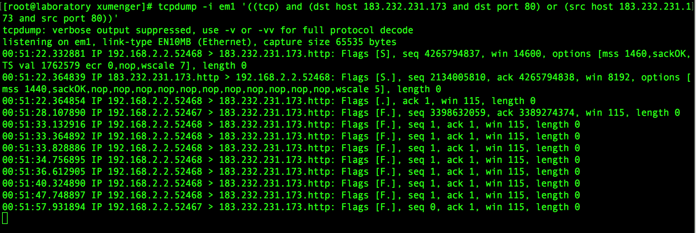

## tcpdump

WireShark是一个可视化的网络抓包工具，支持Windows、Linux、MacOS平台。而tcpdump也是一款经典的网络抓包工具，tcpdump给使用者提供了大量的选项，用以过滤数据包或者定制输出格式

`tcpdump -i em1 '((tcp) and (dst host 183.232.231.173 and dst port 80) or (src host 183.232.231.173 and src port 80))'` 抓取网卡em1上目的ip是183.232.231.173目的端口是80，或者源ip是183.232.231.173源端口是80的tcp网络包

## 