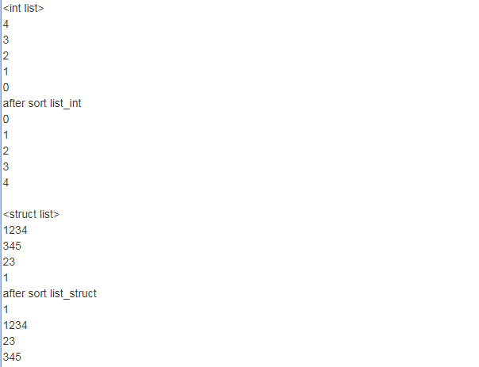

>首先讲明，本文主要是对STL中list的用法进行简单梳理，熟悉一下STL和感受STL的用法。没有考虑STL的实现细节、时间复杂度分析等内容（这些内容作为后续的一个研究点）

>其他STL容器和算法的用法不会再重复整理，这种API用法层面的东西，直接参考相关的[帮助手册](http://en.cppreference.com/w/)即可。该网站很强大的一个点就是可以在查看语法的同时直接在上面的在线编译器上编写测试代码并运行查看结果！

>另外可以简单通过[《比较C++、Java、Delphi声明类对象时候的相关语法和原理》](http://www.xumenger.com/java-cpp-delphi-oop/)对C++、Delphi面向对象中的类、对象、对象指针在概念和用法上的异同快速做个回顾

## 关于STL

C语言中如果想使用链表、队列、栈、堆、哈希等数据结构必须自己实现，而C++中有STL标准库方便开发者直接使用

STL的一个重要特点是数据结构和算法的分离。尽管这是个简单的概念，但这种分离确实使得STL变得非常通用。例如，由于STL的sort()函数是完全通用的，你可以用它来操作几乎任何数据集合，包括链表、容器和数组

STL的一个重要特性是它不是面向对象的。为了具有足够通用性，STL主要依赖于模板而不是封装、继承和多态(虚函数)。这好像是一种倒退，但这正好是使得STL的组件具有广泛通用性的底层特性。另外，由于STL是基于模板，内联函数的使用使得生成的代码短小高效

STL有三个基本组件：迭代器、容器、算法

* **迭代器**提供了访问容器中对象的方法。例如，可以使用一对迭代器指定list或vector中的一定范围的对象。迭代器就如同一个指针。事实上，C++的指针也是一种迭代器。但是迭代器也可以是那些定义了operator\*()以及其他类似于指针的操作符的方法的类对象
* **容器**是一种数据结构，如list、vector、deques，以模板类的方法提供。为了访问容器中的数据，可以使用由容器类输出的迭代器
* **算法**是用来操作容器中的数据的模板函数。例如，STL用sort()来对一个vector中的数据进行排序，用find()来搜索一个list中的对象。函数本身与它们操作的数据的结构和类型无关，因此他们可以在从简单数组到高度复杂容器的任何数据结构上使用

## STL链表(list)

list是C++ STL中的部分内容。实际上，list容器就是一个双向链表，可以高效地进行插入删除元素

下面给一个简单的例子展示STL list的用法

```
#include <iostream>
#include <list>

using namespace std;

typedef struct Node{
    char key[32];
    char value[256];
}TNode;

//is n1 less than n2 ?
bool lessthan(const TNode &n1, const TNode &n2){
    for(int i=0; ; i++){
        if(n1.key[i] == '\0')
            return true;
        if(n2.key[i] == '\0')
            return false;
        if(n1.key[i] == n2.key[i]){
            continue;
        }else if(n1.key[i] < n2.key[i]){
            return true;
        }else{
            return false;
        }
    }
}

int main()
{
    std::list<int> list_int;
    std::list<TNode> list_struct;
   
    cout << "<int list>" << endl; 
    //insert 5 int into list
    for(int i=0; i<5; i++){
        list_int.insert(list_int.begin(), i);
    }

    //use iterator to output list
    std::list<int>::iterator it;
    for(it=list_int.begin(); it!=list_int.end(); it++){
        ::cout << *it << ::endl;
    }

    //sort int list
    list_int.sort();
    cout << "after sort list_int" << endl;
    for(it=list_int.begin(); it!=list_int.end(); it++){
        cout << *it << endl;
    }

    cout << endl << "<struct list>" << endl;
    TNode node1{"1", "1"};
    TNode node2{"23", "23"};
    TNode node3{"345", "345"};
    TNode node4{"1234", "1234"};

    list_struct.insert(list_struct.begin(), node1);
    list_struct.insert(list_struct.begin(), node2);
    list_struct.insert(list_struct.begin(), node3);
    list_struct.insert(list_struct.begin(), node4);    

    ::list<TNode>::iterator it2;
    for(it2=list_struct.begin(); it2!=list_struct.end(); it2++){
        cout << TNode(*it2).key << endl;
    }
    
    //sort struct list
    list_struct.sort(lessthan);
    cout << "after sort list_struct" << endl;
    for(it2=list_struct.begin(); it2!=list_struct.end(); it2++){
        cout << TNode(*it2).key << endl;
    }
    
    return 0;
}
```

通过上面这个小例子，看得出来使用很方便。关于std::list的给更多接口说明参见[std::list](http://en.cppreference.com/w/cpp/container/list)

执行`g++ stl_list.cpp -o stl_list -std=c++0x`编译程序，`./stl_list`运行程序。下面是在[一个C++在线编译器](http://www.dooccn.com/cpp/)上编译的结果



## 关于sort()方法

当你的容器中元素是一些标准类型（int、float、char）或string时，你可以直接使用这些函数模板

但如果你是自己定义的类型或你需要按照其他方式排序，你可以有两种方法来达到效果

1. 自己写比较函数
2. 重载类型的`<`操作符

>参考[《C++_运算符重载》](http://blog.csdn.net/insistgogo/article/details/6626952)可以快速复习C++的运算符重载语法

## 新的需求如何解决？

假如我想要实现这样的场景：使用链表存储数据，然后每个数据有一个键值（字符串型的），可以根据该键值来查找到对应的数据，那么要怎么做？STL的List提供的find方法只能通过数据本身进行搜索，无法通过键值搜索

在Delphi中我们是这样实现的，定义一个结构体

```
  PStrOrderListNode = ^TStrOrderListNode;
  TStrOrderListNode = record
    Left: PStrOrderListNode;  //左结点
    Right: PStrOrderListNode; //右结点
    Key: string;              //键值
    Data: Pointer;            //数据，Pointer指向具体的数据，可以是整型、结构体、对象
  end;
```

使用TList来存储PStrOrderListNode结构的数据，根据`Key: string`实现对链表的排序，然后提供`Search`方法进行搜索，搜索的实现就很简单了：给定了要搜索的Key，明确链表本身是已经排好序的，那么使用二分查找方法即可根据Key找到对应的节点

在C++中基于STL的list也可以这么做，但这需要自己再在链表的基础上实现查找方法。而STL本身提供了一个针对键值对的数据结构map

关于map的用法、map是如何实现查找的，可以直接参考[对应的帮助手册](http://en.cppreference.com/w/cpp/container/map)

## 相关资料

* [C++在线编译器](http://coliru.stacked-crooked.com/)
* [另一个C++在线编译器](http://www.dooccn.com/cpp/)
* [C++参考资料](http://en.cppreference.com/w/)
* [《C++对象内存模型：模板、异常与RTTI》](http://www.xumenger.com/cpp-object-memory-02-20161113/)
* [《重学算法与数据结构之单链表》](http://www.xumenger.com/algorithms-01-20160217/)
* [《重学算法与数据结构之双向链表》](http://www.xumenger.com/algorithms-02-20160217/)
* [为何某些公司不允许使用 C++ STL？](https://www.zhihu.com/question/20201972)
* [《C++:STL标准入门汇总》](http://www.cnblogs.com/shiyangxt/archive/2008/09/11/1289493.html)
* [《三十分钟掌握STL》](http://net.pku.edu.cn/~yhf/UsingSTL.htm)
* [《STL之list容器详解》](http://www.cnblogs.com/scandy-yuan/archive/2013/01/08/2851324.html)
* [《详细解说 STL 排序(Sort)》](http://blog.csdn.net/bz201/article/details/543001)
* [《STL源码剖析》](https://book.douban.com/subject/1110934/)
* [《C++_运算符重载》](http://blog.csdn.net/insistgogo/article/details/6626952)
