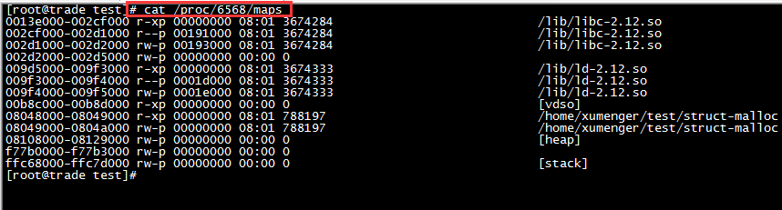
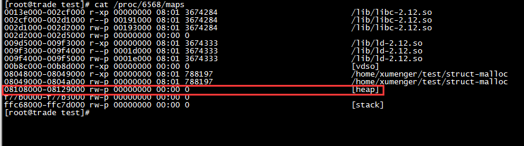
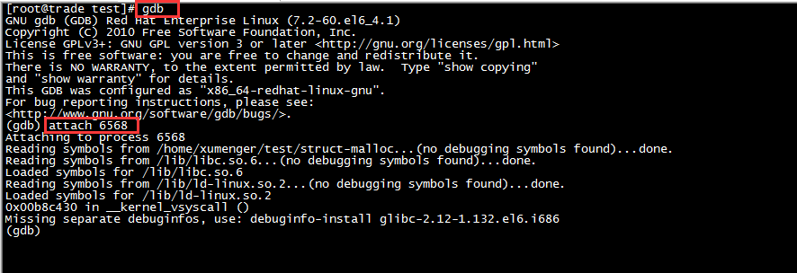
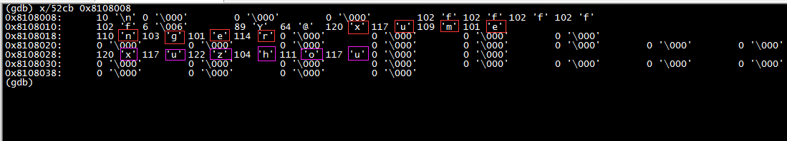
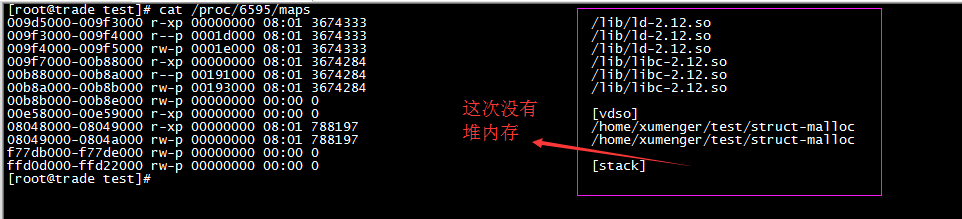

## 查看maps

程序运行后输出进程号、结构体地址必要信息，然后进入循环，如此让进程不立即退出，方便调试


执行`cat /proc/6568/maps`查看其内存分布情况



任务启动时看到为结构体申请的内存的地址是`0x8108008`，结合`cat /proc/6568/maps`，正好在堆内存上



## 使用GDB调试

`gdb`开启调试器，然后`attach 6568`附到该进程上，准备进行调试



因为上面输出结构体是52字节，地址是0x8108008，所以我们用x命令查看从0x8108008开始的52字节，`x/52cb 0x8108008`



简单验证其中的字符部分，确实有"xumenger"和"xuzhou"

关于`x`命令推荐[《GDB下查看内存命令(x命令)》](http://blog.csdn.net/allenlinrui/article/details/5964046)

仔细分析也存在结构体对齐的问题，因为这个点比较熟悉了，所以不再赘述

## Linux下的堆内存

我们修改一下程序，将其中的如下代码删除

```
    Person *p;
    p = malloc(sizeof(Person));
    printf("address=%p, size=%d\n", p, sizeof(Person));
    p->age = 10;
    p->weight = 100.10;
    strcpy(p->name, "xumenger");
    strcpy(p->address, "xuzhou");
```

也就是不申请堆内存，编译运行程序


然后再去`cat /proc/6595/maps`查看进程内存布局



这次没有堆内存了

所以上面测试中遇到的第一次申请的内存地址，正好等于`/proc/pid/maps`看到的堆内存地址，并不是巧合！

## 最后附上测试源码

```
#include <stdio.h>
#include <stdlib.h>
#include <sys/time.h>
#include <string.h>
#include <unistd.h>
#include <sys/wait.h>

typedef struct{
    int age;
    double weight;
    char name[20];
    char address[20];
}Person;

int isClose = 0;

void Stop(int signo);

int main()
{
    printf("pid=%d\n", getpid());
    
    //注册信号
    signal(SIGINT, Stop);

    Person *p;
    p = malloc(sizeof(Person));
    printf("address=%p, size=%d\n", p, sizeof(Person));
    p->age = 10;
    p->weight = 100.10;
    strcpy(p->name, "xumenger");
    strcpy(p->address, "xuzhou");

    //循环保证进程不立即退出，方便GDB attach到上面进行调试
    while(0 == isClose){
        usleep(1000);
    }

    printf("stop\n");

    return 0;
}

//使用信号通知进程退出
void Stop(int signo)
{
    isClose = 1;
}
```
