## 实验方案是这样的

在Windows下用Delphi用ScktComp写一个简单的服务端程序，逻辑很简单，收到数据后输出到界面上

在Linux下用C开发一个简单的客户端程序，逻辑也很简单，连接、发送数据、关闭连接。分别发送"c"、"c"、"string"

在Linux端使用GDB控制客户端程序的运行

在Linux端使用tcpdump抓包、在Windows端用WireShark抓包，分析socket API调用的关键环节其具体传输了什么网络包！

详细的程序源码点击[这里](../download/20170911/01-tcp-connect-send-close.zip)下载

Windows网卡的IP地址是192.168.163.41；Linux下网卡的IP地址是：192.168.39.28

客户端运行后，和客户端通信的效果如下：

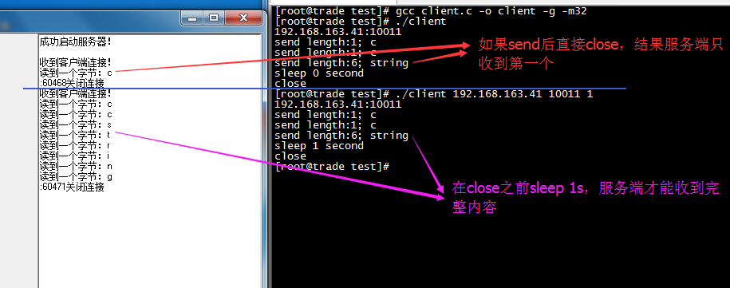

为什么send之后立刻close，会导致服务端只收到第一次发送的内容

## 抓包分析

>抓包分析，到底是客户端已经发送出去但是服务端没收到，还是客户端没有发出去？

所以在客户端发送完立即关闭的情况下，在Windows上使用WireShark抓包分析

过滤条件是

```
((ip.src==192.168.39.28) or (ip.dst==192.168.39.28)) and ((ip.dst==192.168.163.41 and tcp.dstport==10011) or (ip.src==192.168.163.41 and tcp.srcport==10011))
```

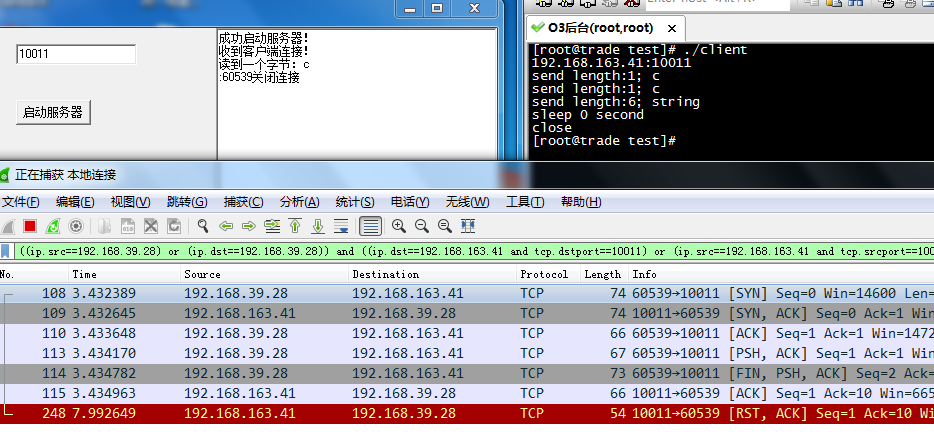

在Windows上抓包，确实已经收到了所有的数据

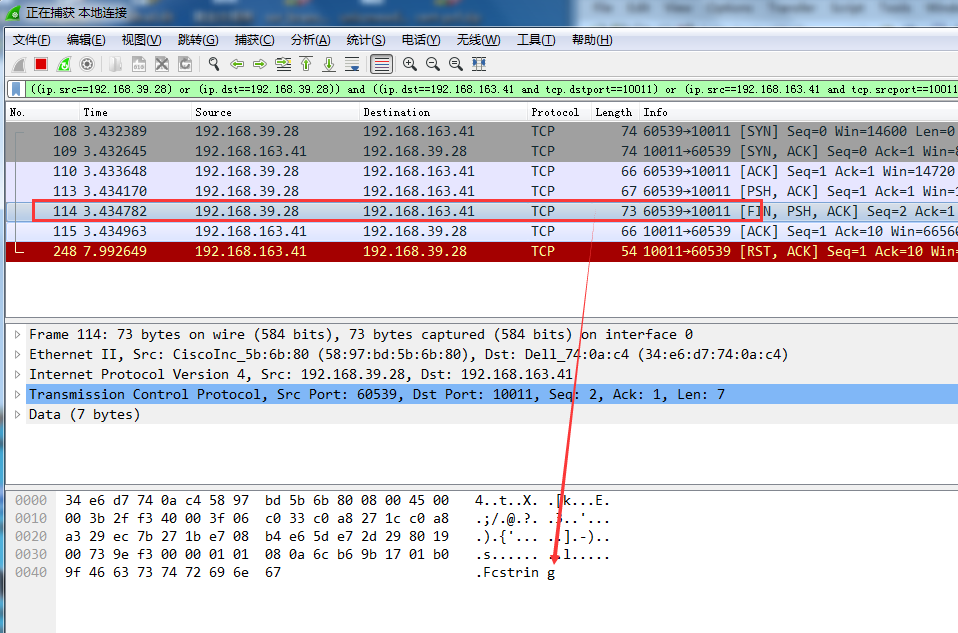

>明显服务端虽然收到了，但是没有正确输出出来，OnRead没有被触发。所以很显然，做网络编程还不知道有多少坑呢

>今天我们先不纠结这个问题，今天的重点是分析API对应的网络包

在没有加调试器控制客户端运行逻辑的情况下，分析WireShark的抓包结果，看到客户端发送的"c"、"c"、"string"，虽然是调用send三次，但是在wireshark中是分两次发出去的，第一次发送的"c"


第二次发送的"cstring"

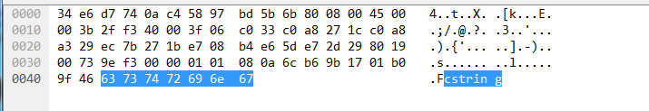

>所以这里已经能窥到TCP的一些

>下面再使用调试器控制客户端逻辑的情况下抓包分析

## 开始调试试验

**gdb打开进程调试**

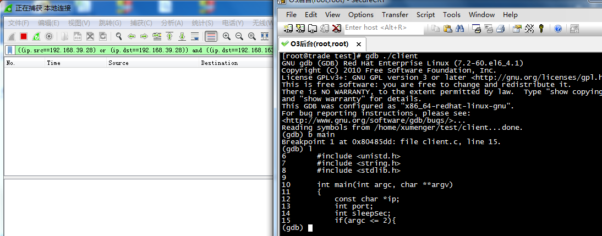

**在connect处下断点，运行到connect的地方**

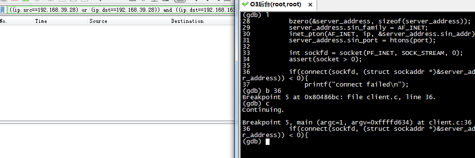

**运行完connect**

继续单步，执行完成connect，发现WireShark上有三条网络包记录，其实这就是TCP的三次握手

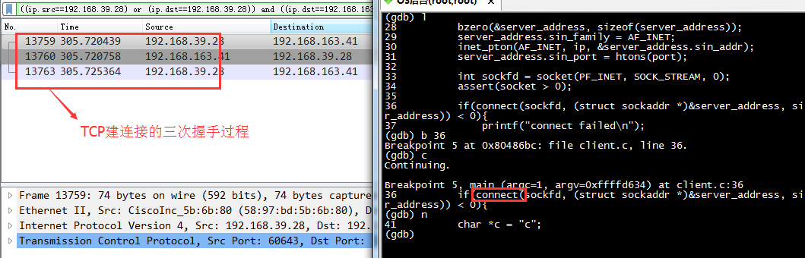

* 客户端发送SYN报文，并置发送序号为X
* 服务端发送SYN + ACK报文，并置发送序号为Y，确认序号为X+1
* 客户端发送ACK报文，并置发送序号为Z，确认序号为Y+1

关于TCP的三次握手详细参见[《使用WireShark分析TCP的三次握手过程》](http://www.xumenger.com/wireshark-tcp-20160716/)

**运行到第一次send("c")**

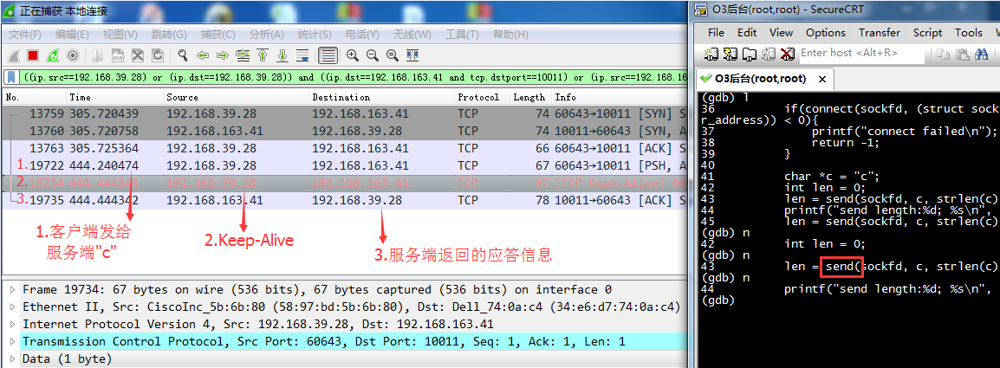

**运行到第二次send("c")**

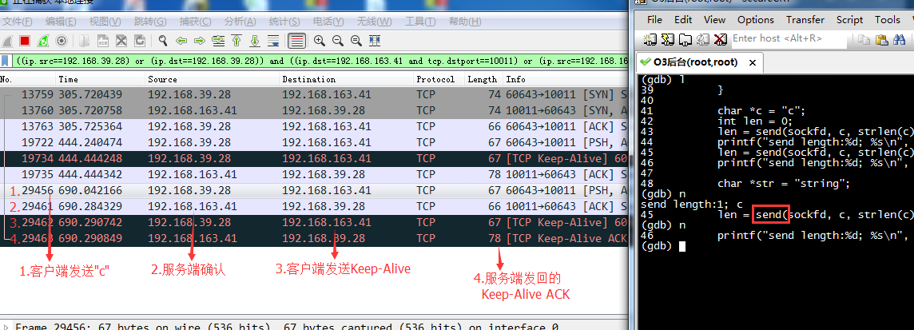

**运行到第三次send("string")**

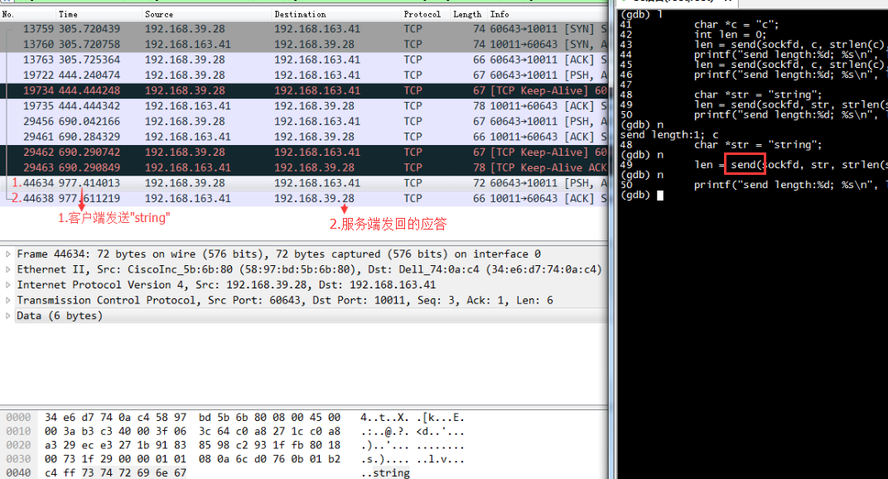

**运行到close**

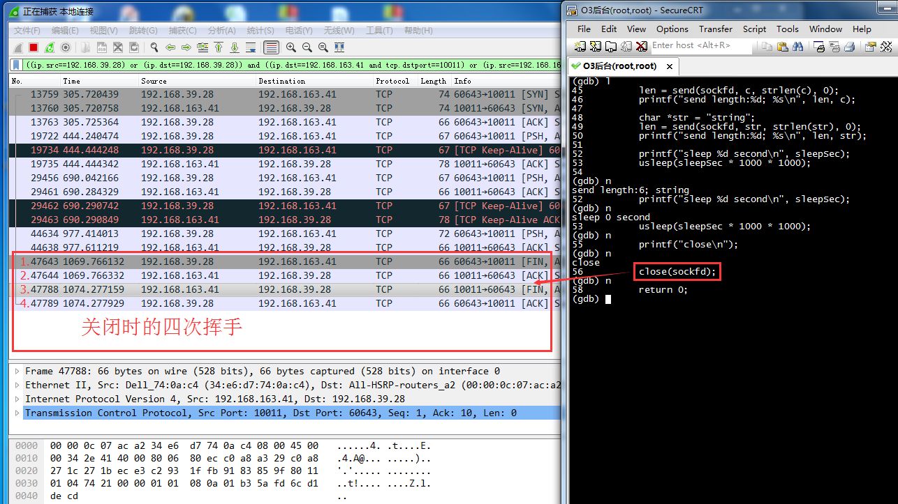

**再看服务端**

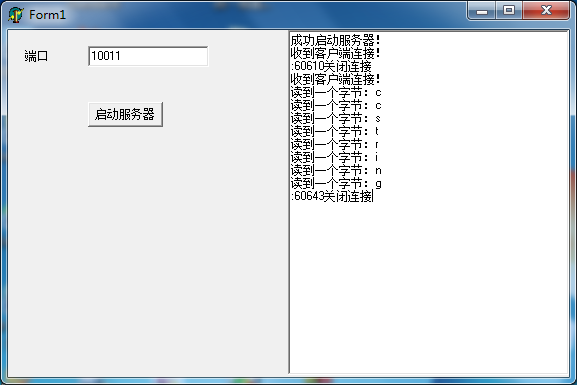

**简单总结**

很明显，因为gdb的介入，导致和上次直接运行有完全不同的效果。很明显的就是出现了Keep-Alive的网络包！

所以关于TCP确实还有太多疑问，至少目前还存在的问题：

* Keep-Alive包在什么情况下发送？
* SYN、ACK、URG、PSH、RST、FIN等标志位有什么作用？

另外测试当客户端快速发完立即关闭的情况下，服务端并没有完整的将数据输出在界面上，而这还只是几个字节的小数据呢！虽然TCP本身是保证数据不丢失的，但是开发出来的程序可能存在bug导致没有收到完整的数据！所以在实际的网络编程中如何保证数据的完整性、如何做到合理的连接关闭等还都值得思考！

更多文章

* [《为什么基于TCP的应用需要心跳包（TCP keep-alive原理分析）》](http://blog.csdn.net/hengyunabc/article/details/44310193)
* [《TCP连接探测中的Keepalive和心跳包. 关键字: tcp keepalive, 心跳, 保活》](http://blog.csdn.net/aa2650/article/details/17027845)
* [《TCP keepAlive 详解 》](http://blog.itpub.net/25259598/viewspace-684112/)
* [《http://www.blogjava.net/yongboy/archive/2015/04/14/424413.html》](http://www.blogjava.net/yongboy/archive/2015/04/14/424413.html)
