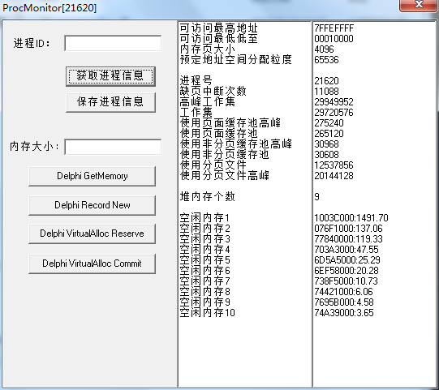
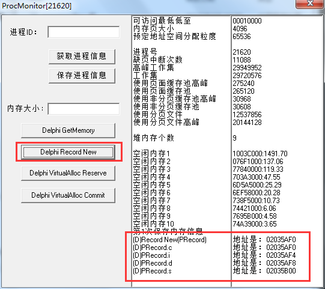
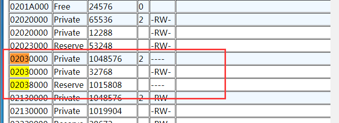
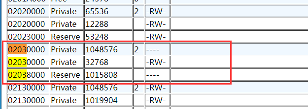
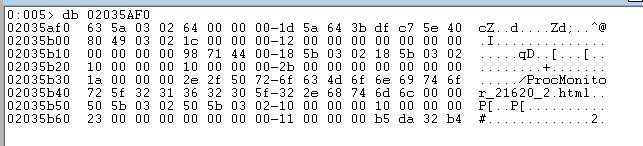
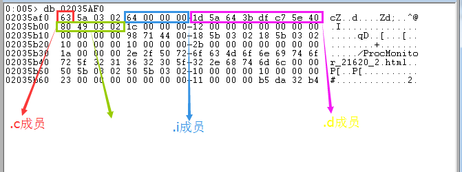
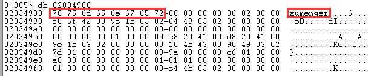
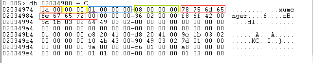

## New()简介

本文使用的结构体是

```
  PRecord = ^TRecord;
  TRecord = record
    c: Char;
    i: Integer;
    d: Double;
    s: string;
  end;
```

测试用的代码是

```
procedure TForm1.btnDelphiNewClick(Sender: TObject);
var
  p: PRecord;
begin
  New(p);
  p.c := 'c';
  p.i := 100;
  p.d := 123.123;
  p.s := 'xumenger';
  mmoProcessInfo.Lines.Add('(D)Record New(PRecord)');    mmoProcessInfo2.Lines.Add('地址是：' + Format('%p', [p]));
end;
```

## 运行测试工具

运行测试工具，点击【获取进程信息】可以看到该进程的大致内存情况



然后点击【保存进程信息】生成HTML文件，用于和后续执行了`New()`申请内存的进程内存布局变化情况进行对比

然后【Delphi Record New】为`TRecord`结构体申请一块内存，并且按照代码赋值，可以看到该结构体的内存地址是`02035AF0`



执行了`New()`之后，再次执行【保存进程信息】将这次的内存信息保存起来

查看第一次保存进程内存布局的`02035AF0`所在内存区域的情况



>可以看到这块内存本身已经是Private的了

执行`New()`之后，`02035AF0`所在内存区域的情况



>明显和执行`New()`之前的该内存区域的属性是一致的

## 关于New对内存的影响

在上一篇[关于GetMemory的整理](http://www.xumenger.com/windbg-delphi-getmemory20170915/)中，可以看到虽然GetMemory申请了1000M的内存，看到对应的内存区域变成了Private，但是资源管理器中的内存并没有变化

而这次试用New申请内存空间，通过\_ProcMonitor的输出可以看到就是在一块Private的内存区域中申请的空间

所以针对这个现象可以思考一下：

* 为什么GetMemory申请的内存没有导致内存增长
* 为什么New是在Private的内存区域中申请的

## 使用WinDbg去分析对应的内存

接下来我们直接使用WinDbg附到进程上，查看这个这块内存的数据

`db 02035AF0`可以查看这块内存的内容



**分析结构体**

首先列出结构体的定义

```
  PRecord = ^TRecord;
  TRecord = record
    c: Char;     //SizeOf(Char) = 1Byte
    i: Integer;  //SizeOf(Integer) = 4Byte
    d: Double;   //SizeOf(Double) = 8Byte
    s: string;   //SizeOf(string) = 4Byte ; 特殊结构
  end;
```

在程序的输出中可以看到如下相关的地址信息，因为存在结构体对齐机制

```
结构体本身 ：02035AF0
结构体成员c：02035AF0
结构体成员i：02035AF4
结构体成员d：02035AF8
结构体成员s：02035B00
```

结合结构体、结构体成员的大小情况，可以在WinDbg下分析对应的值



其中c、i、d成员因为结构体的对齐机制、以及本机是小端模式，可以很好的看到分别对应哪块内存

但是为什么string类型的s是这个值呢？接下来我针对string进行一下分析

**分析string**

之前在[《C++对象内存模型：C++的string和Delphi的string》](http://www.xumenger.com/cpp-delphi-string-20161116/)中对Delphi下的string有简单介绍

讲到Delphi下的string的内存模型是这样的


* 01~02 字节是代码页，如上面的0x03A8为十进制的936，表示简体中文GBK
* 03~04 字节表示每个字符所占的字节数（ANSI为1，Unicode为2）
* 05~08 字节是该字符串的引用计数
* 09~12 字节是该字符串的字符个数
* 13~?? 字节就是字符串实际的内容了
* ?? 最后一个字节是00，字符串的结束符

>这里需要注意的是，在Delphi 2009以前的版本中是没有描述代码页的4字节的（代码页+字符宽度），而是直接从第05字节开始（引用计数）。而我现在使用的Delphi版本是Delphi6，所以上面说的01~02、03~04字节是没有的

但是没有经过验证所以也无法确定，这里使用WinDbg初步探究一下！

因为string的大小是4Byte，而按照上面在WinDbg中看到的结构体情况，s所在内存区域的值是`80 49 03 02`，和我在代码中附的"xumenger"完全无关

所以猜测这个`80 49 03 02`是地址！因为本机是小端模式，所以转换成`02034980`

使用`db 02034980`查看这块内存对应的信息，正好就是"xumenger"



但是按照[《C++对象内存模型：C++的string和Delphi的string》](http://www.xumenger.com/cpp-delphi-string-20161116/)给出的string结构图，Delphi6的string的内容前面应该有12-4字节的其他信息？

所以我们使用`db 02034980 - C`往前查看12Byte，并且和[《C++对象内存模型：C++的string和Delphi的string》](http://www.xumenger.com/cpp-delphi-string-20161116/)中的string结构图做一下对应，看一看是否符合



* 01~02 无
* 03~04 无
* 05~08 字节是该字符串的引用计数，这里的值是`0001`看起来确实是引用计数，还待确认
* 09~12 字节是该字符串的字符个数，这里的值是`00000008`，看起来确实是"xumenger"字符串的长度
* 13~?? 字节就是字符串实际的内容了，确实是"xumenger"
* ?? 最后一个字节是00，字符串的结束符

关于string通过本节的研究，比较清晰了，但是还存在一些疑问。我会在下一篇设计一个方案，对string的内存模型继续探究

## 参考资料

* [《Delphi配合VC++开发：结构体对齐机制》](http://www.xumenger.com/delphi-vc-dll-2-20160903/)
* [《Delphi的string访问越界出错》](http://www.xumenger.com/delphi-string-20170109/)
* [《C++对象内存模型：C++的string和Delphi的string》](http://www.xumenger.com/cpp-delphi-string-20161116/)
* [《Delphi字符串与字符数组之间的转换（初始化的重要性）》](http://www.xumenger.com/delphi-string-pchar-chararray-20150422-02/)
* [《Delphi的字符串、PChar和字符数组之间的转换》](http://www.xumenger.com/delphi-string-pchar-chararray-20150422-01/)
* [《Delphi配合VC++开发：跨语言传字符串》](http://www.xumenger.com/delphi-vc-dll-5-20160903/)
* [《Delphi使用FillChar时候如果有string可能导致内存泄漏》](http://www.xumenger.com/delphi-string-memory-20151118/)
