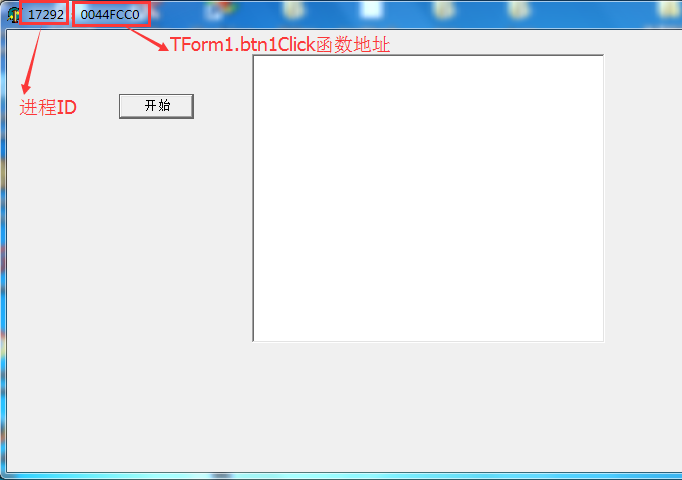
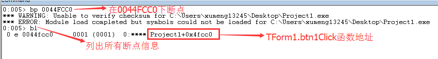
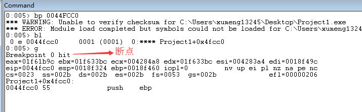
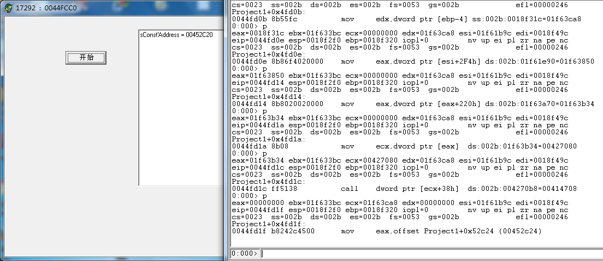
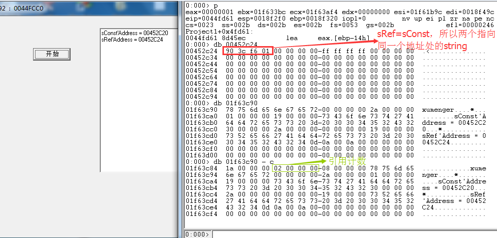
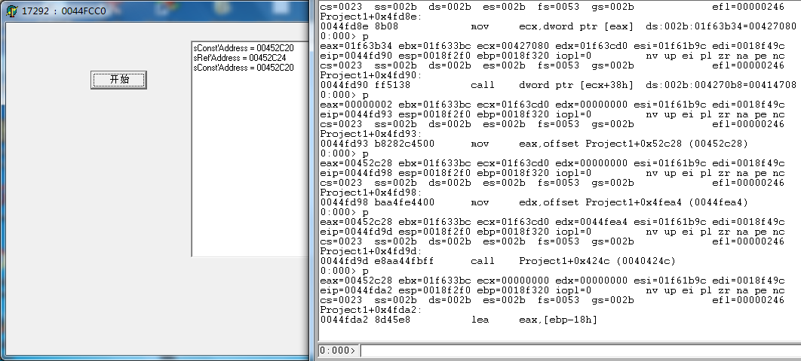
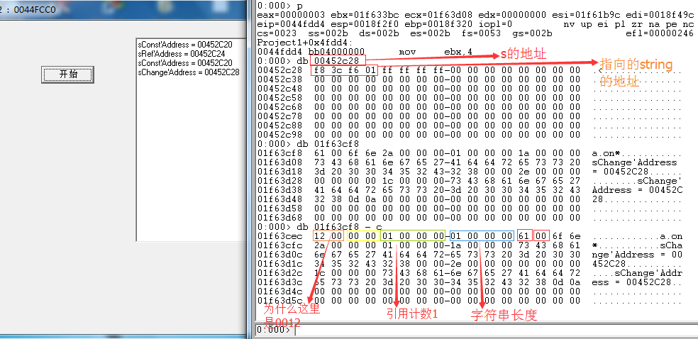

## 背景

在上一篇[《从内存角度分析Delphi的结构体》](http://www.xumenger.com/windbg-delphi-record-new20170917/)中对Delphi的New内存申请机制、结构体内存模型进行了研究，顺便对string进行了研究，大概了解到以下规律

* `s: string`，s保存的是string所在的内存信息，具体内容需要到该地址处查看
* `s: string`，s并不是指向string的首字节，而是指向内容的首字节，前面还有一些字节存储string的其他信息

但是依然存在疑问，和我在[《C++对象内存模型：C++的string和Delphi的string》](http://www.xumenger.com/cpp-delphi-string-20161116/)中的总结稍有不符，还需要通过本节进行探究

## 设计方案

设计下面的代码，用于研究string的内容结构

```
unit Unit1;

interface

uses
  Windows, Messages, SysUtils, Variants, Classes, Graphics, Controls, Forms,
  Dialogs, StdCtrls;

type
  TForm1 = class(TForm)
    btn1: TButton;
    mmo1: TMemo;
    procedure FormCreate(Sender: TObject);
    procedure btn1Click(Sender: TObject);
  private
    { Private declarations }
  public
    { Public declarations }
  end;

var
  Form1: TForm1;

  //声明几个测试用的全局string变量
  sConst: string;    //赋字符串常量
  sRef: string;      //测试引用计数
  sChange: string;   

implementation

{$R *.dfm}

procedure TForm1.FormCreate(Sender: TObject);
begin
  //输出线程ID 、TForm1.btn1Click这个函数的地址，方便后续使用WinDbg进行
  Self.Caption := Format('%d  :  %p', [GetCurrentProcessId, @TForm1.btn1Click]);
end;

procedure TForm1.btn1Click(Sender: TObject);
var
  i: Integer;
begin
  sConst := 'xumenger';
  mmo1.Lines.Add(Format('sConst''Address = %p' , [@sConst]));

  //增加引用计数
  sRef := sConst;
  mmo1.Lines.Add(Format('sRef''Address = %p' , [@sRef]));
  mmo1.Lines.Add(Format('sConst''Address = %p' , [@sConst]));

  //测试string变化时的内容变化
  sChange := 'a';
  mmo1.Lines.Add(Format('sChange''Address = %p' , [@sChange]));
  for i:=0 to 3 do
  begin
    sChange := sChange + sChange;
    mmo1.Lines.Add(Format('sChange''Address = %p' , [@sChange]));
  end;
end;

end.
```

启动进程，可以看到对应的进程ID(17292)、`TForm1.btn1Click`函数地址(0044FCC0)



## 断点调试分析引用计数

>关于WinDbg断点和更多WinDbg命令，参见[windbg-detail](https://github.com/HackerLaboratory/_Crack/tree/master/20170511-windbg-detail)

使用WinDbg附到测试进程(17292)上！`bp 0044FCC0`在函数入口处下断点，因为没有符号文件，所以会有下面的警告信息



输入`g`让程序继续运行，然后点击进程的【开始】按钮使刚才的断点被触发，方便下面的调试



`F10`可以进行Step Over单步跟踪，逐步跟踪到第一个内容的输出！



到这一步之后，我们看一下string的内存信息，此时的引用计数是1


继续单步到下一个输出，因为`sRef := sConst;`，都指向同一个同一个string实体，所以引用计数`1 + 1 = 2`



继续单步直到下一个输出



## 断点分析字符串变化

继续断点到下一个sChange的输出，其地址是`01f63cf8`，分析字符串内存结构



继续断点到下一个sChange的输出

先看一下这个最新的sChange的内存情况，其地址还是`01f63cf8`，看具体内存，还是在`01f63cf8`对应的地址处申请更多内存来放更多的信息


>这里面的测试情况是当sChange被变化的时候，是在原有的地址处扩展内存。但是这个应该不是必然的，假如原来所在的地址处可用内存不够了，估计就会在其他地方申请内存来放

......

后续更多的分析不在这里展示了

## 简单总结

在这篇整理中对string的内存结构进行了整理，但是结合上一篇的整理发现其内存结构和[《C++对象内存模型：C++的string和Delphi的string》](http://www.xumenger.com/cpp-delphi-string-20161116/)中整理的的一致：

>Delphi在2009版本前后，string的内存模型是有较大不同的，详见[《C++对象内存模型：C++的string和Delphi的string》](http://www.xumenger.com/cpp-delphi-string-20161116/)

* [Delphi6 无]01~02 字节是代码页
* [Delphi6 无]03~04 字节表示每个字符所占的字节数（ANSI为1，Unicode为2）
* [这部分是符合的]05~08 字节是该字符串的引用计数
* [这部分是符合的]09~12 字节是该字符串的字符个数
* [这部分是符合的]13~?? 字节就是字符串实际的内容了
* [这部分是符合的]?? 最后一个字节是00，字符串的结束符

另外就是在这个过程中使用WinDbg的断点跟踪机制，不过现在的问题就是自己没有对这个过程中的汇编代码进行详细分析，所以后续有必要针对断点以及断点过程中的汇编代码进行详细的分析

关于汇编的详细分析，是后续研究进程内存模型的一个方向
