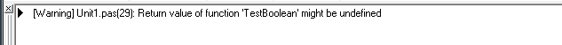
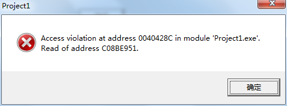
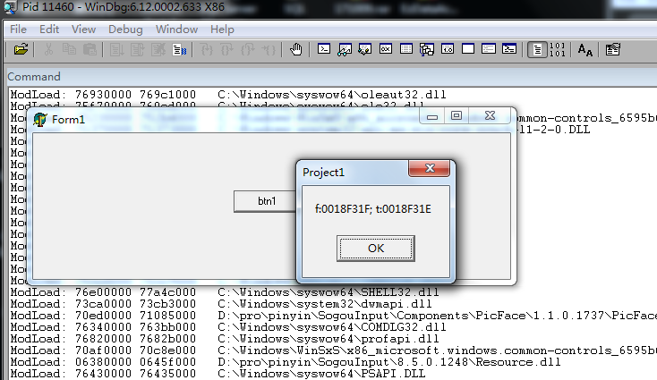
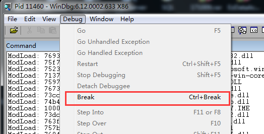
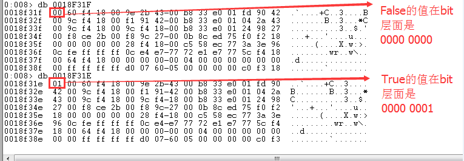
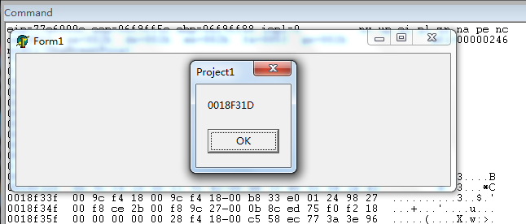
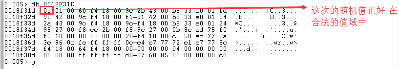
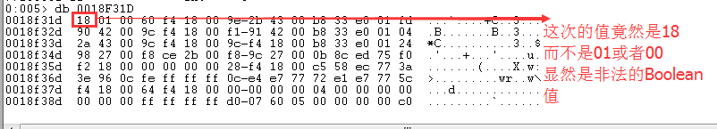
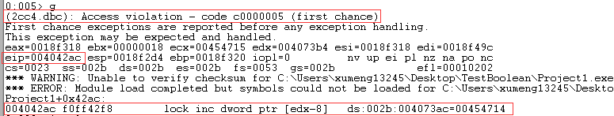
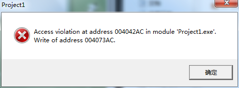

## 问题背景

最近项目开发中遇到了一个问题，程序出现报错，结果发现是在调用`BoolToStr(bRet)`的地方报错了：`Access violation at address ??? in module ??? Read of address ???`

再往上追溯，发现是因为函数调用的返回值有问题，代码大致如下

```
procedure Proc;
var
  bRet: Boolean;
  s: string;
begin
  bRet := BoolFunc;
  s := BoolToStr(bRet);  //结果在这里出现
  ...
end;

function BoolFunc: Boolean;
begin
  if DoSomething() then
  begin
    Result := False;
  end;
end;

```

当BoolFunc函数中DoSomething()返回值为Flase的时候，BoolFunc的Result就没有被赋值，相当于返回一个没有被初始化的返回值。对应的，在Proc中调用BoolFunc，当出现上面的场景时，在BoolToStr(bRet)的时候就会出现`Access violation`报错

## 设计并进行实验

编写Delphi程序如下

```
unit Unit1;

interface

uses
  Windows, Messages, SysUtils, Variants, Classes, Graphics, Controls, Forms,
  Dialogs, StdCtrls;

type
  TForm1 = class(TForm)
    btn1: TButton;
    procedure btn1Click(Sender: TObject);
  private
    { Private declarations }
  public
    { Public declarations }
  end;

var
  Form1: TForm1;

implementation

{$R *.dfm}

function TestBoolean: Boolean;
begin

end;

procedure TForm1.btn1Click(Sender: TObject);
var
  i: Integer;
  b: Boolean;
  s: string;
begin
  //循环多次，提升出现概率
  for i:=0 to 1000 do
  begin
    b := TestBoolean();
    s := BoolToStr(b);
  end;
  ShowMessage('测试完成');
end;

end.
```

编译有警告信息：



我们不管这个信息，直接运行程序，报错：



试着将上面用到Boolean类型的地方修改为使用Integer，结果循环10000000次也没有出现`Access violation`错误

## 看一看BoolToStr和IntToStr

```
function BoolToStr(B: Boolean; UseBoolStrs: Boolean = False): string;
const
  cSimpleBoolStrs: array [boolean] of String = ('0', '-1');
begin
  if UseBoolStrs then
  begin
    VerifyBoolStrArray;
    if B then
      Result := TrueBoolStrs[0]
    else
      Result := FalseBoolStrs[0];
  end
  else
    Result := cSimpleBoolStrs[B];
end;

function IntToStr(Value: Integer): string;
begin
  FmtStr(Result, '%d', [Value]);
end;
```

单纯看这些代码也看不出什么头绪，所以还是从内存模型的层面来分析这个问题

## 分析Boolean的每个bit

Integer类型的是32位有符号整数，其范围是-2147483648 .. 2147483647，即使一个Integer的变量没有被初始化，那么这个变量是一个随机值，但总是一个合法的整型

但是Boolean就不是这样，Boolean只有两个可能值：True、False，正常情况下一个Boolean变量只需要一个bit就可以表示这两个值域：0/1

但是实际上可以通过SizeOf(Boolean)看到，一个Boolean类型的大小是1Byte=8bit，有2^8中可能的0/1组合，而Boolean只需要用到其中的 2个值就可以了，所以我就怀疑当没有给有一个Boolean变量进行初始化的时候，其是一个随机值，这个随机值并不是合法的True/False，导致在调用BoolToStr的时候出现地址错误

进行了合理的猜测之后，我就开始设计实验来进行验证

```
function TestBoolean: Boolean;
begin

end;

procedure TForm1.btn1Click(Sender: TObject);
var
  f, t: Boolean;
  i: Integer;
  b: Boolean;
  s: string;
begin
  f := False;
  t := True;
  //查看合法的Boolean值的bit信息
  ShowMessage(Format('f:%p; t:%p', [@f, @t]));

  //循环多次，提升出现概率
  for i:=0 to 100 do
  begin
    b := TestBoolean();
    //获取其地址
    ShowMessage(Format('%p', [@b]));
    s := BoolToStr(b);
  end;
  ShowMessage('测试完成');
end;
```

打开进程，界面如下


通过任务管理器看到其进程ID是`11460`。接着用WinDbg Attach到这个进程上

`F5`让被调试进行可以被点击操作，然后点击窗体上的按钮



可以看到两个Boolean的地址信息，f:0018F31F、t:0018F31E。简单分析地址，正好差1Byte

接着在WinDbg上`Break`，让WinDbg来调试分析这个Win32进程！



分别查看0018F31F、0018F31E两个地址上的内容



F5继续运行进程，可以看到上面代码中变量`b`的地址是0018F31D



```
......
    b := TestBoolean();
    //获取其地址
    ShowMessage(Format('%p', [@b]));
......
```

继续Break让主动权回到WinDbg上，然后查看0018F31D地址处的值



果不其然，在这次循环中没有报错，那么开始第二次循环，第二次循环中会第二次调用`b := TestBoolean();`

那我们看第二次调用`b := TestBoolean();`后，0018F31D地址处的值



果然，这次得到了一个非法的Boolean值，不在合法的True(01)和False(00)中，所以猜测这次调用`BoolToStr`会出错了！

F5继续运行，果然在将弹出框关闭后，运行到调用`BoolToStr(b)`的地方出现地址报错了

先看到WinDbg上截获的报错信息



F5继续运行看到弹出框



报错信息如下：

>Access violation at address 004042AC in module 'Project.exe'. Write of address 004073AC.

其中004042AC是出错时，当前线程正在执行的指令的地址，如上面的截图 ，就是eip寄存器的值；而004073AC则是访问的非法地址

## 简单总结

上面简单的调试过程证实了自己的猜测是对的

考虑Delphi的问题，命名Boolean类型只有两种可能值，明明1bit就够了，它非得给1Byte，导致如果没有初始化变量就会有可能2^8-2种随机值，这个概率还是很大的，而一旦调用`BoolToStr`就会出问题

当然，站在开发者的层面来看虽然Delphi（说明一下，这次测试用的是Delphi6，其他版本的具体情况这里不盲目下定论）这样设计有瑕疵，但是你完全可以通过初始化变量来避免的呀！

>思考：当出现上面这种Access violation的错误时，应该怎么根据其中的地址信息，向上追溯到具体是哪个函数内部出错的，然后逐层向上找到最开始那个导致错误的点？！
