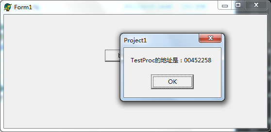
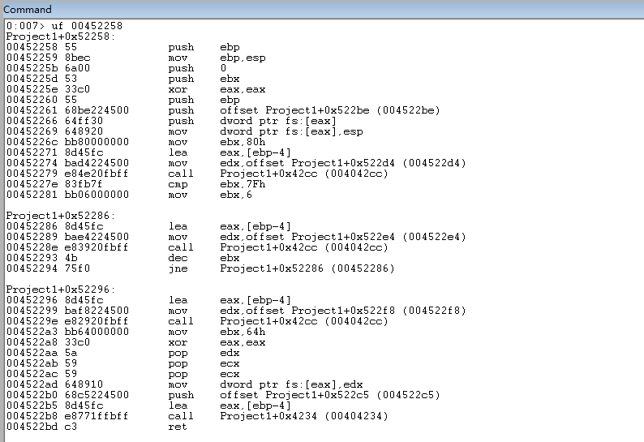
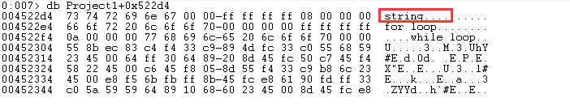
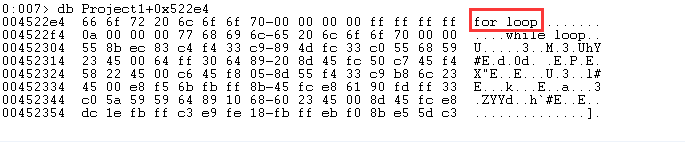
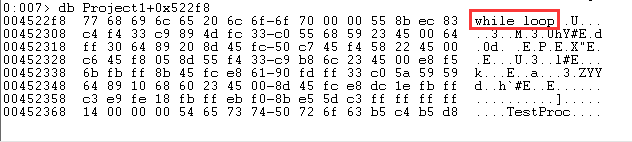

本文使用WinDbg分析Delphi6语言中的一些典型的语法对应的汇编语言

编写一个测试程序，核心代码如下，或者可以点击[这里](../download/20171022/asm.zip)下载代码

```
function TestProc(): Integer;
var
  i: Integer;
  s: string;
begin
  //赋值语句
  i := 128;
  s := 'string';

  //判断语句
  if (127 = i) then
  begin
    i := 129;
  end;

  //for循环
  for i:=0 to 5 do
  begin
    s := 'for loop';
  end;

  //while循环
  while True do
  begin
    s := 'while loop';
    break;
  end;

  //返回值
  Result := 100;
end;

procedure TForm1.btn1Click(Sender: TObject);
begin
  //直接弹出框的方式输出testProc这个函数的函数地址！
  ShowMessage(Format('TestProc的地址是：%p', [@TestProc]));
end;
```

编译程序，运行弹出框如下



然后将WinDbg Attach到这个进程上进行接下来的分析

`uf 00452258`反汇编testProc这个函数代码



接下来将反汇编得到的汇编代码拷贝出来，对比Delphi的代码分析其汇编代码，下面的反汇编代码中将添加详细注释来进行说明

```
Project1+0x52258:
00452258 55              push    ebp
; push ebp指令用户在栈中保存上一个函数的栈底指针
; 当退出本函数的时候可以恢复调用者的调用栈

00452259 8bec            mov     ebp,esp
; ebp是当前函数的存取指针，即存储或者读取时的指针基地址；esp就是当前函数的栈顶指针
; 每次发生主函数调用子函数时，被调用函数初始化时，都会把主函数的ebp压栈，以便从子函数返回主函数时可获取ebp
; 以下是对于esp和ebp的总结（知识点，请记笔记！）
; esp是一直指向栈顶的指针，而ebp只是存取某时刻的栈顶指针，以方便对栈的操作，如获取函数参数、局部变量等

0045225b 6a00            push    0
; 将0压入栈

0045225d 53              push    ebx
; 将ebx的值压入栈

0045225e 33c0            xor     eax,eax
; 是异或运算，两数相反为1；两数相同为0
; 由于这两个数(eax中值)相同，异或后等于清0
; 由于它比mov eax,0效率高，所以一般用它！
; lea方式消耗2个机器指令；mov方式消耗5个机器指令
; 除此之外，mov eax, 0并不会影响ZF标志位，但xor eax, eax就会将ZF置为1

00452260 55              push    ebp
00452261 68be224500      push    offset Project1+0x522be (004522be)
00452266 64ff30          push    dword ptr fs:[eax]
; fs寄存器指向当前活动线程的TEB结构
; 上面进行了xor eax, eax，所以eax值为0
; fs偏移0处的内容是指向SEH链指针
; fs偏移004、008、00C、010……都分别存储对应有意义的内容
; 这里讲fs:[eax]的内容压入栈

00452269 648920          mov     dword ptr fs:[eax],esp
; 这里将esp寄存器的内容拷贝到fs:[eax]内存地址处
; esp是栈顶指针
```

继续看下一段汇编代码

```
0045226c bb80000000      mov     ebx,80h
; 对应Delphi中`i := 128`这个复制语句
; 因为80h就是对应十进制的128
```

下一段汇编代码

```
00452271 8d45fc          lea     eax,[ebp-4]
; lea的作用是，计算ebp-4，将得到的结果放入到eax寄存器中

00452274 bad4224500      mov     edx,offset Project1+0x522d4 (004522d4)
; 对应Delphi代码`s := 'string';`
```

可以使用`db Project1+0x522d4`看一下对应地址处的内容，可以看到是字符串string，所以这部分汇编对应`s := 'string';`



继续往下看汇编代码

```
00452279 e84e20fbff      call    Project1+0x42cc (004042cc)
; 为什么`call    Project1+0x42cc (004042cc)`出现的频率这么高

0045227e 83fb7f          cmp     ebx,7Fh
; 7Fh对应十进制127，所以这行代码对应`if (127 = i) then`
; cmp oprd1, oprd2，用oprd1减去oprd2，但不影响两个操作数的值
; 它影响的flag有CF、ZF、OF、AF、PF
; 详细逻辑这里不做描述！
```

继续看下一段

```
00452281 bb06000000      mov     ebx,6
; for循环是从0~5，也就是6次循环，ebx存放循环的次数

Project1+0x52286:
00452286 8d45fc          lea     eax,[ebp-4]
00452289 bae4224500      mov     edx,offset Project1+0x522e4 (004522e4)
; 使用`db Project1+0x522e4`查看这部分地址的内容是字符串'for loop'
; 所以这部分对应for循环中的`s := 'for loop';`

0045228e e83920fbff      call    Project1+0x42cc (004042cc)
; `call    Project1+0x42cc (004042cc)`又出现一次

00452293 4b              dec     ebx
; 循环完成一轮，ebx寄存器中的值减一，ebx用于维护循环标记

00452294 75f0            jne     Project1+0x52286 (00452286)
; `jne     Project1+0x52286`指令表示
; 如果ZF零标志位是0，则跳转到Project1+0x52286，也就是for循环入口
; 如果ZF零标志位不是0，则继续运行下一条指令
; 问题：哪些操作会影响到哪些标志位？
```



继续看下面的汇编代码

```
Project1+0x52296:
00452296 8d45fc          lea     eax,[ebp-4]
00452299 baf8224500      mov     edx,offset Project1+0x522f8 (004522f8)
; 使用`db Project1+0x522e4`查看这部分地址的内容是字符串'while loop'
; 所以这部分对应for循环中的`s := 'while loop';`

0045229e e82920fbff      call    Project1+0x42cc (004042cc)
; `call    Project1+0x42cc (004042cc)`又出现一次
```



继续看下面的汇编

```
004522a3 bb64000000      mov     ebx,64h
; 对应Delphi中的`Result := 100;`
```

继续看下面的代码

```
004522a8 33c0            xor     eax,eax
004522aa 5a              pop     edx
004522ab 59              pop     ecx
004522ac 59              pop     ecx
; 函数入口处是各种push压栈操作
; 函数结尾的地方则是各种pop出栈操作
; 出栈是为了恢复调用函数的调用栈上下文

004522ad 648910          mov     dword ptr fs:[eax],edx
004522b0 68c5224500      push    offset Project1+0x522c5 (004522c5)
004522b5 8d45fc          lea     eax,[ebp-4]
004522b8 e8771ffbff      call    Project1+0x4234 (00404234)
; 怎么突然冒出来这么个`call`指令？

004522bd c3              ret
; 函数返回
```

>本文只是进行了粗略的汇编分析，在汇编代码的注释中对一些常见的指令、寄存器进行了极其粗略的说明。但并没有很深入的分析每条指令、每个寄存器、每个标志位、每个bit位！

参考文章：

* [《汇编笔记四【标志寄存器】 by:凉游浅笔深画眉 / Net7Cracker》](http://www.cnblogs.com/fuhua/p/5936394.html)
* [《对寄存器ESP和EBP的一些理解》](http://blog.csdn.net/wangkr111/article/details/41315629)
* [《在WinDBG中查看函数的反汇编代码的命令》](http://www.cnblogs.com/awpatp/archive/2011/01/01/1923881.html)
