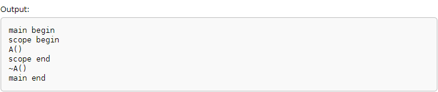
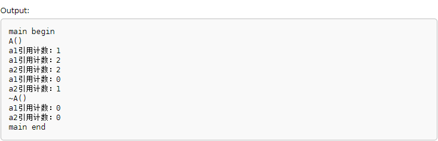
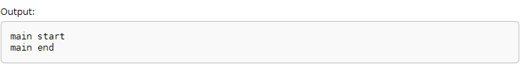
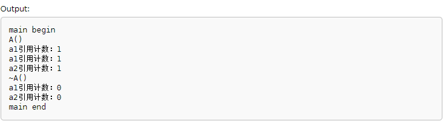
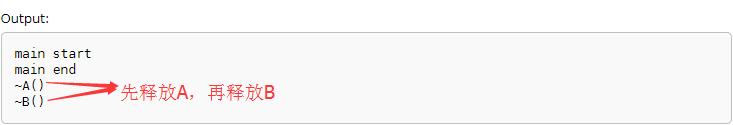
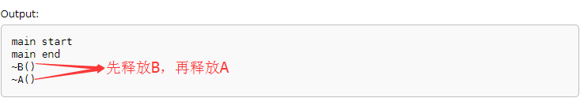

>下面的C++代码是在[http://en.cppreference.com](http://en.cppreference.com)通过GCC 7.1(C++ 17)编译运行程序

## boost::scoped_ptr简介

boost::scoped_ptr是一个简单的智能指针，它能够保证在离开作用域后对象被自动释放，比如下面这段代码

```
#include <iostream>
#include <boost/scoped_ptr.hpp>

using namespace std;

class A{
public:
  A() { cout << "A()" << endl; }
  ~A() { cout << "~A()" << endl; }
};

int main()
{
  cout << "main begin" << endl;

  //开始一个新的作用域
  {
    cout << "scope begin" << endl;
    boost::scoped_ptr<A> a1(new A());
  
    //不允许这样的赋值方式！编译报错！
    //boost::scoped_ptr<A> a2 = a1;
    //不允许这样的调用！编译报错！
    //delete a1;
    
    cout << "scope end" << endl;
  }
  cout << "main end" << endl;
  return 0;
}
```

运行效果如下


在调用`new A()`的时候，根据输出可以看到A的构造方法被调用！但是程序中没有显式调用`delete a1;`，为什么析构方法还是被调用？这就是scoped\_ptr的作用

scope的一个中文意思是：范围！这个智能指针在某个作用域内自动化管理对象的生命周期，当从这个智能指针作用域出来的时候，自动会调用它的析构方法来释放资源！

## boost::shared_ptr简介

```
#include <iostream>
#include <boost/shared_ptr.hpp>

using namespace std;

class A{
public:
  A() { cout << "A()" << endl; }
  ~A() { cout << "~A()" << endl; }
};

int main()
{
  cout << "main begin" << endl;
  
  {
    cout << "scope begin" << endl;
    boost::shared_ptr<A> a1(new A());
    cout << "scope end" << endl;
  }
  cout << "main end" << endl;
  
  return 0;
}
```



可以看到，使用shared\_ptr写出来和上面scoped\_ptr同样的程序，其运行效果是一样的（背后是作用域、对象的生命周期原理）！但shared\_ptr的作用更强大！

```
#include <iostream>
#include <boost/shared_ptr.hpp>

using namespace std;

class A{
public:
  A() { cout << "A()" << endl; }
  ~A() { cout << "~A()" << endl; }
};

int main()
{
  cout << "main begin" << endl;
  
  boost::shared_ptr<A> a1(new A());
  cout << "a1引用计数：" << a1.use_count() << endl;
  
  boost::shared_ptr<A> a2 = a1;
  cout << "a1引用计数：" << a1.use_count() << endl;
  cout << "a2引用计数：" << a2.use_count() << endl;
  
  a1 = NULL;
  cout << "a1引用计数：" << a1.use_count() << endl;
  cout << "a2引用计数：" << a2.use_count() << endl;
  
  a2 = NULL;
  cout << "a1引用计数：" << a1.use_count() << endl;
  cout << "a2引用计数：" << a2.use_count() << endl;
  
  cout << "main end" << endl;
  
  return 0;
}
```



这个程序中，当作用域没有结束之前，如果没有任何引用指向这个对象实体，那么其引用计数变成0，那么就会自动释放这个对象的资源！

关于引用计数的更多细节，可以看[《Delphi引用模型：接口的引用计数特性》](http://www.xumenger.com/delphi-interface-refcount-20170621/)中的介绍。Delphi、Python中有大量地方用到引用计数机制！

## boost::shared_ptr可能导致循环引用

上面展示了shared\_ptr用法和运行效果，但如果误用shared\_ptr可能会导致一些问题。比如下面这种编码方式就会出现循环引用：类A中有类B的shared\_ptr智能指针，类B中有类A的shared\_ptr智能指针

```
#include <iostream>
#include <boost/shared_ptr.hpp>
#include <boost/weak_ptr.hpp>

using namespace std;

class A;
class B;

//重命名shared_ptr智能指针类型
typedef boost::shared_ptr<A> A_ptr;
typedef boost::shared_ptr<B> B_ptr;

class A{
public:
  ~A() { cout << "~A()" << endl; }

  B_ptr b;
};

class B{
public:
  ~B() { cout << "~B()" << endl; }

  A_ptr a;
};

int main()
{
  cout << "main start" << endl;  

  B *b_obj = new B();
  A *a_obj = new A();
  B_ptr b_ptr(b_obj);   //等价于 boost::shared_ptr<B> b_ptr(new B());
  A_ptr a_ptr(a_obj);   //等价于 boost::shared_ptr<A> b_ptr(new A());

  b_ptr->a = a_ptr;
  a_ptr->b = b_ptr;

  cout << "main end" << endl;

  return 0;
}
```

编译运行效果如下



可以看到因为A和B的循环引用，由于A对象和B对象互相引用，它们的引用计数都是1，不能自动释放（也就是析构函数没有调用），最终的结果就是出现了**内存泄漏**

## 如何解决循环引用问题？

一般来说，解决这种循环引用有下面这些可行方法：

* 当只剩下最后一个引用的时候需要手动打破循环引用释放对象
* 当A的生存期超过B的生存期时，B改为使用一个普通指针指向A
* 使用弱引用的智能指针打破这种循环引用

虽然这三种方法都可行，但前两者都需要开发者手动控制，很麻烦并且容易出错。其实可以使用boost中的弱引用的智能指针boost::weak\_ptr来解决问题

>一个强引用是指当前被引用的对象仍活着的话，这个引用也存在（也就是说，只要至少有一个强引用，那么这个对象就不会也不能被释放）。boost::shared_ptr就是强引用

>相对而言，弱引用当引用对象活着的时候不一定存在。仅仅是当它自身存在的时候的一个应用

>弱引用并不修改该对象的引用计数，这意味着弱引用它并不对对象的内存进行管理。在功能上类似于普通指针，然而一个比较大的区别是，弱引用能检测到所管理的对象是否已经被释放，从而避免访问非法内存

>boost::weak_ptr必须从一个boost::share_ptr或另一个boost::weak_ptr转换而来，这也说明，进行该对象的内存管理的是那个强引用的boost::share_ptr

下面可以看一下weak\_ptr的用法！

```
#include <iostream>
#include <boost/shared_ptr.hpp>
#include <boost/weak_ptr.hpp>

using namespace std;

class A{
public:
  A() { cout << "A()" << endl; }
  ~A() { cout << "~A()" << endl; }
};

int main()
{
  cout << "main begin" << endl;
  
  boost::shared_ptr<A> a1(new A());
  cout << "a1引用计数：" << a1.use_count() << endl;
  
  //这里使用weak_ptr而不是用shared_ptr
  boost::weak_ptr<A> a2 = a1;
  cout << "a1引用计数：" << a1.use_count() << endl;
  cout << "a2引用计数：" << a2.use_count() << endl;
  
  a1 = NULL;
  cout << "a1引用计数：" << a1.use_count() << endl;
  cout << "a2引用计数：" << a2.use_count() << endl;
 
  //weak_ptr不允许这样赋值使用 
  //a2 = NULL;
  
  cout << "main end" << endl;
  
  return 0;
}
```



可以看到当把shared\_ptr赋值给weak\_ptr的时候，并没有增加其引用计数！

>boost::weak\_ptr是 boost::shared\_ptr的观察者（Observer）对象，观察者？观察者怎么理解呢？观察者意味着boost::weak\_ptr只对boost::shared\_ptr进行引用，而不改变其引用计数。当被观察的boost::shared\_ptr失效后，相应的boost::weak\_ptr也随之失效

## 使用boost::weak\_ptr解决循环引用

```
//相比于上面的程序，其他代码都不变，只修改B类的定义

...

class B{
public:
  ~B() { cout << "~B()" << endl; }

  //将B中的boost::shared_ptr<A>修改为boost::weak_ptr<A>
  //A_ptr a;
  boost::weak_ptr<A> a;
};

...

```



>这段程序中，A还是引用一个boost::shared\_ptr<B>成员变量，而B则是引用一个boost::weak\_ptr<A>的成员变量。通过程序的输出可以看到，是先释放A，再释放B

上面是在B类中定义boost::weak\_ptr<A>的成员变量，如果修改为在A类中定义boost::weak\_ptr<B>的成员变量呢？

```
//相比于上面的程序，其他代码都不变，只修改B类的定义

...

class A{
public:
  ~A() { cout << "~A()" << endl; }

  ////将A中的boost::shared_ptr<B>修改为boost::weak_ptr<B>
  //B_ptr b;
  boost::weak_ptr<B> b;
};

...

```



>这段程序中，B还是引用一个boost::shared\_ptr<A>成员变量，而A则是引用一个boost::weak\_ptr<B>的成员变量。通过程序的输出可以看到，是先释放B，再释放A

虽然通过弱引用指针可以有效的解除循环引用，但这种方式必须在程序员能预见会出现循环引用的情况下才能使用，也可以是说这个仅仅是一种编译期的解决方案

如果程序在运行过程中出现了循环引用，还是会造成内存泄漏的

因此不要认为只要使用智能指针便能杜绝内存泄漏

毕竟，对于C++来说，由于没有垃圾回收机制，内存泄漏对每一个程序员来说都是一个非常头痛的问题

## 简单总结

在这篇文章中，完全没有深入研究scoped\_ptr、shared\_ptr、weak\_ptr的实现细节，只是讲到其如何使用、运行效果而已！
