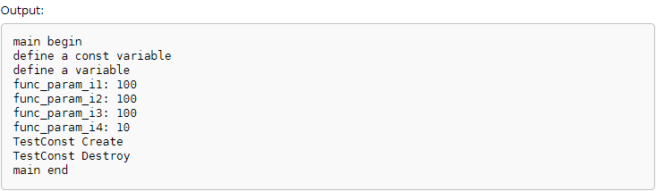

在C++的函数定义中，到处都是`const`关键字的使用

* const修饰普通变量
* const修饰指针
* const修饰函数参数
* const修饰函数返回值
* const修饰类成员变量
* const修饰类成员函数

比如下面这段代码将const的各种应用场景都揉到一起了：

```
#include<iostream>
#include<stdio.h>

using namespace std;

/*
 * const修饰函数参数
 * 
 * const int i1：参数是常量，不允许在函数中修改这个参数
 * const int* i2：参数指针所指的内容为常量不可变
 * int* const i3：参数指针本身是常量，不可变
 * const int& i4：参数为引用，增加效率（不用拷贝参数）同时防止修改
 * 
 * 其实和const修饰变量是一样的效果
 */
void func_param( const int i1, 
                const int* i2, 
                int* const i3,
                const int& i4 ){

  cout << "func_param_i1: " << i1 << endl;
  //compile error: assignment of read-only parameter 'i1'
  //i1 = 10;

  cout << "func_param_i2: " << *i2 << endl;
  //compile error: assignment of read-only location '* i2'
  //*i2 = 10;
  i2 = NULL;

  cout << "func_param_i3: " << *i3 << endl;
  *i3 = 10;
  //compile error: assignment of read-only parameter 'i3'
  //i3 = NULL;

  cout << "func_param_i4: " << i4 << endl;
  //compile error: assignment of read-only reference 'i4'
  //i4 = 10;
}


/*
 * const修饰函数返回值
 * const int func_ret_1()，没啥意义，因为返回值本身就是赋值
 * const int* func_ret_2()，把func_ret_2()看成一个变量，指针内容不可变
 * int const* func_ret_3()，把func_ret_3()看作成一个变量，即指针本身不可变
 */
const int func_ret_1(){
  return 1;
}
const int* func_ret_2(){
  int *i = (int*)malloc(sizeof(int));
  *i = 100;
  return i;
}
int* const func_ret_3(){
  int *i = (int*)malloc(sizeof(int));
  *i = 100;
  return i;
}


/*
 * const在类中的应用
 */
class TestConst{
/*
 * const修饰类成员“变量”
 */
private:
  /*
   * 成员变量不能修改
   * 只能在初始化列表中赋值
   */
  const int iConst;
public:
  /*
   * 在初始化列表中对const成员赋值
   */
  TestConst(int x): iConst(x) { cout << "TestConst Create" << endl; }
  ~TestConst() { cout << "TestConst Destroy" << endl; }


/*
 * const修饰类成员函数
 */
private:
  //普通变量
  int iVar;
  //非const成员函数
  int testFunc() { return 1; }
public:
  /*
   * 常成员函数，它不能改变对象的成员变量
   * 也不能调用类中任何非const成员函数
   */
  void testConstFunc() const {
    //compile error: assignment of member 'TestConst::iVar' in read-only object
    //iVar = 10;
    //compile error: passing 'const TestConst' as 'this' argument discards qualifiers [-fpermissive]
    //testFunc();
  }
};


int main()
{
  cout << "main begin" << endl;
  

  /*
   * const定义一个常量，其值不可变
   */
  cout << "define a const variable" << endl;
  const int constInt = 10;   //等价于这样的定义：int const constInt = 10;
  //compile error: assignment of read-only variable 'constInt'
  //constInt = 100;

  
  /*
   * const修饰一个指针会怎么样呢
   * 若const位于*左侧，则const用于修饰指针所指向的内容，即指针指向一个常量
   * 若const位于*右侧，则const用于修饰指针本身，即指针本身是一个常量
   */
  cout << "define a variable" << endl;
  int varInt = 10;

  /*
   * const位于*右侧，指针本身是常量
   */
  int* const p1 = &varInt;
  *p1 = 100;
  //compile error: assignment of read-only variable 'p1'
  //p1 = NULL;

  /*
   * const位于*左侧，指针指向一个常量
   */
  const int* p2 = &varInt;
  //compile error: assignment of read-only location '* p2'
  //*p2 = 100;
  p2 = NULL;

  /*
   * const位于*左侧和右侧，指针本身、指向的内都是常量
   */
  const int* const p3 = &varInt;
  //compile error: assignment of read-only location '*(const int*)p3'
  //*p3 = 100;
  //compile error: assignment of read-only variable 'p3'
  //p3 = NULL;
  

  /*
   * 测试const修饰函数参数
   */
  int param = 100;
  func_param(param, &param, &param, param);


  /*
   * 测试const修饰函数返回值
   */
  int ret1 = func_ret_1();

  //compile error: invalid conversion from 'const int*' to 'int*' [-fpermissive]
  //int *ret2 = func_ret_2();
  //*ret2 = 100;
  //ret2 = NULL;

  int *ret3 = func_ret_3();
  *ret3 = 100;
  ret3 = NULL;


  /*
   * 测试类中的const
   */
  TestConst *t = new TestConst(10);
  delete t;


  cout << "main end" << endl;
  return 0;
}
```

编译运行效果如下



上面通过注释、运行结果已经将const关键字的各种应用场景进行了描述。完全可以认为是讲解C++中const用法的一份简单参考手册！

另外结合这篇[《C++函数传值返回和引用返回》](http://www.xumenger.com/cpp-return-reference-20170916/)一起阅读效果会更好
