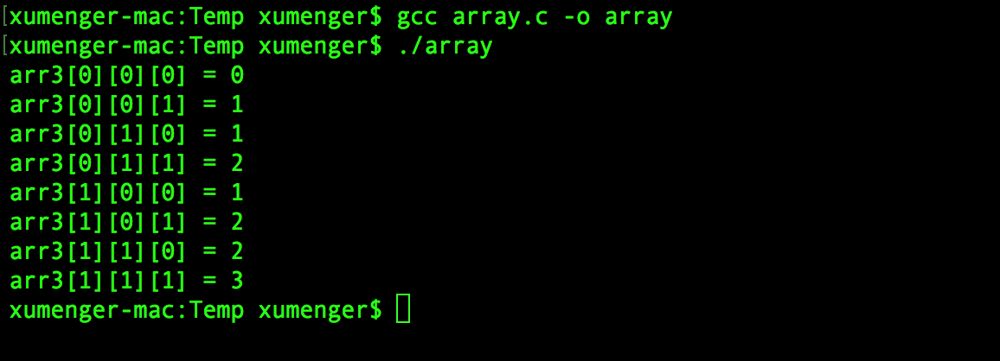
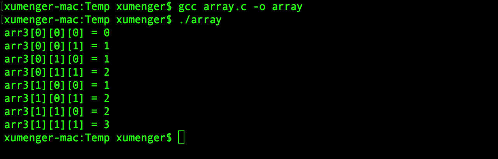
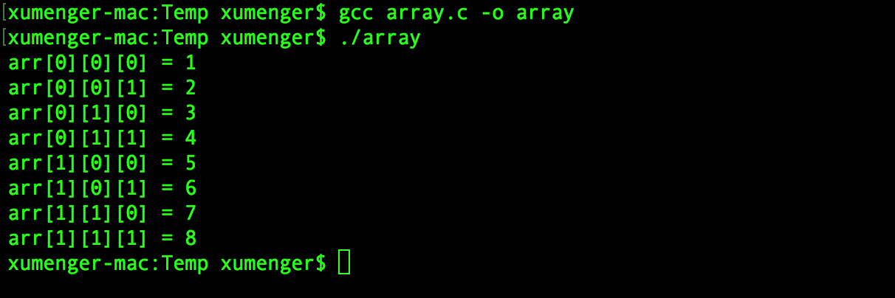
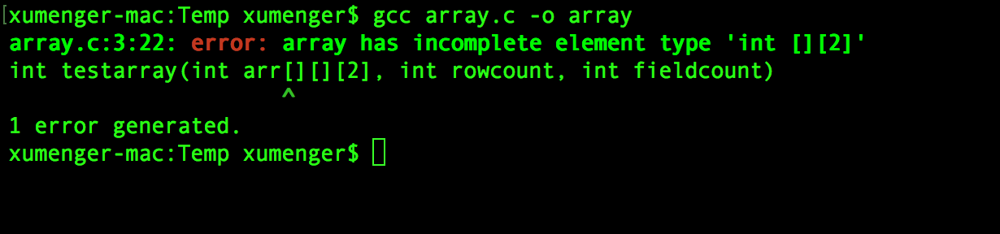
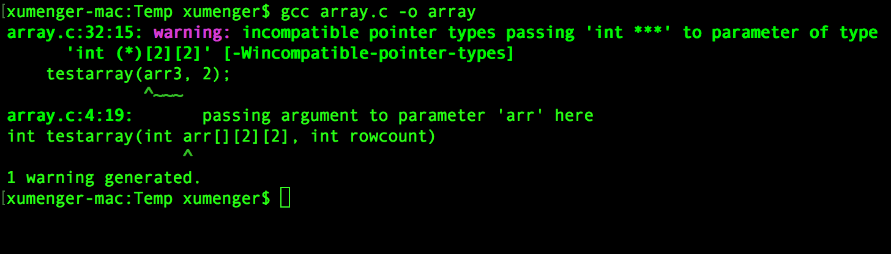
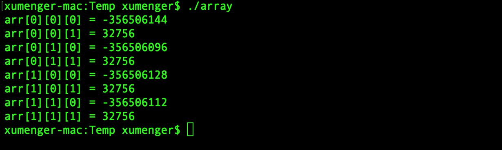
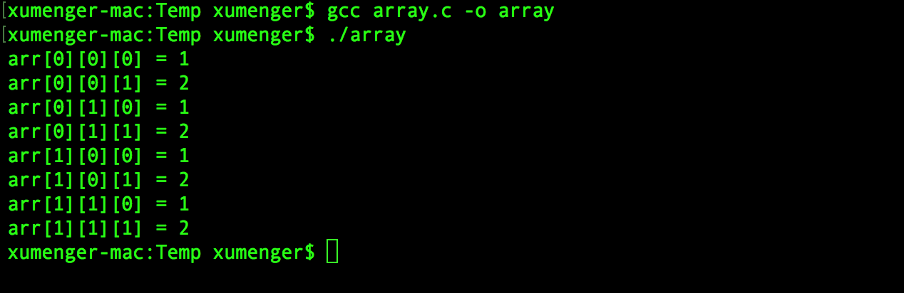
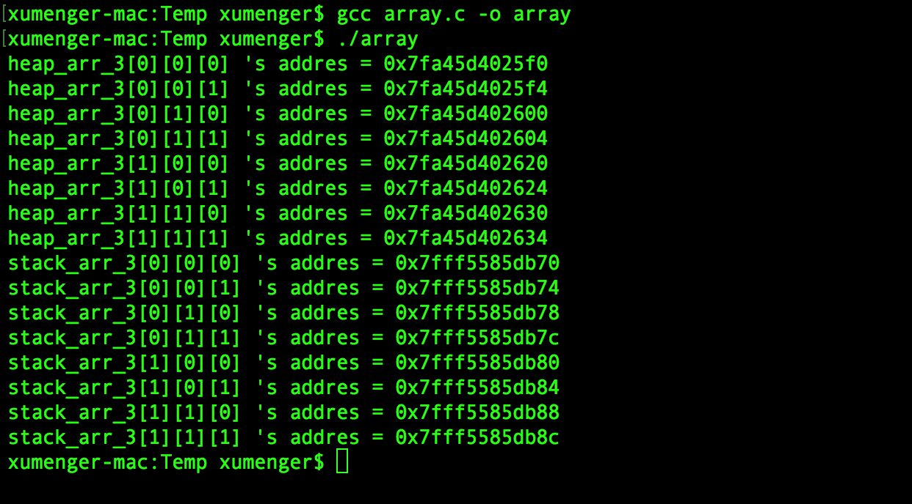
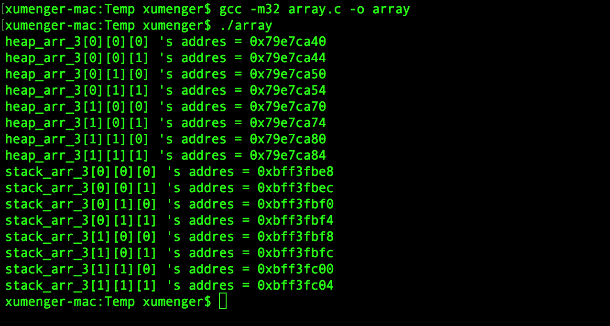

## 实验1：多维数组

C语言中定义数组的语法很简单，比如下面这个例程中定义了一维、二维、三维数组

```
#include <stdio.h>

int main()
{
    int arr1[2];        //一维数组
    int arr2[2][2];     //二维数组
    int arr3[2][2][2];  //三维数组

    //为三维数组赋值
    int i, j, k;
    for(i = 0; i < 2; i++)
        for(j = 0; j < 2; j++)
            for(k = 0; k < 2; k++)
                arr3[i][j][k] = i + j + k;

    //输出三维数组的值
    for(i = 0; i < 2; i++)
        for(j = 0; j < 2; j++)
            for(k = 0; k < 2; k++)
                printf("arr3[%d][%d][%d] = %d\n", i, j, k, arr3[i][j][k]);

    return 0;
}
```

`gcc array.c -o array`编译程序，然后`./array`执行程序输出结果如下



## 实验2：动态申请多维数组

以上展示的多维数组的定义、赋值、轮询访问是在栈上的行为，但很多时候需要在堆上进行动态申请，那么就应该向下面这样（以三级指针为例）

```
#include <stdio.h>
#include <stdlib.h>

int main()
{
    int ***arr3;
    int i, j, k;
    //动态为三级指针的每一维申请内存
    arr3 = (int ***)malloc(sizeof(int **) * 2);  //第一维大小为2
    for(i = 0; i < 2; i++){
        arr3[i] = (int **)malloc(sizeof(int *) * 2); //第二维大小为2
        for(j = 0; j < 2; j++){
            arr3[i][j] = (int *)malloc(sizeof(int) * 2);  //第三维大小为2
        }
    }

    //为其赋值
    for(i = 0; i < 2; i++)
        for(j = 0; j < 2; j++)
            for(k = 0; k < 2; k++)
                arr3[i][j][k] = i + j + k;

    //输出其值
    for(i = 0; i < 2; i++)
        for(j = 0; j < 2; j++)
            for(k = 0; k < 2; k++)
                printf("arr3[%d][%d][%d] = %d\n", i, j, k, arr3[i][j][k]);

    //释放动态申请的内存
    for(i = 0; i < 2; i++){
        for(j = 0; j < 2; j++){
            free(arr3[i][j]);
        }
        free(arr3[i]);
    }
    free(arr3);

    return 0;
}
```

同样的编译运行程序输出如下



## 实验3：函数的多维数组类型参数

可以定义这样的函数，它的参数是多维数组类型

```
#include <stdio.h>

int testarray(int arr[][2][2], int rowcount)
{
    int i, j, k;
    for(i = 0; i < rowcount; i++)
        for(j = 0; j < 2; j++)
            for(k = 0; k < 2; k++)
                printf("arr[%d][%d][%d] = %d\n", i, j, k, arr[i][j][k]);
    return 0;
}

int main()
{
    //栈上定义三维数组同时进行赋值的语法格式
    int arr3[2][2][2] = { 
                          {
                              {1, 2},
                              {3, 4}
                          }, 
                          {
                              {5, 6},
                              {7, 8}
                          } 
                      };
    testarray(arr3, 2);
    return 0;
}
```

编译程序，执行程序输出如下



如果下面这样定义函数，在编译的时候就会报错

```
#include <stdio.h>

int testarray(int arr[][][2], int rowcount, int fieldcount)
{
    int i, j, k;
    for(i = 0; i < rowcount; i++)
        for(j = 0; j < fieldcount; j++)
            for(k = 0; k < 2; k++)
                printf("arr[%d][%d][%d] = %d\n", i, j, k, arr[i][j][k]);
    return 0;
}

int main()
{
    int arr3[2][2][2] = { { {1, 2}, {3, 4} }, { {5, 6},  {7, 8} } };
    testarray(arr3, 2, 2);
    return 0;
}
```



编译报错，因为在函数中定义n维数组，必须至少指定其中n-1维的大小，如果像上面定义函数参数为`int arr[][][2]`就会无法通过编译

## 实验4：动态多级指针传入多维数组参数函数

```
#include <stdio.h>
#include <stdlib.h>

int testarray(int arr[][2][2], int rowcount)
{
    int i, j, k;
    for(i = 0; i < rowcount; i++)
        for(j = 0; j < 2; j++)
            for(k = 0; k < 2; k++)
                printf("arr[%d][%d][%d] = %d\n", i, j, k, arr[i][j][k]);
    return 0;
}

int main()
{
    int ***arr3;
    int i, j, k;
    //动态为三级指针的每一维申请内存
    arr3 = (int ***)malloc(sizeof(int **) * 2);  //第一维大小为2
    for(i = 0; i < 2; i++){
        arr3[i] = (int **)malloc(sizeof(int *) * 2); //第二维大小为2
        for(j = 0; j < 2; j++){
            arr3[i][j] = (int *)malloc(sizeof(int) * 2);  //第三维大小为2

            //赋值
            arr3[i][j][0] = 1;
            arr3[i][j][1] = 2;
        }
    }

    //动态多级指针传入静态多维数组函数参数
    testarray(arr3, 2);

    //这里没有进行释放，所以存在内存泄漏
    //测试程序，暂不关心
    //free(...)

    return 0;
}
```

编译程序有警告信息



运行程序，看到在函数中轮询多维数组输出



明显输出的多维数组的值和在main函数中赋的值不一致，为什么？

## 实验5：将函数参数从多维数组修改为多级指针

```
#include <stdio.h>
#include <stdlib.h>

int testarray(int ***arr, int rowcount, int fieldcount, int count)
{
    int i, j, k;
    for(i = 0; i < rowcount; i++)
        for(j = 0; j < fieldcount; j++)
            for(k = 0; k < count; k++)
                printf("arr[%d][%d][%d] = %d\n", i, j, k, arr[i][j][k]);
    return 0;
}

int main()
{
    int ***arr3;
    int i, j, k;
    //动态为三级指针的每一维申请内存
    arr3 = (int ***)malloc(sizeof(int **) * 2);  //第一维大小为2
    for(i = 0; i < 2; i++){
        arr3[i] = (int **)malloc(sizeof(int *) * 2); //第二维大小为2
        for(j = 0; j < 2; j++){
            arr3[i][j] = (int *)malloc(sizeof(int) * 2);  //第三维大小为2

            //赋值
            arr3[i][j][0] = 1;
            arr3[i][j][1] = 2;
        }
    }

    //动态多维数组传入静态多维数组函数参数
    testarray(arr3, 2, 2, 2);

    //这里没有进行释放，所以存在内存泄漏
    //测试程序，暂不关心
    //free(...)

    return 0;
}
```

运行程序，看到在函数中轮询多维数组（多级指针）输出



这次正确地将在main中对动态多维数组的赋值进行输出！

## 为什么有实验4和5的不同表现？

遇到这类问题，首先应该想到去分析内存结构。这里也是一样，去分析一下堆多级指针动态申请内存模式、栈多维数组的内存模型的区别！

```
#include <stdio.h>
#include <stdlib.h>

int main()
{
    int ***heap_arr_3;
    int i, j, k;
    //动态为三级指针的每一维申请内存
    heap_arr_3 = (int ***)malloc(sizeof(int **) * 2);  //第一维大小为2
    for(i = 0; i < 2; i++){
        heap_arr_3[i] = (int **)malloc(sizeof(int *) * 2); //第二维大小为2
        for(j = 0; j < 2; j++){
            heap_arr_3[i][j] = (int *)malloc(sizeof(int) * 2);  //第三维大小为2

            //赋值
            heap_arr_3[i][j][0] = 1;
            heap_arr_3[i][j][1] = 2;
        }
    }

    //栈上定义三维数组
    int stack_arr_3[2][2][2] = { 0 };

    //轮询输出堆多级指针的地址
    for(i = 0; i < 2; i++)
        for(j = 0; j < 2; j++)
            for(k = 0; k < 2; k++)
                printf("heap_arr_3[%d][%d][%d] 's addres = %p\n", i, j, k, &heap_arr_3[i][j][k]);

    //轮询输出栈多维数组的地址
    for(i = 0; i < 2; i++)
        for(j = 0; j < 2; j++)
            for(k = 0; k < 2; k++)
                printf("stack_arr_3[%d][%d][%d] 's addres = %p\n", i, j, k, &stack_arr_3[i][j][k]);
}
```

`gcc array.c -o array`编译出64位可执行程序的运行效果如下



`gcc -m32 arary.c -o array`编译出32位可执行程序的运行效果如下



下面我们针对32位进程的运行效果进行分析，暂不考虑64位的情况！

仔细的分析栈上申请的三维数组（`int _arr[2]][2][2]`)的地址，明显可以看出逐个地址是连续递增的（每一个都比上一个元素的地址大4Byte，也就是sizeof(iny)的大小）。其实比如在栈上申请`i * j * k`的三维数组（假设数据类型是int），就是从栈上某个地址开始申请`i * j * k * sizeof(int)`个字节的内存，然后来存储三维数组的内容，注意，是栈上的连续内存

同样的去看堆上动态为三级指针（`int ***arr`）申请的内存空间，可以看到并不是每个元素的地址都确定比上一个元素的地址大sizeof(int)个字节的！其实像上面的写法中，使用malloc为多级指针动态申请内存达到申请多维数据的效果，和在栈上直接定义多维数组是完全不同的，比如上面的程序，它为了给三级指针动态申请内存，多次调用了malloc，其实最终可能多次调用的malloc是在相差很远的内存中申请到内存的，不能保证上面在栈上定义多维数组的连续性！

所以明显这两种模式申请到的内存结构是完全不同的，当然编译器和操作系统在处理上没有办法统一！

其实上面的实验中，如果是像下面这样定义动态多级指针

```
    int ***heap_arr_3;
    int i, j, k;
    //动态为三级指针的每一维申请内存
    heap_arr_3 = (int ***)malloc(sizeof(int **) * 2);  //第一维大小为2
    for(i = 0; i < 2; i++){
        heap_arr_3[i] = (int **)malloc(sizeof(int *) * 2); //第二维大小为2
        for(j = 0; j < 2; j++){
            heap_arr_3[i][j] = (int *)malloc(sizeof(int) * 2);  //第三维大小为2

            //赋值
            heap_arr_3[i][j][0] = 1;
            heap_arr_3[i][j][1] = 2;
        }
    }
```

而对应的函数中参数通过多维数组，即

```
int testarray(int arr[][2][2], int rowcount)
{
    int i, j, k;
    for(i = 0; i < rowcount; i++)
        for(j = 0; j < 2; j++)
            for(k = 0; k < 2; k++)
                printf("arr[%d][%d][%d] = %d\n", i, j, k, arr[i][j][k]);
    return 0;
}
```

将多级指针强转为多维数组，虽然可以实现强转，但两者背后的内存结构完全不同，就会在运行的时候出现异常现象！也就是实验4所展示的那样！

而如果函数参数也定义为多级指针的方式，即

```
int testarray(int ***arr, int rowcount, int fieldcount, int count)
{
    int i, j, k;
    for(i = 0; i < rowcount; i++)
        for(j = 0; j < fieldcount; j++)
            for(k = 0; k < count; k++)
                printf("arr[%d][%d][%d] = %d\n", i, j, k, arr[i][j][k]);
    return 0;
}
```

那么就可以保证实参和形参有相同的内存结构，那么就可以符合预期的执行，也就是实验5的运行效果！

>虽然都可以使用类似`arr[?][?][?]`的语法格式来索引到某个具体的元素，但两者在背后的内存结构却是完完全全不一致的！
